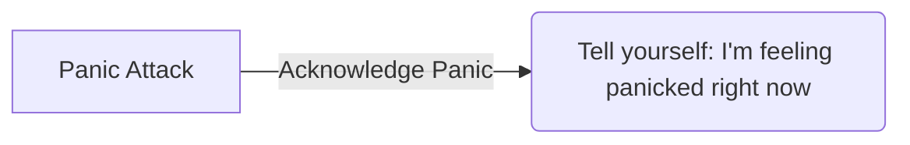
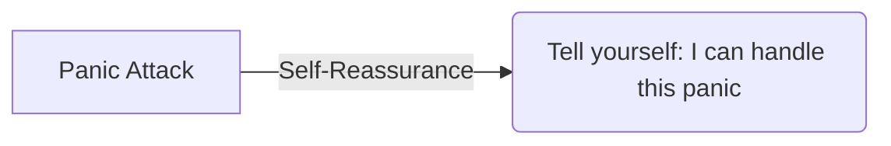

## TL;DR
This article teaches you how to alleviate panic symptoms in 5 steps, giving you a better way to cope when panic strikes.

## Prerequisites
No specific environment or tools are required, but a basic understanding of mental health and self-awareness is necessary.

## Steps
### Step 1: Acknowledge Panic
Acknowledging your panic is the crucial first step. Don't try to suppress or deny your feelings; instead, face them head-on. Tell yourself, "I'm feeling panicked right now, and that's okay." I believe this step is vital because acknowledging your emotions helps you start addressing your panic.



### Step 2: Deep Breathing
Deep breathing can calm you down and reduce anxiety. Try the following:
- Close your eyes
- Inhale slowly for 4 seconds
- Exhale slowly for 4 seconds
- Repeat the process 3-5 times

I've tried deep breathing to alleviate panic, and it really works!

### Step 3: Observe Physical Sensations
During panic, your body experiences many uncomfortable sensations, such as a racing heart and sweaty palms. Try to observe your physical sensations and tell yourself, "What's my body experiencing right now?" This step helps you better understand your body.

### Step 4: Distract Yourself
Distracting yourself can help you temporarily forget about your panic. Try doing something unrelated to your panic, such as:
- Listening to music
- Looking at pictures
- Doing simple actions

I like listening to music to distract myself; it helps me relax.

### Step 5: Self-Reassurance
Finally, try telling yourself reassuring words. Say to yourself, "I can handle this panic; I've overcome many challenges before, and I can do it again." This step helps you build confidence.



## Complete Example
Here's a simple self-reassurance exercise:

```
I'm feeling panicked right now, but I can handle it.
I'll breathe deeply, observe my body, and distract myself.
I'll tell myself I can overcome this challenge again.
```

## Common Pitfalls
When panicked, it's easy to fall into negative thinking. Be aware of suppressing your emotions and denying your panic. Remember the importance of deep breathing and self-reassurance.

## References
- Book: "Self-Help for Panic Disorder"
- Website: "Mental Health"
- Video: [5 Steps to Alleviate Panic #Zhou Mu Zhi](https://www.youtube.com/shorts/QwFH6RdEQsk)