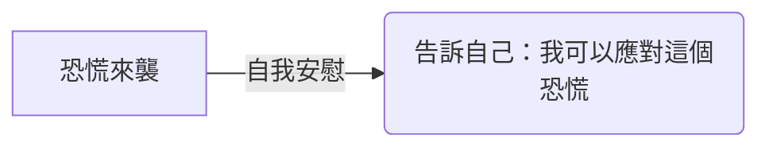

## TL;DR
這篇文章教你如何使用 5 個步驟來緩解恐慌的症狀，讓你在面對恐慌時有更好的應對方法。

## 前置條件
本文不需要任何特定的環境或工具，但需要有一定的心理健康知識和自我意識。

## 步驟
### 步驟 1：承認恐慌
承認自己的恐慌感是很重要的第一步。不要嘗試壓抑或否認自己的感受，相反，應該試著正視它們。告訴自己：「我現在正在感到恐慌，這是正常的。」我認為，這個步驟很重要，因為承認自己的感受可以幫助你開始面對恐慌。


### 步驟 2：深呼吸
深呼吸可以幫助你平靜下來，減少焦慮感。試著做以下動作：
- 閉上眼睛
- 慢慢地吸氣，持續 4 秒鐘
- 緩慢地呼氣，持續 4 秒鐘
- 重複這個過程 3-5 次

我曾經嘗試過深呼吸來緩解恐慌，它真的有效！

### 步驟 3：觀察身體感受
恐慌時，身體會出現許多不舒服的感受，如心跳加速、手心冒汗等。試著觀察自己的身體感受，告訴自己：「我的身體現在正在經歷什麼？」這個步驟可以幫助你更好地了解自己的身體。

### 步驟 4：分散注意力
分散注意力可以幫助你暫時忘記恐慌感。試著做一些與恐慌無關的事情，如：
- 聽音樂
- 看圖片
- 做一些簡單的動作

我喜歡聽音樂來分散注意力，它可以幫助我放鬆。

### 步驟 5：自我安慰
最後，試著對自己說一些安慰的話。告訴自己：「我可以應對這個恐慌，我已經經歷過許多困難，我可以再次度過這個難關。」這個步驟可以幫助你建立自信。



## 完整範例
以下是一個簡單的自我安慰練習：

```
我現在正在感到恐慌，但我可以應對它。
我會深呼吸，觀察我的身體感受，分散我的注意力。
我會告訴自己，我可以再次度過這個難關。
```

## 常見地雷
恐慌時，很容易陷入負面思維中。要注意不要壓抑自己的感受，也不要嘗試否認自己的恐慌感。另外，要記得深呼吸和自我安慰的重要性。

## 參考資料
- 《恐慌症的自我幫助》一書
- 《心理健康》網站
- [恐慌來襲怎麼辦？5步驟緩解  #周慕姿放心說](https://www.youtube.com/shorts/QwFH6RdEQsk)