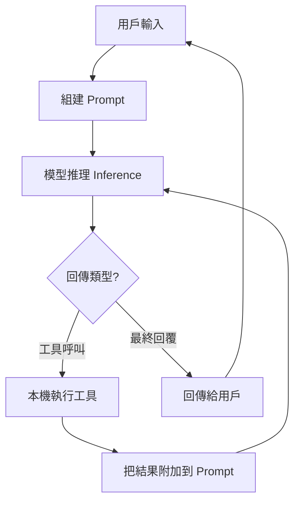
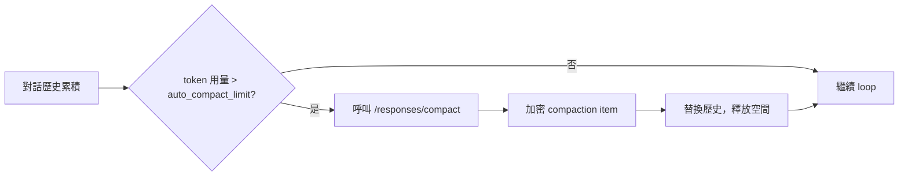

Most people using the Codex CLI only see "type a sentence, and then code appears." But during that process, the agent loop has actually run dozens of inferences and tool calls. OpenAI's Michael Bolin wrote a piece titled *Unrolling the Codex agent loop* that fully opens up this black box. Below is a summary of the core content.

## What Is the Agent Loop

At the core of every AI agent is a loop:

1. Receive user input
2. Assemble the prompt (including instructions, tool definitions, and conversation history)
3. Send it to the model for inference
4. The model returns a result — which may be a tool call, or it may be a final reply
5. If it's a tool call: execute the tool, append the result to the prompt, and go back to step 3
6. If it's a final reply: the loop ends, and we wait for the next user input

One of Bolin's key points is: **the agent's "output" is not just the assistant message**. For a coding agent, the truly valuable output is the code it writes or modifies on the local machine; the assistant message at the end of each turn is merely a signal marking "this round is done."



A single "conversation turn" can contain dozens of inference-tool loops; what the user sees is only the final result.

## The Three-Layer Structure of the Prompt

The payload Codex sends to the Responses API has three core fields:

**Instructions**: Comes from `~/.codex/config.toml` or a model-specific built-in config file; these are static system-level directives.

**Tools**: Codex's built-in tools (shell execution, file operations) + the Responses API's native tools + tools the user mounts via MCP. Tool definitions are JSON schemas that the model uses to decide when and how to call a tool.

**Input**: The conversation history, including system, developer, user, and assistant role messages, along with the current sandbox permissions and project context.

After the API server receives the payload, it rearranges it into the final structure: system message → tool definitions → instructions → input messages. This ordering has a direct impact on the prompt cache hit rate (more on that below).

## How Tokens Flow

The inference process is essentially a translation:

```
文字 prompt → 輸入 tokens → 模型取樣 → 輸出 tokens → 文字
```

Because tokens are generated one at a time, the output can be streamed back — which is why LLM applications usually show a "typewriter effect." Each model has a fixed **context window** — the total cap on input plus output tokens — and this limit is one of the most important constraints in agent loop design.

## Context Window Management: Auto Compaction

As the conversation grows, the accumulated tokens approach the context window cap. Codex's solution is auto compaction:

- **Trigger condition**: The `auto_compact_limit` setting; once token usage exceeds the threshold, compaction triggers automatically.
- **Compaction endpoint**: A dedicated `/responses/compact` endpoint that returns summary items which can directly replace the history.
- **Encrypted storage**: The compaction result is stored as an item with `type=compaction`. The model's "latent understanding" is preserved, but the original messages no longer occupy the context.

This design also supports **Zero Data Retention (ZDR)** customers: because the model is requested statelessly, the server doesn't need to persist the original conversation, and the encrypted compaction item can still carry the model's reasoning forward.



## Prompt Cache Optimization

Every inference has to send the entire prompt. If the server can reuse the portions it computed before (a prompt cache hit), you can compress quadratic growth down to linear growth. Codex's optimization strategies:

**Put static content first**: Instructions, tool definitions, sandbox settings — these unchanging things go at the start of the prompt so they can be cached.

**MCP tool ordering**: If the order in which an MCP server enumerates tools is nondeterministic, it differs every time, causing every request to be a cache miss. Codex solves this by enforcing a consistent tool ordering — an easily overlooked but highly impactful detail.

**Effect**: "Even though the request payload grows at a quadratic rate, model sampling can still stay in linear time."

## Overall

The core of the Codex agent loop design is a few mutually balancing tradeoffs:

- **autonomy vs. safety**: IDE integration allows continuous adjustment from "Q&A mode" to "fully autonomous execution."
- **stateless vs. continuity**: Stateless requests satisfy compliance needs, while encrypted compaction preserves reasoning continuity.
- **context depth vs. cost**: Auto compaction makes long conversations feasible, and the prompt cache makes them affordable.

For anyone wanting to build their own coding agent, the most valuable part of this article isn't "how Codex is implemented," but **the reasons behind these design decisions** — context management is not an optional feature; it's a necessary condition for letting an agent run for more than a few minutes.

## References

- [Unrolling the Codex agent loop — OpenAI](https://openai.com/index/unrolling-the-codex-agent-loop/)
- [Introducing Codex — OpenAI](https://openai.com/index/introducing-codex/)
- [Harness engineering: leveraging Codex in an agent-first world — OpenAI](https://openai.com/index/harness-engineering/)
- [OpenAI Responses API Documentation](https://platform.openai.com/docs/api-reference/responses)
- [Codex CLI GitHub Repository](https://github.com/openai/codex)
