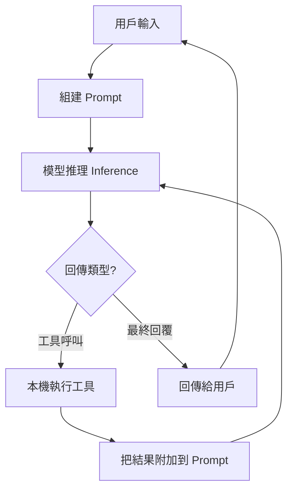
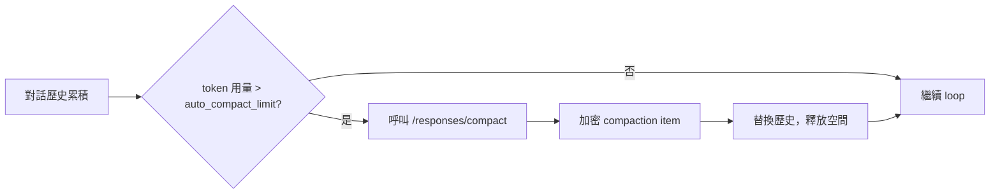

大多數人用 Codex CLI 時只看到「輸入一句話，然後 code 就出現了」。但在這個過程中，agent loop 其實已經跑了幾十次推理與工具呼叫。OpenAI 的 Michael Bolin 寫了一篇文章《Unrolling the Codex agent loop》，把這層黑盒子完整攤開。以下是核心內容的整理。

## Agent Loop 是什麼

每個 AI agent 的核心都是一個迴圈（loop）：

1. 收到用戶輸入
2. 組建 prompt（包含指令、工具定義、對話歷史）
3. 送給模型做推理（inference）
4. 模型回傳結果——可能是工具呼叫，也可能是最終回覆
5. 如果是工具呼叫：執行工具、把結果附加到 prompt，回到步驟 3
6. 如果是最終回覆：loop 結束，等待下一個用戶輸入

Bolin 的重點之一是：**agent 的「輸出」不只是 assistant message**。對一個 coding agent 而言，真正有價值的輸出是它在本機寫入或修改的程式碼，每個 turn 最後的 assistant message 只是標示「這一輪結束了」的信號。



一個「對話 turn」可以包含幾十次 inference-tool 循環，用戶看到的只是最終結果。

## Prompt 的三層結構

Codex 送給 Responses API 的 payload 有三個核心欄位：

**Instructions**：來自 `~/.codex/config.toml` 或模型專屬的內建設定檔，是靜態的系統層指令。

**Tools**：Codex 內建工具（shell 執行、檔案操作）+ Responses API 原生工具 + 用戶透過 MCP 掛載的工具。工具定義是 JSON schema，模型用來決定何時以及如何呼叫工具。

**Input**：對話歷史，包含 system、developer、user、assistant 角色的訊息，以及當前沙箱權限與專案 context。

API server 收到 payload 後，會重新排列成最終結構：system message → 工具定義 → instructions → input messages。這個順序對 prompt cache 命中率有直接影響（下面會提到）。

## Token 如何流動

推理的過程本質上是一個翻譯：

```
文字 prompt → 輸入 tokens → 模型取樣 → 輸出 tokens → 文字
```

因為 token 是逐個產生的，輸出可以 streaming 回傳，這就是為什麼 LLM 應用通常會顯示「打字機效果」。每個模型有一個固定的 **context window**——輸入與輸出 tokens 的總上限，這個限制是 agent loop 設計中最重要的約束之一。

## Context Window 管理：自動壓縮（Compaction）

隨著對話變長，累積的 tokens 會逼近 context window 上限。Codex 的解法是自動壓縮（auto compaction）：

- **觸發條件**：`auto_compact_limit` 設定值，當 token 用量超過閾值就自動觸發
- **壓縮端點**：專用的 `/responses/compact` endpoint，回傳可以直接替換歷史的摘要 items
- **加密保存**：壓縮結果以 `type=compaction` 的 item 存在，模型的「潛在理解」被保留，但原始訊息不再佔用 context

這個設計也支援 **Zero Data Retention（ZDR）** 客戶：因為是無狀態請求模型，伺服器不需要持久化原始對話，而加密的壓縮 item 仍可帶著模型的推理繼續跑。



## Prompt Cache 優化

每次 inference 都要送整個 prompt，如果能讓 server 重複使用之前計算過的部分（prompt cache hit），就可以從二次方成長壓到線性成長。Codex 的優化策略：

**靜態內容放最前面**：instructions、工具定義、沙箱設定這些不變的東西放 prompt 開頭，才能被 cache 住。

**MCP 工具排序**：MCP server 枚舉工具的順序如果不確定，每次都會不同，導致每個 request 都 cache miss。Codex 透過強制一致的工具排序解決這個問題——這是一個容易被忽略但影響很大的細節。

**效果**：「儘管 request payload 以二次方速度增長，模型取樣仍可維持線性時間」。

## 整體來說

Codex agent loop 的設計核心是幾個相互制衡的取捨：

- **autonomy vs. safety**：IDE 整合允許從「問答模式」到「全自主執行」的連續調節
- **stateless vs. continuity**：無狀態請求滿足合規需求，加密壓縮保留推理連貫性
- **context depth vs. cost**：auto compaction 讓長對話可行，prompt cache 讓它負擔得起

對想自己做 coding agent 的人來說，這篇文章最有價值的地方不是「Codex 怎麼實作」，而是**這些設計決策背後的原因**——context 管理不是可選功能，是讓 agent 能跑超過幾分鐘的必要條件。

## 參考資料

- [Unrolling the Codex agent loop — OpenAI](https://openai.com/index/unrolling-the-codex-agent-loop/)
- [Introducing Codex — OpenAI](https://openai.com/index/introducing-codex/)
- [Harness engineering: leveraging Codex in an agent-first world — OpenAI](https://openai.com/index/harness-engineering/)
- [OpenAI Responses API 文件](https://platform.openai.com/docs/api-reference/responses)
- [Codex CLI GitHub Repository](https://github.com/openai/codex)
