# Codex APP Master Guide: Comprehensive Practical Tutorials for Mastery

## TL;DR
This article will guide you through the steps to master Codex APP, with hands-on tutorials to help you quickly become proficient.

## Prerequisites
* Basic understanding of Codex APP
* Installed version of Codex APP
* Basic computer operation knowledge

## Steps
### Step 1: Installation and Login
First, you need to install Codex APP. You can download and install it from the App Store or Google Play Store. If you have already installed it, make sure you have logged in to your account.

### Step 2: Browsing the Homepage
After logging in, you will enter the Codex APP homepage, where you can find various tutorials and courses, including programming and data analysis.

### Step 3: Choosing a Tutorial
Select the tutorial that interests you and click to enter the tutorial page. Each tutorial has a detailed introduction and hands-on content.

### Step 4: Learning and Practicing
Start learning the tutorial, following the guide step by step to complete the practice. Each tutorial has actual code and data for you to practice.

### Step 5: Submitting Assignments
After completing the practice, you can submit your assignment, and Codex APP will evaluate and provide feedback.

## Complete Example
Here is a simple Python tutorial example:

```python
# Codex APP Python Tutorial Example
print("Hello, World!")
x = 5
y = 3
print(x + y)
```

## Frequently Asked Questions
* How to log in to Codex APP?
 + Make sure you have installed Codex APP, then click the login button and enter your account and password.
* How to submit assignments?
 + Complete the practice and click the submit button, and Codex APP will evaluate and provide feedback.

## References
* Codex APP Official Website: [https://www.codex.app/](https://www.codex.app/)
* Codex APP User Manual: [https://www.codex.app/docs/](https://www.codex.app/docs/)

## Technical Structure Diagram

```mermaid
graph LR
    A[Start] -->|"Installation and Login"| B(Install Codex APP)
    B -->|"Login Success"| C(Browse Homepage)
    C -->|"Browse Tutorials"| D(Choose Tutorial)
    D -->|"Enter Tutorial Page"| E(Learn and Practice)
    E -->|"Complete Practice"| F(Submit Assignment)
    F -->|"Submit Success"| G(Evaluate and Feedback)
    G -->|"Complete"| H(End)

    style A fill:#f9f,stroke:#333,stroke-width:2px
    style B fill:#f9f,stroke:#333,stroke-width:2px
    style C fill:#f9f,stroke:#333,stroke-width:2px
    style D fill:#f9f,stroke:#333,stroke-width:2px
    style E fill:#f9f,stroke:#333,stroke-width:2px
    style F fill:#f9f,stroke:#333,stroke-width:2px
    style G fill:#f9f,stroke:#333,stroke-width:2px
    style H fill:#f9f,stroke:#333,stroke-width:2px
```

