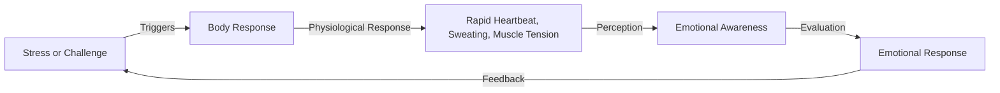

**The Emotional Alarm Mechanism: Why Trying to Calm Down Can Make You More Anxious**

## TL;DR
Having a bad emotional day doesn't mean you're a bad person; it means your body is sounding the alarm, reminding you to take care of yourself.

## What is it?
The emotional alarm mechanism refers to the physiological responses our body produces when we face stress, anxiety, or other negative emotions, including rapid heartbeat, sweating, and muscle tension. While these responses are meant to help us cope with danger or challenges, overthinking or suppressing them can worsen the situation.

## Why is it important?
The emotional alarm mechanism is crucial for our mental and physical well-being. Ignoring or suppressing our emotions can lead to long-term mental health issues, such as anxiety and depression. Understanding this mechanism can help us better manage our emotions, reducing stress and anxiety.

## How it works
The emotional alarm mechanism involves the following steps:

## Difference from Stress Management
Stress management involves techniques and strategies to reduce or control stress, such as deep breathing, exercise, and meditation. However, stress management often focuses on eliminating stress rather than understanding and addressing the root causes of emotions. The emotional alarm mechanism, on the other hand, emphasizes understanding and addressing the root causes of emotions to better manage stress and anxiety.

## Summary
The emotional alarm mechanism is a crucial concept that helps us understand and manage our emotions. By understanding this mechanism, we can better manage stress and anxiety, improving our mental and physical well-being. Suitable for those who want to better understand and manage their emotions.

## References
* [Ten Minutes of Psychology] Why Trying to Calm Down Can Make You More Anxious? Understanding the Emotional Alarm Mechanism - YouTube