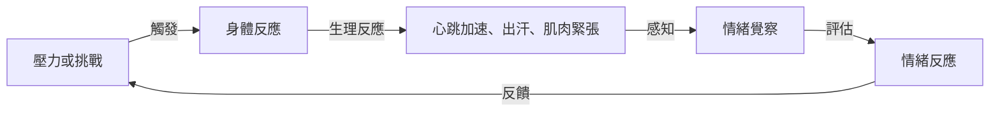

## TL;DR
越想冷靜反而越焦慮，是因為我們的身體在發出警報，提醒我們該好好照顧自己了。

## 是什麼，為什麼現在才出現
在我們的日常生活中，壓力和焦慮隨時都可能出現。然而，當我們試圖壓制或忽略這些情緒時，反而會使情況惡化。其實，這與我們的身體有關。當我們面臨壓力或挑戰時，身體會產生一系列的生理反應，包括心跳加速、出汗、肌肉緊張等。這些反應原本是為了幫助我們應對危險或挑戰，但是當我們過度思考或試圖壓制這些情緒時，反而會使情況惡化。

## 怎麼運作
情緒的警報器機制主要涉及以下幾個步驟：

這個機制可以幫助我們理解，為什麼越想冷靜反而越焦慮。當我們試圖壓制情緒時，身體會產生更多的生理反應，進而使情緒惡化。

## 跟壓力管理的差別
壓力管理是指通過各種技巧和策略來減少或控制壓力的方法，例如深呼吸、運動、冥想等。然而，壓力管理往往著重於消除壓力，而不是了解和處理情緒的根本原因。情緒的警報器機制則著重於理解和處理情緒的根本原因，從而更好地管理壓力和焦慮。

## 實際用起來怎麼樣
了解情緒的警報器機制，可以幫助我們更好地管理自己的情緒，減少壓力和焦慮。然而，這個機制也有一些限制。例如，當我們過度依賴於壓力管理技巧時，可能會忽略自己的情緒，進而使情況惡化。因此，重要的是要找到平衡，既要學會管理壓力，也要學會了解和處理自己的情緒。

我認為，了解情緒的警報器機制是一個非常重要的第一步。通過這個機制，我們可以更好地理解自己的情緒，進而更好地管理壓力和焦慮。然而，這也需要我們有意識地去實踐和應用這個機制。

## 參考資料

- [原始影片](https://www.youtube.com/watch?v=sZh0DhSXNQY)