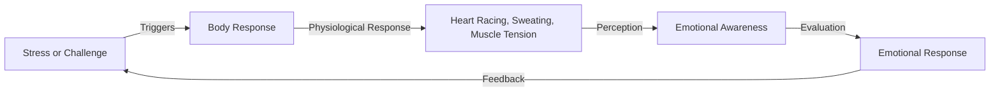

## TL;DR
The more you try to calm down, the more anxious you become. This is because your body is sounding the alarm, reminding you to take care of yourself.

## What is it and why is it happening now
Stress and anxiety can creep up on us at any moment in our daily lives. However, when we try to suppress or ignore these emotions, things only get worse. This is because our body is involved. When we face stress or challenges, our body triggers a series of physiological responses, including a racing heart, sweating, and muscle tension. These responses are meant to help us cope with danger or challenges, but when we overthink or try to suppress these emotions, things only get worse.

## How it works
The emotional alarm mechanism involves the following steps:

This mechanism helps us understand why the more we try to calm down, the more anxious we become. When we try to suppress our emotions, our body produces more physiological responses, making things worse.

## Difference from stress management
Stress management involves using various techniques and strategies to reduce or control stress, such as deep breathing, exercise, and meditation. However, stress management often focuses on eliminating stress rather than understanding and addressing the root cause of emotions. The emotional alarm mechanism, on the other hand, focuses on understanding and addressing the root cause of emotions, leading to better stress and anxiety management.

## How to apply it in practice
Understanding the emotional alarm mechanism can help us better manage our emotions, reducing stress and anxiety. However, this mechanism also has its limitations. For example, when we rely too heavily on stress management techniques, we may ignore our emotions, making things worse. Therefore, it's essential to strike a balance between managing stress and understanding and addressing our emotions.

I believe that understanding the emotional alarm mechanism is a crucial first step. Through this mechanism, we can better understand our emotions and manage stress and anxiety more effectively. However, this requires us to consciously practice and apply this mechanism.