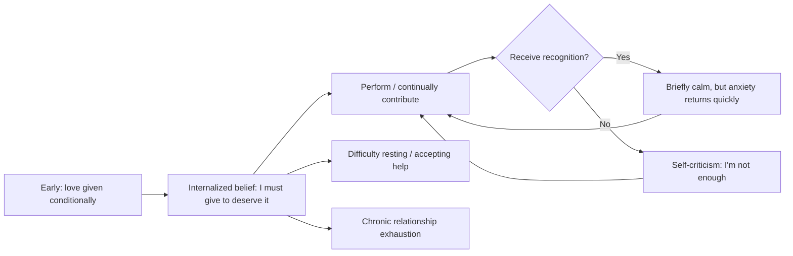

"I need to be good enough to be loved." "You'll stay because I'm useful to you." Have you ever quietly told yourself either of these things? Counseling psychologist Chou Mu-Tzu asked this question directly in one of her YouTube Shorts. It hit a nerve — because this belief is far more common, and far more damaging, than most people realize.

## TL;DR

- "Only those who contribute deserve love" is an internalized **conditional love** belief
- This belief ties self-worth to external performance, producing chronic anxiety and post-achievement emptiness
- Genuine self-worth (Self-Worth) is unconditional: it doesn't depend on achievements, contributions, or others' approval
- Breaking the pattern isn't about stopping effort — it's about shifting the motivation from "fear of losing love" to "genuine desire to give"

## What Is It

**Conditional love** means: love and approval are contingent — you do something, you receive love; you stop doing it, the love disappears.

When a child grows up receiving the message "Mommy loves you when you're good / when you get good grades / when you make Mommy happy," they slowly learn that **love is earned through performance, not something they already have**.

In adulthood, this pattern replicates across all kinds of relationships:
- At work: "I need to be useful enough or my colleagues won't respect me"
- In friendships: "I can't burden anyone or they'll stop liking me"
- In romantic relationships: "I need to take care of them well or they'll leave"

Chou Mu-Tzu's observation is that this isn't "being ambitious and caring" — it's **a fear-driven relationship strategy**.

## Why It Matters

Conditional love beliefs produce several persistent psychological effects:

**Chronic anxiety**: Because the standard for "enough" is vague and always theoretically raisable, genuine relaxation becomes impossible. Even when performing well, the underlying security is absent.

**Post-achievement emptiness**: After reaching a goal, instead of satisfaction, comes immediate anxiety: "What do I need to prove next?" The relief window is short.

**Difficulty accepting help**: If love is built on giving, receiving help (becoming someone who needs help) threatens the entire arrangement.

**Exhaustion and resentment in relationships**: Maintaining "being useful" is high-energy. Over time, relationships feel like obligations rather than connections.

## How It Works

The dynamic Chou Mu-Tzu describes:

This is a closed loop: no matter how much recognition arrives, the core insecurity doesn't resolve — because its fundamental logic is "I'm not inherently worthy; I need to earn it through performance."

## The Difference from Effort Itself

An important nuance: Chou Mu-Tzu isn't saying "stop trying" or "stop giving in relationships."

The difference is **motivation**:

| Motivation source | Behavior | Psychological state |
|-------------------|----------|---------------------|
| Fear of losing love | Effort and giving, but anxious | Persistent unease, depletion |
| Genuine desire to give | Effort and giving, with limits | Fulfillment, capacity to rest |

Shifting from "because I'm afraid of losing" to "because I genuinely want to give" — the output might look similar on the surface, but the internal experience is completely different. The first is obligation; the second is choice.

## Summary

The reason "I must contribute to deserve love" is so hard to dislodge is that it's packaged as a virtue: diligence, responsibility, caring for others. But its underlying logic is: **I'm not enough as I am; I need effort to compensate**.

Chou Mu-Tzu's view: genuine self-worth doesn't depend on performance. Not because of something you've done, but because you exist — that's sufficient for the right to be accepted and loved. This isn't about abandoning effort; it's about building effort on a foundation of security rather than fear.

Change doesn't happen from one sentence of "you're already good enough." But recognizing that the belief exists — that it's a pattern running underneath — is the first step toward loosening its grip.

## References

- [Do You Deserve Love Only If You Contribute? #周慕姿放心說](https://www.youtube.com/shorts/ZkHbH6VMInI)
- [Chou Mu-Tzu YouTube channel @muerstalk](https://www.youtube.com/@muerstalk)
