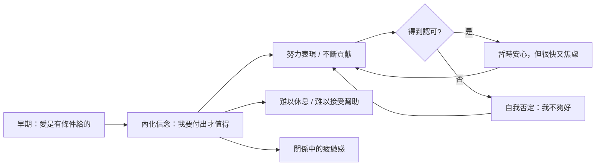

「我要夠優秀才值得被愛。」「我對你有用，你才會留下來。」這兩句話，你有沒有曾經對自己說過？諮商心理師周慕姿在她的 YouTube Short 裡直接問了這個問題。這個問題觸動很多人，因為這種信念比我們以為的更普遍，也比我們以為的更傷人。

## TL;DR

- 「有貢獻才值得被愛」是一種**條件式愛（Conditional Love）**的內化信念
- 這個信念讓人把自我價值和外在表現綁在一起，導致長期的焦慮和努力後的空虛
- 真正的自我價值（Self-Worth）是無條件的：不依附於成就、貢獻或他人的認可
- 打破這個信念不是「不努力」，而是把努力的動機從「恐懼失去愛」改成「真心想給予」

## 是什麼

**條件式愛**是指：愛或認可的發生是有條件的——你做了某件事，才得到愛；你停止做，愛就消失。

當一個孩子從小接受到的訊息是「你乖/你得高分/你讓媽媽開心，媽媽才愛你」，他會慢慢學到：**愛是用表現換來的，不是本來就有的**。

成年後，這個模式會複製到各種關係裡：
- 職場：「我要夠有用，同事才會尊重我」
- 友誼：「我不能麻煩別人，否則朋友會不喜歡我」
- 伴侶：「我得照顧好他/她，他/她才會留下來」

周慕姿的觀點是：這種信念不是「努力上進」，而是一種**以恐懼為動力的關係策略**。

## 為什麼重要

條件式愛的信念會產生幾個持久的心理後果：

**持續焦慮**：因為「夠不夠」的標準很模糊，而且總是可能做得更多，所以無法真正放鬆。即使表現很好，也很難感到安全。

**努力後的空虛感**：達到一個目標之後，不是滿足，而是立刻開始擔心「接下來我要怎麼證明自己？」

**難以接受幫助**：如果愛是建立在付出上，那麼接受幫助（變成「需要被幫助的人」）就威脅了這個地位。

**關係中的控制感和疲憊**：努力維持「有用」是一種高耗能的狀態。長期下來，關係變成了義務，而不是連結。

## 怎麼運作

周慕姿的分析把這個動態描述得很清楚：

這是一個封閉的迴路：不管得到多少認可，核心的不安全感不會消失，因為它的根本邏輯是「我本來不值得，我需要用表現去賺取」。

## 跟「努力本身」的差別

很重要的一點是：周慕姿並不是說「不要努力」或「不要在關係中付出」。

差別在於**動機**：

| 動機來源 | 表現 | 心理狀態 |
|---------|------|---------|
| 恐懼失去愛 | 努力付出，但焦慮 | 持續不安，耗竭 |
| 真心想給予 | 努力付出，有邊界 | 滿足，能夠休息 |

從「因為害怕失去」變成「因為真的想給」，付出的形式可能很像，但內在體驗截然不同。前者是義務，後者是選擇。

## 小結

「有貢獻才值得被愛」這個信念之所以難以撼動，是因為它被包裝成美德：努力、負責任、為他人著想。但它的底層邏輯是：**我本來不夠好，我需要用努力去彌補**。

周慕姿的觀點是：真正的自我價值感不依賴於表現。不是因為你做了什麼，而是因為你存在本身，就有被接受和被愛的資格。這不是放棄努力，而是把努力的根基從恐懼換成安全感。

改變不是一句「你本來就很好」就能完成的。但意識到這個信念存在，是開始鬆動它的第一步。

## 參考資料

- [有貢獻才值得被愛嗎？#周慕姿放心說](https://www.youtube.com/shorts/ZkHbH6VMInI)
- [周慕姿放心說 YouTube 頻道](https://www.youtube.com/@muerstalk)
