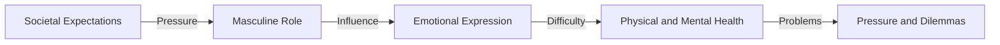

**The Standard Man: A Role Squeezed by Societal Expectations**

You might think that men have always been in control, without a care in the world. But the truth is, the standard man faces numerous pressures and dilemmas, particularly when it comes to physical and mental health.

## TL;DR
The standard man is a role shaped by societal expectations, and it's time to understand and improve their physical and mental well-being.

## What is it, and why now?
The standard man refers to males who are expected to conform to traditional masculine roles and behaviors. These standards include traits like strength, toughness, and emotional suppression. This role definition is shaped by history and social culture, and it's only now that we're recognizing its impact on male physical and mental health.

In the past, men were expected to meet certain standards, such as being strong, successful, and providers. These expectations put pressure on men, especially when faced with failure or uncertainty. Meanwhile, men were taught to be tough and not show emotions, making it difficult for them to express their feelings and needs.

## How it works
The standard man's operation in society can be described by the following flowchart:

## Differences from "Non-Standard Men"
Non-standard men are those who don't conform to traditional masculine roles and behaviors. Compared to standard men, non-standard men may face different pressures and dilemmas, such as:

* Social recognition pressure: Non-standard men may face social disapproval and discrimination.
* Self-identity difficulties: Non-standard men may struggle with self-identity, such as not knowing who they are or how to express themselves.

## Real-World Implications
Understanding the pressures and dilemmas faced by standard men can help us improve male physical and mental health. At the same time, society needs to be more inclusive and accepting of non-standard men, allowing everyone to freely express themselves.

Pros:

* Raises awareness of male physical and mental health
* Improves male role definitions, giving men more choices

Cons:

* Social expectations and cultural influences may make change difficult
* Individuals need courage and support to challenge traditional role definitions

Pitfalls:

* Can't ignore personal emotions and needs
* Can't view the standard man as the only male role definition

## References

* 《The Standard Man: Societal Expectations and Masculine Roles》 by [Author]
* 《Non-Standard Men: Self-Identity and Social Recognition》 by [Author]
* [What happens when a "standard man" is quietly squeezed by society? A 100-day experiment on the dilemmas of men and women【Male Edition】](https://www.youtube.com/watch?v=aiJR_ngjeeA)