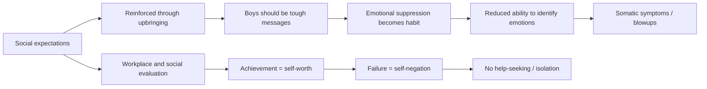

"Men need to be strong" — we've all heard it. But almost nobody seriously asks: what does that phrase actually cost the people it's directed at? An educational video that took 100 days to produce approached this question through data and psychology, and it resonated widely. Not because it was emotionally overwrought, but because it named things that rarely get discussed openly.

## TL;DR

- The "standard man" role is socially constructed around core demands: be strong, provide, suppress emotion
- Male mental health data is consistently worse than reported — low treatment rates mask, not reflect, the reality
- Emotional suppression isn't a personal choice; it's a conditioned reflex reinforced since childhood
- Men's social support networks are thinner than women's: male friendship is typically activity-based, not emotionally intimate
- Change doesn't require "dismantling masculinity" — it requires expanding the definition so more choices become available

## What Is It

The "standard man" isn't a person — it's a role script. The script has several core requirements:

**Provider**: Men should earn money and support the family. Even in households where both partners work, "how much a man earns" remains a central measure of social evaluation.

**Stoic strength**: Don't show weakness, don't cry, don't publicly express vulnerability. "Real men don't cry" rests on the logic that emotional expression signals unreliability.

**Protector**: The safety — physical and financial — of family and relationships is the man's responsibility to provide.

**Achiever**: Professional success is core to male identity. Unemployment or career failure often directly threatens a man's sense of self-worth.

These dimensions layer on top of each other to build the "standard man." Falling short on any one of them can trigger intense shame.

## Why It Matters

### The Mental Health Data Being Ignored

Men's depression treatment rates are far lower than women's — but this doesn't mean men experience depression less frequently. The more likely explanation is that men are taught emotions need suppressing, not processing. The result:

- Men account for a disproportionate majority of suicide deaths (roughly three times women's rate in most countries)
- Men more commonly turn to alcohol and substances to "manage" emotions rather than seeking counseling
- After relationship breakdowns, men often experience psychological collapse faster than women — because the relationship was frequently their only emotional support system

### The Isolation of "Men Don't Need to Talk"

The Harvard Study of Adult Development and other long-running research consistently finds that relationship quality is the single strongest predictor of longevity and psychological wellbeing. But male friendships typically center on activities — playing sports, drinking — rather than emotional intimacy.

When a man needs to talk, his support network may be very thin. Women typically have several close friends to confide in deeply. Many men have only their romantic partner. When that relationship ends, the entire support system collapses with it.

## How It Works

The pressure system's operating mechanism:

The amplification mechanism: suppressing emotions makes it harder to recognize your own emotional state, which makes it harder to seek help before pressure accumulates to a breaking point. This is a positive feedback loop that deepens over time.

## The Non-Standard Man

Men who don't fit the "standard man" script — those who prioritize family over career, who are emotionally open, who haven't "succeeded" professionally — face a different set of pressures:

- Peer skepticism ("He has no ambition")
- Partner's family judgment ("Can't he provide for her?")
- Internalized standards ("Am I not man enough?")

The problem isn't "standard man vs. non-standard man" and which is better — both are struggling in a system with very few options.

## Summary

The video's 100-day production investment paid off because it said things that are rarely said formally: men's pressure is real, men's pain is real, but the channels for expressing it and the social permission to do so have long been insufficient.

This isn't about competing with women's struggles over who has it harder — both genders carry their own structural burdens. But acknowledging that male struggles exist is the first step toward giving everyone more choices. Strength can be a choice rather than an obligation; emotional expression can be a form of strength rather than weakness.

## References

- [How Society Quietly Drains the "Standard Man" — 100-day gender explainer video (Male Edition)](https://www.youtube.com/watch?v=aiJR_ngjeeA)
- [EP361: The Male Predicament Nobody Wants to Discuss | Apple Podcasts](https://podcasts.apple.com/ca/podcast/ep361-%E7%94%B7%E4%BA%BA%E7%9A%84%E5%9B%B0%E5%A2%83-%E6%B2%92%E4%BA%BA%E6%83%B3%E8%AB%87-%E5%BE%9E-%E7%94%B7%E6%80%A7%E5%BB%A2%E9%80%80-%E7%9C%8B%E8%A6%8B%E9%9A%B1%E8%97%8F%E7%9A%84%E5%85%A8%E7%90%83%E5%8D%B1%E6%A9%9F-ft-%E9%99%B3%E6%9F%8F%E5%81%89/id1547950387?i=1000700086925)
