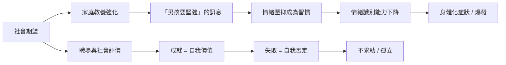

「男人要堅強」——這句話我們都聽過，但很少人認真問過：這句話到底要求男人付出什麼代價？一支花了 100 天製作的科普影片從資料和心理學角度梳理這個問題，觸動了很多人。不是因為它充滿煽情，而是因為它說出了一些很少被正式討論的事情。

## TL;DR

- 「標準男人」的角色定義是社會建構的，核心要求：強壯、供養、不表達情緒
- 男性的心理健康數據長期惡劣但被忽視：憂鬱低就醫率、自殺率比女性高三倍
- 情緒壓抑不是個人選擇，而是從小被強化的條件反射
- 男性的社會支持網絡比女性薄弱：友誼通常以活動為中心，而非情感交流
- 改變不需要「推翻男性氣概」，而是擴大定義，讓人有更多選擇

## 是什麼

「標準男人」不是一個人，而是一套角色腳本。這套腳本包含幾個核心要求：

**供養者（Provider）**：男人應該負責賺錢、養家。即使在雙薪家庭普遍的今天，「男人賺多少」仍然是社會評價的核心指標之一。

**堅強（Stoic Strength）**：不應該示弱，不應該哭泣，不應該公開表達脆弱。「男兒有淚不輕彈」的邏輯是：表達情緒等於不可靠。

**保護者（Protector）**：家庭和關係中的安全感由男性負責提供，包括物理安全和財務安全。

**成就者（Achiever）**：職業成功是男性身份認同的核心，失業或事業不順常常直接威脅一個男人的自我價值感。

這幾個維度疊加在一起，構成了「標準男人」——而任何一個維度上的缺失，都可能引發強烈的羞恥感。

## 為什麼重要

### 被忽視的心理健康數據

男性憂鬱的就醫率遠低於女性，但這不代表男性比較不憂鬱。更可能的解釋是：男性被教導情緒是需要壓抑的，而不是需要處理的。結果是：

- 男性在自殺死亡人數上佔大多數（多數國家約是女性的 3 倍）
- 男性更常用酒精和物質來「管理」情緒，而非尋求諮商
- 男性在感情關係破裂後的心理崩潰速度通常比女性快，因為關係往往是唯一的情感支持來源

### 「男人不用說」的孤立

心理學研究（包括哈佛成人發展研究）一再發現，人際關係的品質是長壽和心理健康的最重要預測因子。但男性的友誼通常是「活動型」的——一起打球、喝酒——而非「情感型」的。

當一個男人需要談心，他的支持網絡可能非常有限。女性通常有好幾個可以深談的朋友；很多男性只有伴侶一個人可以傾訴，而一旦感情破裂，整個支持系統也跟著崩塌。

## 怎麼運作

這套壓力系統的運作機制：

關鍵的放大機制是：壓抑情緒讓人更難識別自己的情緒狀態，而更難識別情緒狀態讓人更難在壓力累積到爆炸之前尋求幫助。這是一個正反饋迴路，越走越深。

## 跟「非標準男人」的差別

不符合「標準男人」腳本的男性——例如選擇以家庭為優先、在情感上比較開放、職業上沒有「成功」——面對的是另一種壓力：

- 來自同儕的質疑（「他沒有野心」）
- 來自伴侶家庭的評價（「養不起你嗎？」）
- 來自自己內化的標準（「我是不是不夠男人？」）

問題不是「標準男人 vs 非標準男人」誰比較好，而是兩種人都在一個選項很少的系統裡掙扎。

## 小結

這支花了 100 天製作的影片之所以引發討論，是因為它把一些長期「不被提起」的事情說出來了：男性的壓力是真實的，男性的痛苦是真實的，但說出來的管道和社會允許的空間長期不足。

這不是在比較「男性比女性更苦」——兩性都有各自的結構性困境。但承認男性困境的存在，是讓每個人都有更多選擇的第一步。強壯可以是選擇，而不是義務；情感表達可以是力量，而不是軟弱。

## 參考資料

- [一個「標準男人」，是如何被社會悄悄榨乾的？耗時100天，我做了個兩性困境科普【男性篇】](https://www.youtube.com/watch?v=aiJR_ngjeeA)
- [EP361 男人的困境，沒人想談？從《男性廢退》看見隱藏的全球危機 | Apple Podcasts](https://podcasts.apple.com/ca/podcast/ep361-%E7%94%B7%E4%BA%BA%E7%9A%84%E5%9B%B0%E5%A2%83-%E6%B2%92%E4%BA%BA%E6%83%B3%E8%AB%87-%E5%BE%9E-%E7%94%B7%E6%80%A7%E5%BB%A2%E9%80%80-%E7%9C%8B%E8%A6%8B%E9%9A%B1%E8%97%8F%E7%9A%84%E5%85%A8%E7%90%83%E5%8D%B1%E6%A9%9F-ft-%E9%99%B3%E6%9F%8F%E5%81%89/id1547950387?i=1000700086925)
