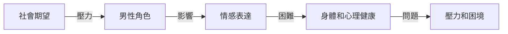

**標準男人：被社會期望悄悄榨乾的角色**

你可能會覺得，男人一直是社會的主宰者，不需要擔心任何事情。但事實上，標準男人也面臨著許多壓力和困境，尤其是在身體和心理健康方面。

## TL;DR
標準男人是被社會期望所塑造的角色，需要理解和改善其身體和心理健康。

## 是什麼，為什麼現在才出現
標準男人是指那些被社會期待符合傳統男性角色和行為標準的男性。這些標準包括了強壯、堅強、不表現情感等特質。這種角色定義是由歷史和社會文化所塑造的，現在才出現是因為我們開始意識到這種角色定義對男性身體和心理健康的影響。

在過去，男性被期待要達到某些標準，例如要強壯、要成功、要能夠提供給家人。這些期望會對男性造成壓力，尤其是在面對失敗或不確定性時。同時，男性被教導要堅強，不要表現情感，這使得他們難以表達自己的感受和需求。

## 怎麼運作
標準男人在社會中的運作，可以用以下的流程圖來描述：

## 跟「非標準男人」的差別
非標準男人是指那些不符合傳統男性角色和行為標準的男性。與標準男人相比，非標準男人可能會面臨不同的壓力和困境，例如：

* 社會認可的壓力：非標準男人可能會面臨社會的不認可和歧視。
* 自我認同的困難：非標準男人可能會面臨自我認同的困難，例如不知道自己是誰，或者不知道如何表達自己。

## 實際用起來怎麼樣
了解標準男人面臨的壓力和困境，可以幫助我們改善男性身體和心理健康。同時，社會也需要更加包容和認可非標準男人，讓每個人都能夠自由表達自己。

優點：

* 提高男性身體和心理健康的意識
* 改善男性角色定義，讓男性有更多的選擇

限制：

* 社會期望和文化影響可能會使得改變困難
* 個人需要勇氣和支持來挑戰傳統角色定義

踩坑點：

* 不能忽略個人的情感和需求
* 不能將標準男人視為唯一的男性角色定義

## 參考資料

* 《標準男人：社會期望和男性角色》 by [作者]
* 《非標準男人：自我認同和社會認可》 by [作者]
* [一個「標準男人」，是如何被社會悄悄榨乾的？耗時100天，我做了個兩性困境科普【男性篇】](https://www.youtube.com/watch?v=aiJR_ngjeeA)