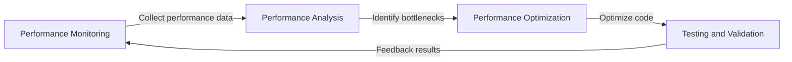

## TL;DR
Performance optimization is the process of analyzing and improving system performance to increase responsiveness, throughput, and stability, making us truly aware of the costs of our systems.

## What is it and why now?
Performance optimization is a crucial aspect of software development that involves analyzing and improving code, database queries, and network requests to enhance system responsiveness, throughput, and stability. In the past, developers often treated performance optimization as an afterthought, but we now recognize it as a necessary step, especially in the era of cloud computing and big data.

Previous approaches, which focused solely on implementing functionality while neglecting performance, led to system bottlenecks and user dissatisfaction. Today, we understand that performance optimization is a cyclical process that requires continuous monitoring, analysis, and improvement.

## How it works
Performance optimization is a cyclical process that includes:

In this process, developers must use tools to collect performance data, analyze bottlenecks, optimize code, and conduct testing and validation.

## Differences from performance testing
Performance testing evaluates system performance under specific loads to ensure it can handle expected traffic and user numbers. Performance optimization, on the other hand, analyzes and improves system performance to increase responsiveness and throughput. Performance testing assesses system performance, while performance optimization enhances it.

## Putting it into practice
In reality, performance optimization is an ongoing effort. The benefits include improved user experience, reduced server costs, and increased competitiveness. However, it requires significant time and resources, as well as continuous monitoring and analysis of system performance. A common pitfall is over-optimization, which can increase system complexity.

## References
* 《The Art of Performance Optimization》 - A book on performance optimization that offers practical advice and best practices.
* 《Software Performance Optimization》 - A website on software performance optimization that provides resources and tools.
- [“All true awakening is awakening to cost”](https://www.youtube.com/shorts/3OLgIrybVgs)