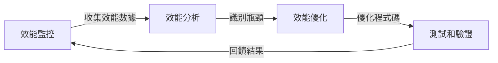

## TL;DR
效能優化是一種透過分析和改進系統的效能，提高反應速度、吞吐量和穩定性的過程，讓我們真正意識到系統的代價。

## 是什麼，為什麼現在才出現
效能優化是軟體開發中的關鍵環節，透過分析和改進程式碼、資料庫查詢、網路請求等方面的效能，提高系統的反應速度、吞吐量和穩定性。以前，開發者往往將效能優化放在最後，認為這是一個可選的步驟，但現在，我們意識到效能優化是一個必須的步驟，尤其是在雲端計算和大數據時代。

過去的替代方案，如只關注功能的實現，忽略了系統的效能，導致了系統的瓶頸和使用者的不滿。現在，我們意識到效能優化是一個循環的過程，需要不斷地監控、分析和改進系統的效能。

## 怎麼運作
效能優化是一個循環的過程，包括：

在這個過程中，開發者需要使用工具收集效能數據，分析瓶頸，優化程式碼，並進行測試和驗證。

## 跟效能測試的差別
效能測試是評估系統在特定負載下的效能，通常是為了確保系統能夠承受預期的流量和使用者數量。效能優化則是透過分析和改進系統的效能，提高系統的反應速度和吞吐量。效能測試是評估系統的效能，效能優化是改進系統的效能。

## 實際用起來怎麼樣
實際上，效能優化是一個需要不斷努力的過程。優點是可以提高使用者體驗、減少伺服器成本和增強競爭力。限制是需要投入大量的時間和資源，需要不斷地監控和分析系統的效能。踩坑點是需要避免過度優化，導致系統的複雜性增加。

在實踐中，我們需要注意以下幾點：

*   監控和分析系統的效能，識別瓶頸和優化目標。
*   使用工具和技術來優化程式碼和資料庫查詢。
*   進行測試和驗證，以確保優化的效果。
*   不斷地迭代和改進，保持系統的效能最佳。

## 參考資料

*   《效能優化的藝術》 - 一本關於效能優化的書籍，提供了許多實用的建議和最佳實踐。
*   《軟體效能優化》 - 一個關於軟體效能優化的網站，提供了許多資源和工具。
*   ["所有真正的覺醒，是對於代價的覺醒"](https://www.youtube.com/shorts/3OLgIrybVgs)