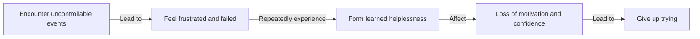

## TL;DR
Learned helplessness is a psychological state that makes you feel like your efforts are meaningless, resulting from past experiences.

## What is it and why is it a thing now
Learned helplessness is a psychological concept that describes the feeling of powerlessness that develops when an individual faces uncontrollable events or outcomes. This feeling leads to a loss of motivation and confidence, causing individuals to give up trying. The concept was introduced by Martin Seligman in 1972, initially to describe the behavior patterns of animals in uncontrollable environments. Later, it was applied to human psychology to explain why some people, despite having the ability and resources, choose to "give up" and abandon their goals and dreams.

## How it works
The formation of learned helplessness typically involves the following process:

This process shows that when individuals face uncontrollable events or outcomes, they feel frustrated and failed. Repeatedly experiencing this situation leads to the formation of learned helplessness, making individuals believe that their actions have no effect on the outcome. This feeling results in a loss of motivation and confidence, ultimately causing individuals to give up trying.

## Difference from self-efficacy
Self-efficacy refers to an individual's confidence and assessment of their own abilities. Both learned helplessness and self-efficacy are important psychological factors that influence motivation and behavior, but the key differences are:
*  Learned helplessness is a learned feeling of powerlessness resulting from past experiences, whereas self-efficacy is an individual's confidence and assessment of their own abilities.
*  Learned helplessness leads to a loss of motivation and confidence, whereas self-efficacy can enhance motivation and self-confidence.

## How to apply it in real life
Learned helplessness is a psychological state that needs attention, especially for individuals who have the ability but lack motivation and confidence. Understanding the concept and mechanism of learned helplessness can help us better understand ourselves and others, and take effective strategies to enhance self-efficacy and achieve personal growth. However, learned helplessness is a stubborn state that requires long-term effort and support to overcome. Therefore, individuals need a strong support network, including family, friends, and mental health professionals, to effectively overcome learned helplessness.

## References
*   Seligman, M. E. P. (1972). Learned helplessness. Annual Review of Medicine, 23(1), 407-422.
*   Bandura, A. (1997). Self-efficacy: The exercise of control. New York: Freeman.
*   [能力不差卻只想躺平？你可能陷入習得性無助｜Ft.劉軒](https://www.youtube.com/watch?v=yfN_pEn5dNs)