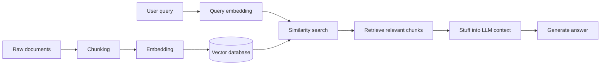
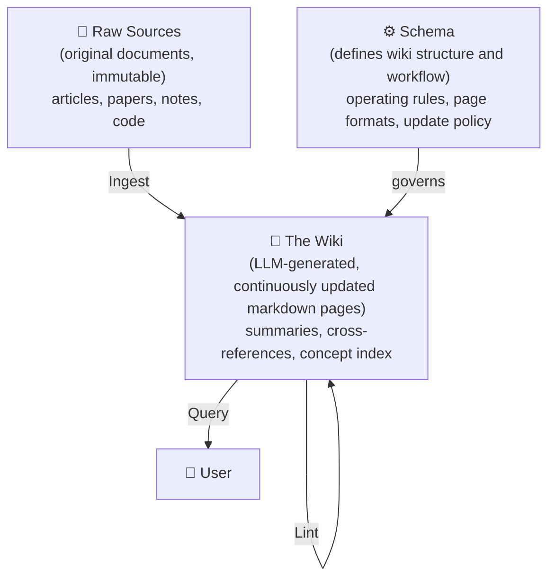

RAG (Retrieval-Augmented Generation) has been the industry's default answer for years now: chunk your documents, vectorize them, and at query time find the relevant chunks and stuff them into the context. It solves the "the LLM doesn't know your private data" problem—but it doesn't solve another one: **knowledge is static**. Every query starts from scratch, there are no links between documents, and the system doesn't get smarter the more you use it.

In April 2026, Andrej Karpathy proposed a different direction in a GitHub Gist: the LLM Wiki. The core claim is to have the LLM **actively build and continuously maintain a structured knowledge base**, rather than passively answering each individual query. This isn't a minor improvement over RAG—it fundamentally replaces the assumption of "how a knowledge system should work."

## The Limits of Traditional RAG

The standard RAG pipeline looks like this:



Every query is independent. The vector database only remembers "which pieces of text are similar to this query"—it doesn't remember "what relationships exist between those pieces."

This brings several concrete problems:

**Weak cross-document reasoning**: "How does this error relate to that incident three months ago?" RAG can find the individually relevant chunks, but it struggles to connect them and reason across them.

**No compounding effect**: You asked a great question today and the system produced a great answer, but that answer vanishes tomorrow—next time it has to be recomputed from scratch.

**Semantic fragmentation from chunking**: Slice a long document into 512-token chunks and a lot of context disappears at the boundaries. Vector similarity finds chunks that are "literally similar," not necessarily the chunks that are "logically most relevant."

**Scale sensitivity**: RAG performs fine when there aren't many documents, but once you hit thousands, recall starts to drop and noise increases.

## The Core Architecture of the LLM Wiki

Karpathy's architecture has three layers:



**Raw Sources** is the immutable fact layer. Original articles, papers, conversation logs, and code all live here; the LLM only reads, never writes.

**The Wiki** is the knowledge layer. After reading in the Raw Sources, the LLM actively generates and maintains these markdown pages: creating entries for each important concept, writing cross-document summaries, and marking the relationships between concepts. These pages update as new data arrives—they aren't generated once and then frozen.

**Schema** defines how the wiki grows: what page types exist, what format each page type uses, and under what circumstances which pages get updated. This is the skeleton of the system.

## Three Core Operations

### Ingest

When new data comes in, the LLM doesn't just chunk it and store it in the vector database—it actively asks: "Which existing wiki pages does this data affect? Are there new concept entries that need to be created? Does anything contradict the older data?"

```mermaidgraph TD

sequenceDiagram
  participant S as Raw Source (new document)
  participant L as LLM
  participant W as The Wiki

  S->>L: New document arrives
  L->>W: Read relevant existing pages
  W-->>L: Current knowledge state
  L->>L: Decide: add page / update page / flag conflict
  L->>W: Write or update markdown page
```

This process accumulates the relationships between pieces of knowledge, rather than just piling up data.

### Query

At query time, the LLM reads wiki pages, not chunks of raw documents. Because wiki pages are already curated knowledge, the context quality is far higher than RAG's fragmented chunks. For questions that require cross-concept reasoning, you can first look up the wiki index to find relevant pages, then read into them more deeply.

### Lint

A health check run periodically or on demand. The LLM scans the wiki and finds: outdated content (a newer source has come in but the wiki wasn't updated), orphaned pages (not referenced by any other page), and places where concept definitions are inconsistent. This lets the knowledge base self-heal.

## LLM Wiki vs RAG: The Fundamental Differences

| Dimension | Traditional RAG | LLM Wiki |
|------|----------|----------|
| Form of knowledge | Chunks of raw documents + vectors | Markdown pages curated by the LLM |
| Cross-document relationships | Indirectly linked via vector similarity | Explicit cross-references and concept index |
| Compounding effect | None (recomputed every query) | Yes (the wiki grows over time) |
| Update method | Re-embed the entire document | Only update the affected wiki pages |
| Query quality | Heavily affected by chunking strategy | Affected by wiki quality |
| Build cost | Low (just embed) | High (an LLM runs on every ingest) |
| Maintenance complexity | Low | Medium (you have to design a schema) |
| Suitable scale | Tens to hundreds of documents | Hundreds and up (where compounding really shows) |

At a scale of around 100 articles and 400,000 words, Karpathy's wiki noticeably beat an equivalent-scale RAG system on both Query accuracy and speed. The key reason: **wiki pages are "digested knowledge," not "fragments of raw data."**

## When Should You Use an LLM Wiki?

**Good fits:**

- Knowledge sources accumulate continuously (a blog, research notes, technical docs) and you want the system to get smarter the more you use it
- You need cross-document reasoning: "What's the relationship between concept A and concept B?", "How has the perspective on this problem evolved across different periods?"
- The knowledge base exceeds a few hundred documents and RAG's recall has already started to disappoint you
- You have the resources to design a schema and absorb the LLM cost of every ingest

**Poor fits:**

- The documents are static and rarely updated (a one-shot RAG is enough)
- You need to query the very latest data in real time (the LLM Wiki's ingest has latency)
- You're resource-constrained and can't afford to run an LLM every time new data arrives
- The knowledge base is small (tens of documents)—RAG is already plenty

A practical rule of thumb: **if you find yourself asking the knowledge system more and more of the same kind of question but having to re-explain the background each time, the LLM Wiki is a direction worth considering.**

## The State of Community Implementations

After the Gist was published, discussion took off quickly, and the community already has 50+ implementations:

- **OmegaWiki**: a full three-operation pipeline implemented in Python + the Claude API
- **SwarmVault**: a multi-agent collaborative wiki, with different agents responsible for different subject domains
- **WeKnora**: integrates Obsidian as the wiki's storage backend

The main challenge right now is **schema design**: there's no standard for wiki page formats, different knowledge domains need different structures, and this part relies heavily on manual design. Karpathy's own schema hasn't been fully published yet.

## Overall

The LLM Wiki solves a problem RAG never set out to solve: **making machine-assisted knowledge management compound over time**. RAG is "go look it up when you have a question"; the LLM Wiki is "keep the knowledge curated continuously, so when you ask a question you can find the answer fast."

For personal knowledge bases, technical documentation systems, and long-term research notes, this direction has a lot of potential. For real-time querying and one-off Q&A, RAG remains the lighter-weight choice.

The two aren't mutually exclusive—a more realistic direction may be to use the LLM Wiki as a preprocessing layer for RAG: first let the LLM curate the knowledge, then use vector search for precise pinpointing.

## References

- [LLM Wiki — Andrej Karpathy (GitHub Gist)](https://gist.github.com/karpathy/442a6bf555914893e9891c11519de94f)
- [karpathy.ai/llmwiki](https://karpathy.ai/llmwiki)
- [Beyond RAG: How Andrej Karpathy's LLM Wiki Pattern Builds Knowledge That Actually Compounds](https://levelup.gitconnected.com/beyond-rag-how-andrej-karpathys-llm-wiki-pattern-builds-knowledge-that-actually-compounds-31a08528665e)
- [OmegaWiki — community implementation](https://github.com/skyllwt/OmegaWiki)
