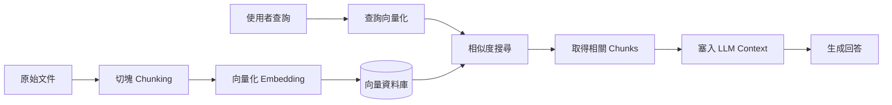
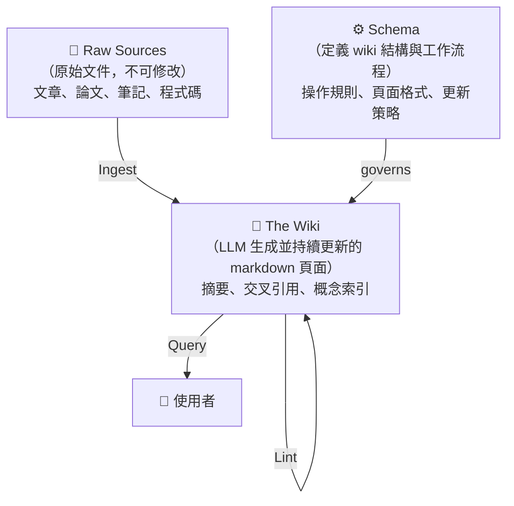

RAG（Retrieval-Augmented Generation）已經是業界標準答案好幾年了：把文件切塊、向量化、查詢時找相關 chunk 塞進 context。它解決了「LLM 不知道你的私有資料」這個問題，但它沒有解決另一個問題：**知識是靜態的**。每次查詢都從零開始，文件之間沒有連結，系統不會因為你使用得越多而變得越聰明。

2026 年 4 月，Andrej Karpathy 在一份 GitHub Gist 裡提出了一個不同的方向：LLM Wiki。核心主張是，讓 LLM **主動建構並持續維護一個結構化知識庫**，而不是被動地回答每一次查詢。這不是對 RAG 的小幅改進，而是從根本換掉了「知識系統應該怎麼運作」的假設。

## 傳統 RAG 的侷限

RAG 的標準流程是這樣的：



每次查詢都是獨立的。向量資料庫只記得「哪些文字片段跟這個查詢相似」，不記得「這些片段之間有什麼關係」。

這帶來幾個具體問題：

**跨文件推理弱**：「這個錯誤跟三個月前的那個 incident 有什麼關係？」RAG 找得到個別相關的 chunk，但很難把它們連起來推理。

**沒有累積效應**：你今天問了一個很好的問題，系統得到了一個很好的答案，但這個答案明天就消失了，下次還要重新計算。

**切塊帶來的語意破碎**：一份長文件切成 512 token 的塊，很多上下文會在邊界消失。向量相似度找到的是「字面上像」的 chunk，不一定是「邏輯上最相關」的 chunk。

**規模敏感**：文件少的時候 RAG 表現還好，但文件量到幾千份之後，recall 開始下降，噪訊增加。

## LLM Wiki 的核心架構

Karpathy 提出的架構分三層：



**Raw Sources** 是不可修改的事實層。原始文章、論文、對話紀錄、程式碼都放在這裡，LLM 只讀不寫。

**The Wiki** 是知識層。LLM 讀入 Raw Sources 之後，主動生成並維護這些 markdown 頁面：為每個重要概念建立條目、寫跨文件摘要、標記概念之間的關係。這些頁面會隨著新資料進來而更新，不是生成一次就凍結。

**Schema** 定義 wiki 怎麼長：有哪些頁面類型、每種頁面的格式是什麼、什麼情況下要更新哪些頁面。這是系統的骨架。

## 三個核心操作

### Ingest

新資料進來時，LLM 不只是把它切塊存進向量資料庫，而是主動問：「這份資料影響了哪些現有的 wiki 頁面？有沒有需要新增的概念條目？有沒有跟舊資料矛盾的地方？」

```mermaidgraph TD

sequenceDiagram
  participant S as Raw Source（新文件）
  participant L as LLM
  participant W as The Wiki

  S->>L: 新文件進來
  L->>W: 讀取相關現有頁面
  W-->>L: 現有知識狀態
  L->>L: 判斷：新增頁面 / 更新頁面 / 標記衝突
  L->>W: 寫入或更新 markdown 頁面
```

這個過程會累積知識之間的關係，而不只是堆資料。

### Query

查詢時，LLM 讀的是 wiki 頁面，不是原始文件的 chunk。因為 wiki 頁面已經是經過整理的知識，context 品質比 RAG 的碎片 chunk 高很多。對於需要跨概念推理的問題，可以先查 wiki 索引找到相關頁面，再深入讀取。

### Lint

定期或按需執行的健康檢查。LLM 掃描 wiki，找出：過時的內容（有更新的 source 進來但 wiki 沒更新）、孤立的頁面（沒有被其他頁面引用）、概念定義不一致的地方。這讓知識庫能夠自我修復。

## LLM Wiki vs RAG：根本差異

| 維度 | 傳統 RAG | LLM Wiki |
|------|----------|----------|
| 知識形式 | 原始文件切塊 + 向量 | LLM 整理過的 markdown 頁面 |
| 跨文件關係 | 靠向量相似度間接連結 | 明確的交叉引用與概念索引 |
| 累積效應 | 無（每次查詢重新計算） | 有（wiki 隨時間增長） |
| 更新方式 | 重新 embed 整份文件 | 只更新受影響的 wiki 頁面 |
| 查詢品質 | 受 chunk 切法影響大 | 受 wiki 品質影響 |
| 建構成本 | 低（embed 即可） | 高（每次 ingest 都要跑 LLM） |
| 維護複雜度 | 低 | 中（需要設計 schema） |
| 適合規模 | 幾十到幾百份文件 | 幾百份以上（複利效應才顯著） |

Karpathy 的 wiki 在約 100 篇文章、40 萬字的規模下，Query 的準確度和速度都明顯優於同等規模的 RAG 系統。關鍵原因是：**wiki 頁面是「已消化的知識」，而不是「原始資料的碎片」**。

## 什麼時候該用 LLM Wiki？

**適合的情況：**

- 知識來源持續累積（部落格、研究筆記、技術文件），且你希望系統越用越聰明
- 需要跨文件推理：「A 概念和 B 概念的關係是什麼」、「這個問題在不同時期的觀點有什麼演變」
- 知識庫規模超過幾百份文件，RAG 的 recall 已經開始讓你不滿意
- 你有資源設計 schema 並承擔每次 ingest 的 LLM 成本

**不適合的情況：**

- 文件是靜態的、不常更新（用一次性 RAG 就夠了）
- 需要即時查詢最新資料（LLM Wiki 的 ingest 有延遲）
- 資源受限，無法承擔每次新資料進來都跑 LLM 的成本
- 知識庫小（幾十份文件），RAG 已經夠用

一個實用的判斷標準：**如果你發現自己對知識系統問的同類問題越來越多、但每次都要重新解釋背景，LLM Wiki 是值得考慮的方向。**

## 社群實作現況

Gist 發布後迅速引發討論，社群已有 50+ 個實作：

- **OmegaWiki**：以 Python + Claude API 實作完整的三操作流程
- **SwarmVault**：多 agent 協作的 wiki，不同 agent 負責不同主題領域
- **WeKnora**：整合 Obsidian 作為 wiki 的儲存後端

目前的主要挑戰是 **schema 設計**：wiki 頁面格式沒有標準，不同的知識領域需要不同的結構，這部分高度依賴人工設計。Karpathy 本人的 schema 還沒有完整公開。

## 整體來說

LLM Wiki 解決的是一個 RAG 從來沒有打算解決的問題：**讓機器輔助的知識管理隨時間複利**。RAG 是「有問題就去查」，LLM Wiki 是「持續把知識整理好，問問題時才能快速找到答案」。

對於個人知識庫、技術文件系統、長期研究筆記，這個方向很有潛力。對於即時查詢、一次性問答，RAG 仍然是更輕量的選擇。

這兩者不是非此即彼——更現實的方向可能是把 LLM Wiki 作為 RAG 的前處理層：先讓 LLM 整理好知識，再用向量搜尋做精準定位。

## 參考資料

- [LLM Wiki — Andrej Karpathy (GitHub Gist)](https://gist.github.com/karpathy/442a6bf555914893e9891c11519de94f)
- [karpathy.ai/llmwiki](https://karpathy.ai/llmwiki)
- [Beyond RAG: How Andrej Karpathy's LLM Wiki Pattern Builds Knowledge That Actually Compounds](https://levelup.gitconnected.com/beyond-rag-how-andrej-karpathys-llm-wiki-pattern-builds-knowledge-that-actually-compounds-31a08528665e)
- [OmegaWiki — 社群實作](https://github.com/skyllwt/OmegaWiki)
