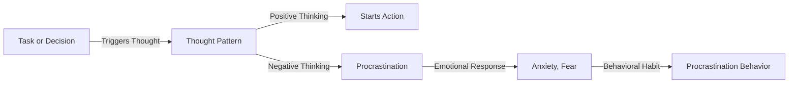

# Understanding the Truth Behind Procrastination

## TL;DR
Knowing the truth about procrastination can help you overcome it effectively.

## What is Procrastination
Procrastination is a psychological phenomenon where an individual intentionally or unintentionally delays starting or completing a task or decision. It is a common problem that affects many people's work, studies, and daily life.

## Why is it Important
Procrastination can lead to missed opportunities, decreased self-confidence, reduced work efficiency, and lower quality of life. Understanding the truth about procrastination can help you overcome it, increasing productivity and quality of life.

## How it Works
Procrastination is often related to an individual's thought patterns, emotions, and behavioral habits. The following is the procrastination process:

## Difference from Laziness
Procrastination is different from laziness. Laziness is the lack of motivation and enthusiasm, while procrastination is the intentional or unintentional delay in starting or completing a task. Laziness is a personality trait, whereas procrastination is a behavioral pattern in specific situations.

## Summary
Understanding the truth about procrastination can help you overcome it effectively. This is suitable for those who often procrastinate, lack motivation, and enthusiasm. By changing thought patterns, emotions, and behavioral habits, you can increase productivity and quality of life.

## References
* "The Truth About Procrastination: Why We Always Put Things Off Until the Last Minute" - TED Talk
* "5 Steps to Overcome Procrastination" - Medium article