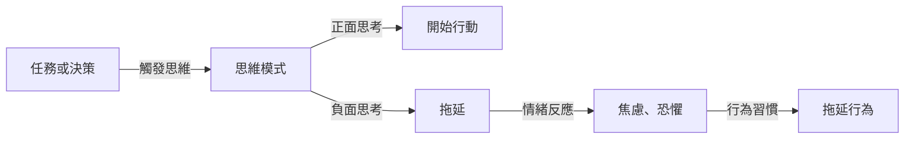

## TL;DR
懂得拖延症背後的真相，能夠有效克服拖延。

## 是什麼，為什麼現在才出現
拖延症是一種心理學現象，指的是個體在面臨任務或決策時，刻意或無意地延遲開始或完成的行為。它是一種常見的問題，影響著許多人的工作、學習和生活。以前，人們常把拖延症歸咎於缺乏動力或懶惰，但事實上，拖延症是一種複雜的行為模式，涉及思維模式、情緒和行為習慣。

## 怎麼運作
拖延症的產生，通常與個體的思維模式、情緒和行為習慣有關。以下是拖延症的運作流程：

## 跟 懶惰 的差別
拖延症與懶惰不同，懶惰是指缺乏動力和熱情，而拖延症是指刻意或無意地延遲開始或完成任務。懶惰是個體的性格特徵，而拖延症是個體在特定情境下的行為模式。懶惰的人可能會完全不想做事，而拖延症的人可能會一直想做事，但就是做不下去。

## 實際用起來怎麼樣
了解拖延症的真相，能夠有效克服拖延。下面是一些實際的方法：

* 改變思維模式：當你出現負面思考時，嘗試用正面思考取代它。
* 情緒管理：當你感受到焦慮或恐懼時，嘗試用深呼吸或運動來管理情緒。
* 行為習慣改變：當你發現自己正在拖延時，嘗試馬上開始行動。

但是，克服拖延症不是一件容易的事，它需要時間和努力。另外，拖延症可能是其他心理問題的徵狀，如焦慮症或抑鬱症，因此如果你發現自己的拖延症嚴重影響你的生活，請求助於專業的心理學家。

## 參考資料

- [原始影片](https://www.youtube.com/shorts/sWBKLUdzn98)