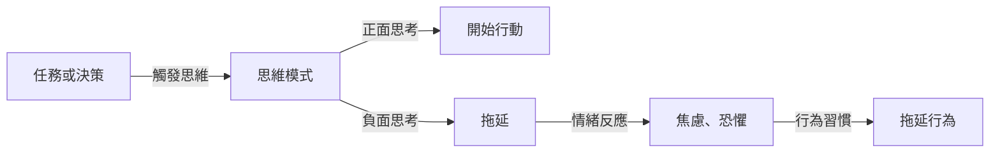

# 了解拖延症背後的真相

## TL;DR
懂得拖延症的真相，能夠有效克服拖延。

## 是什麼
拖延症是一種心理學現象，指的是個體在面臨任務或決策時，刻意或無意地延遲開始或完成的行為。它是一種常見的問題，影響著許多人的工作、學習和生活。

## 為什麼重要
拖延症會導致個體錯失重要機會、影響自信心、降低工作效率和生活質量。了解拖延症的真相，能夠有效克服拖延，提高生產力和生活質量。

## 怎麼運作
拖延症的產生，通常與個體的思維模式、情緒和行為習慣有關。以下是拖延症的運作流程：

## 跟 懶惰 的差別
拖延症與懶惰不同，懶惰是指缺乏動力和熱情，而拖延症是指刻意或無意地延遲開始或完成任務。懶惰是個體的性格特徵，而拖延症是個體在特定情境下的行為模式。

## 小結
了解拖延症的真相，能夠有效克服拖延。適合那些常常拖延、缺乏動力和熱情的人。通過改變思維模式、情緒和行為習慣，能夠提高生產力和生活質量。

## 參考資料
* 《拖延症：為什麼我們總是把事情拖到最後一刻？》 - TED Talk
* 《克服拖延症的 5 個步驟》 - Medium 文章
- [懂這個道理的人，不可能有拖延症](https://www.youtube.com/shorts/sWBKLUdzn98)