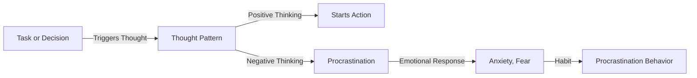

## TL;DR
Understanding the truth behind procrastination can help you overcome it effectively.

## What is it and why is it a problem now
Procrastination is a psychological phenomenon where an individual intentionally or unintentionally delays starting or completing a task or decision. It's a common problem that affects many people's work, learning, and life. While people often attribute procrastination to lack of motivation or laziness, it's actually a complex behavior pattern involving thought patterns, emotions, and habits.

## How it works
Procrastination typically arises from an individual's thought patterns, emotions, and habits. Here's a flowchart illustrating the process:

## The difference between procrastination and laziness
Procrastination is distinct from laziness. Laziness refers to a lack of motivation and enthusiasm, whereas procrastination involves intentionally or unintentionally delaying a task or decision. Laziness is a personality trait, while procrastination is a behavior pattern in specific situations. A lazy person might not want to do anything, whereas someone with procrastination might want to do the task but can't get started.

## Putting it into practice
Understanding the truth about procrastination can help you overcome it. Here are some practical methods:

* Change your thought pattern: When you notice negative thinking, try replacing it with positive thinking.
* Manage your emotions: When you feel anxious or fearful, try deep breathing or exercise to manage your emotions.
* Change your habits: When you catch yourself procrastinating, try starting the task immediately.

However, overcoming procrastination isn't easy; it takes time and effort. Additionally, procrastination might be a symptom of other psychological issues like anxiety or depression. If you find that your procrastination severely affects your life, seek help from a professional psychologist.