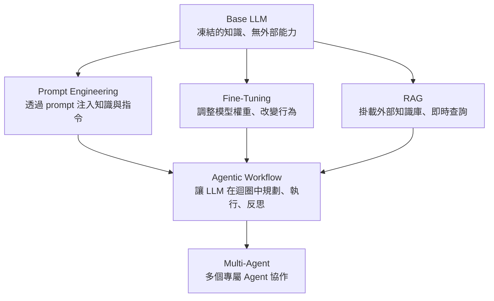
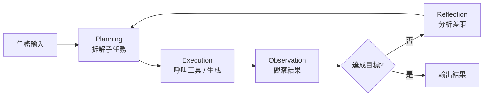
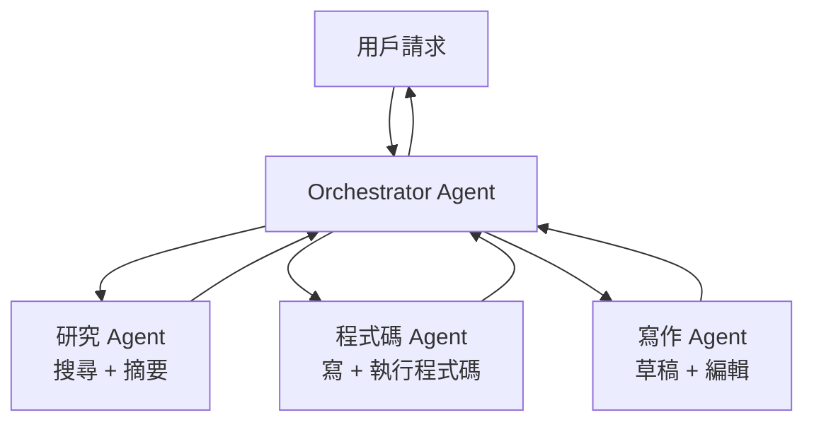

AI Builder 最常遇到的困境不是技術太難，而是術語太多、框架太雜，搞不清楚每個技術在解決什麼問題、自己現在該學哪個。Stanford 的「Beyond LLM」課程提供了一張清晰的技術地圖，從 base model 的本質限制出發，一路到 Agentic Workflow 與 Multi-Agent 的系統設計。這篇是課程核心的整理，讀完你會知道每個技術解什麼痛點、什麼時候用。

## LLM 的限制與縱軸思維

要理解為什麼需要 Prompt Engineering、RAG、Fine-Tuning，先搞清楚 base model 本身的限制：

- **知識截止**：訓練資料有截止日期，不知道最新發生的事
- **無法存取外部資源**：無法查資料庫、呼叫 API、執行程式碼
- **無持久記憶**：每次對話獨立，無法記住跨會話的上下文
- **行為不可預測**：預訓練模型沒有特定任務的對齊，回應品質不穩定

解法的思路是**縱軸疊加**：不是換一個更聰明的模型，而是在既有模型上面一層一層加能力。



## 三種強化單一 LLM 的工具

### Prompt Engineering

最快的起點。在 prompt 裡給模型需要的一切：指令、背景、範例、限制。

適合用在：
- 任務定義明確、有固定輸出格式
- 需要快速迭代、不想動模型權重
- 知識量小、可以直接塞進 context window

不適合的情況：
- 需要的知識遠超 context window 大小
- 任務需要模型「學會」某種風格或領域行為，不只是「照指令做」

幾個核心技巧：
- **Few-shot**：給 2–5 個輸入輸出範例，比只給指令更穩定
- **Chain of Thought**：要求模型「逐步思考」，對推理型任務效果顯著
- **System prompt 分層**：角色定義、任務說明、格式要求分開寫，避免混亂

### Fine-Tuning

直接修改模型的權重，讓它「天生就是」為特定任務設計的。

適合用在：
- 需要模仿特定風格或語氣（品牌聲音、法律文件格式）
- Prompt Engineering 撞到上限，回應品質不穩定
- 高頻率、低延遲的場景（fine-tuned 模型 prompt 可以更短）

代價：
- 需要標記好的訓練資料（通常數百到數千筆）
- 有計算成本與時間成本
- 每次更新知識要重新 fine-tune

Fine-Tuning 解決的是**行為問題**，不是**知識問題**。如果模型缺乏最新知識，Fine-Tuning 不是正確的解法——那是 RAG 的工作。

### RAG（Retrieval-Augmented Generation）

把外部知識庫接進 LLM，查詢時動態取回相關片段塞進 prompt。

```mermaid
graph LR
  User --> Retriever: 提問
  Retriever --> VectorDB: embed + 相似度搜尋
  VectorDB --> Retriever: Top-K 相關文件片段
  Retriever --> LLM: 問題 + 相關片段 → 生成答案
  LLM --> User: 有根據的答案
```

解決的問題：知識截止、知識量太大塞不進 context、知識需要頻繁更新。

**RAG vs Fine-Tuning 怎麼選**：

| | RAG | Fine-Tuning |
|--|-----|-------------|
| 知識更新頻率 | 隨時可更新 | 需重新訓練 |
| 回答可溯源 | 可以附上原始文件 | 難以追溯 |
| 適合解決 | 知識問題 | 行為問題 |
| 前期成本 | 建向量庫 | 標記訓練資料 |

兩者也可以同時用：Fine-Tuning 修行為，RAG 補知識。

## Agentic Workflow 系統設計

單次 prompt-response 解決不了複雜任務。Agentic Workflow 的核心是讓 LLM 在**迴圈**中運作：規劃 → 執行 → 觀察 → 反思 → 繼續。

四個基本 Pattern：

**Reflection（反思）**：LLM 生成初稿後，再呼叫一次 LLM 對初稿做批評和改善。實作簡單但效果顯著，尤其對寫作、程式碼審查類任務。

**Tool Use（工具呼叫）**：LLM 決定何時呼叫哪個工具（搜尋、計算機、資料庫、API），並把工具回傳的結果整合進回答。打破了 LLM 的孤島狀態。

**Planning（規劃）**：把複雜任務拆解成子任務，生成執行計畫。可以是靜態的（一次規劃到底）或動態的（執行中根據結果調整計畫）。

**Memory（記憶）**：
- Short-term：當前對話的 context window
- Long-term：持久化儲存（向量庫、資料庫），跨對話可取回



## 評估系統與客服 Agent 實作

Agent 比 prompt 更難除錯，因為錯誤會在多步驟中累積。課程用客服 Agent 做了示範：

**客服 Agent 的流程**：
1. 理解用戶意圖，分類到對應流程（退款、查訂單、技術問題）
2. RAG 查詢相關政策或知識庫
3. 生成回覆草稿
4. 評估系統檢查（是否符合政策、語氣是否合適）
5. 通過才送出，否則重新生成

**LLM-as-Judge 評估**：用另一個 LLM 作為評審，針對特定標準（準確性、完整性、語氣）對輸出打分。比人工評估可擴展，比規則評估更靈活。

評估維度的例子：
- **Correctness**：回答有沒有事實錯誤
- **Groundedness**：回答是否有根據（對 RAG 系統特別重要）
- **Helpfulness**：對用戶問題有沒有實際幫助
- **Safety**：有沒有違反政策或產生有害內容

## Multi-Agent 與學習路線

當一個 Agent 需要同時具備太多能力，效果往往不如讓多個專屬 Agent 合作。

**Orchestrator + Worker 模型**：
- Orchestrator（指揮）：理解整體目標、分配任務、彙整結果
- Worker（執行）：各司其職，每個只做一件事



**學習路線建議**（課程整理）：

1. **Prompt Engineering** → 入門必學，掌握 few-shot、CoT、system prompt 結構
2. **RAG** → 大多數 AI 應用都需要，先搞懂 chunking、embedding、retrieval
3. **Fine-Tuning** → 當 RAG + Prompt 撞到上限再考慮
4. **Agentic Workflow** → 從單一工具呼叫開始，再加 Reflection，再加 Planning
5. **Multi-Agent** → 複雜系統才需要，先把單一 Agent 做好

整體原則：**從最簡單的方案開始，遇到明確的上限才往下一層走**。過早引入 Fine-Tuning 或複雜的 Multi-Agent 只會增加系統脆弱性。

## 參考資料

- [Stanford Beyond LLM 課程影片（Gary Chen 整理）](https://www.youtube.com/watch?v=eKW9ITaltWw)
- [Stanford CS329A: Self-Improving AI Agents](https://cs329a.stanford.edu/)
- [Agentic AI: A Progression of Language Model Usage（Stanford Webinar）](https://www.youtube.com/watch?v=kJLiOGle3Lw)
- [Chain-of-Thought Prompting Elicits Reasoning in LLMs（論文）](https://arxiv.org/abs/2201.11903)
- [RAG: Retrieval-Augmented Generation for Knowledge-Intensive NLP Tasks（論文）](https://arxiv.org/abs/2005.11401)
