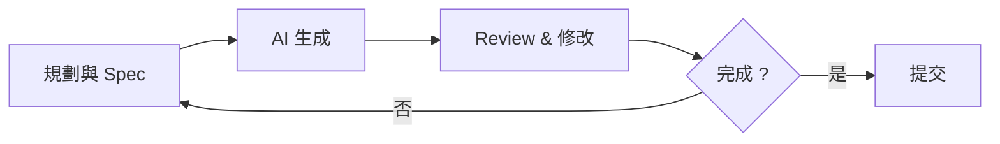
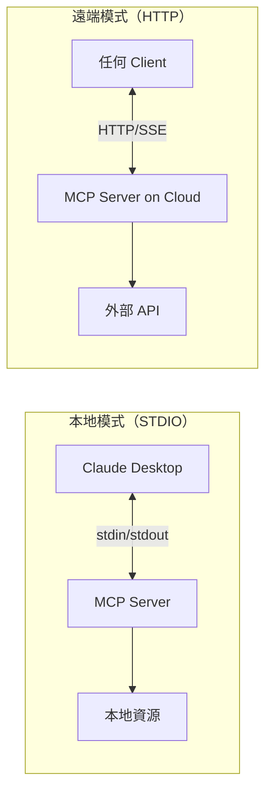
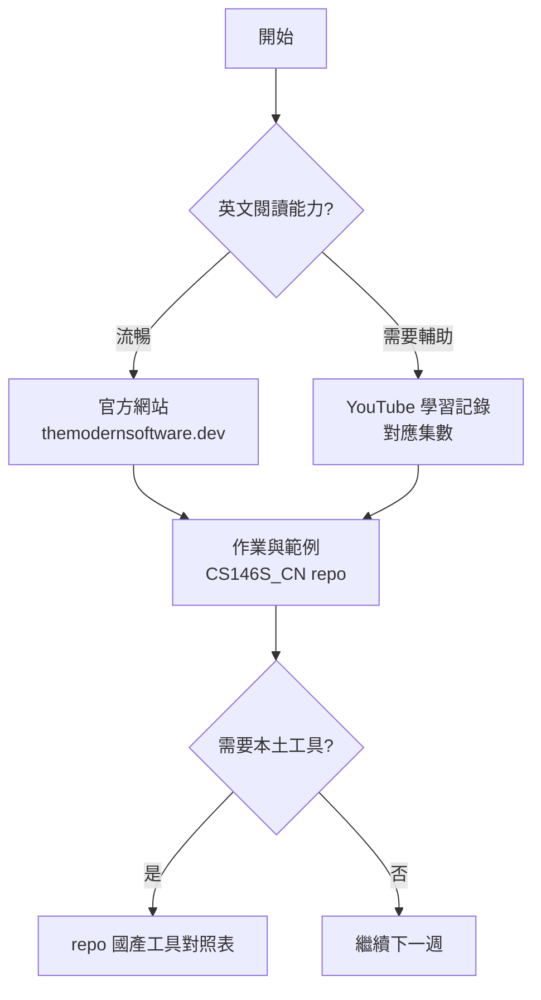

軟體工程師的工作方式正在被 AI 重新定義，但大多數討論停在工具比較或 demo 展示，少有系統性的課程從頭梳理這場轉變。Stanford 在 2025–2026 學年推出的 [CS146S: The Modern Software Developer](https://themodernsoftware.dev/) 填補了這個缺口——它是第一門從課程設計角度把「AI 驅動開發」整合進工程師技能樹的正式課程。

這篇整理三個互補的學習資源：官方課程網站、[中文版社群 repo](https://github.com/ShouZhengAI/CS146S_CN)、以及一位中文創作者 ShouZheng 的 [CS146S 學習記錄播放清單](https://www.youtube.com/playlist?list=PLXM8k1EWy5kiP5eyA9fam2gpndjonpWlr)。三者合在一起，構成目前華語世界最完整的 vibe coding 入門路徑。

## 核心概念：Vibe Coding

課程的核心方法論叫 **vibe coding**，不是一個工具，而是一種工作流：



傳統的「從零開始寫程式碼」變成「規劃 → AI 生成 → 修改 → 反覆」。工程師的核心能力從打字速度轉移到：知道要做什麼、能審查什麼、知道哪裡會壞。

這不是說工程知識變得不重要，而是它的表現形式改變了。Spec 寫得好不好、context 給得準不準、哪裡需要人介入——這些判斷力才是瓶頸。

## 課程架構

CS146S 是 10 週課程，每週一個主題，有實作作業和業界嘉賓。先修要求是 CS111 等級的程式能力，建議但不強制要求 CS221/229（ML 基礎）。

評分結構：最終專案 80%、每週作業 15%、課堂參與 5%——重心很明確放在做出東西。

| 週次 | 主題 | 業界嘉賓 |
|------|------|---------|
| Week 1 | LLM 基礎 + Prompt Engineering | — |
| Week 2 | Coding Agent 架構 + MCP | — |
| Week 3 | AI IDE + Context 管理 | Silas Alberti（Cognition Research Lead）|
| Week 4 | Coding Agent Patterns + Claude Code | Boris Cherney（Claude Code 創建者）|
| Week 5 | 現代 Terminal | Zach Lloyd（Warp CEO）|
| Week 6 | AI 測試與安全 | Isaac Evans（Semgrep CEO）|
| Week 7 | 程式碼 Review 與文件 | Tomas Reimers（Graphite CPO）|
| Week 8 | 自動化 UI 與快速原型 | Gaspar Garcia（Vercel AI Research Lead）|
| Week 9 | Post-Deployment Agent | Mayank Agarwal & Milind Ganjoo（Resolve）|
| Week 10 | AI 軟體工程的未來 | Martin Casado（a16z General Partner）|

## 逐週核心內容與程式碼

### Week 1：Prompting 基礎與四個 Pattern

Week 1 從 LLM 的本質開始——不是工具操作而是原理：token prediction 是什麼、base model 為什麼不夠用、有效 prompting 的邏輯。作業直接用 Ollama 跑本地模型，動手實作四個 prompting pattern。

**Chain of Thought**：要求模型逐步思考，對推理任務效果顯著。作業範例是讓模型解模數算術題：

```python
from ollama import chat

SYSTEM_PROMPT = """
You are a math expert. Think step by step.
"""
USER_PROMPT = """
Solve this, give final answer as "Answer: <number>".
What is 3^{12345} (mod 100)?
"""

response = chat(
    model="llama3.1:8b",
    messages=[
        {"role": "system", "content": SYSTEM_PROMPT},
        {"role": "user", "content": USER_PROMPT},
    ],
    options={"temperature": 0.3},
)
```

**Few-shot Prompting**：在 prompt 裡放 2–5 個輸入輸出範例，讓模型學到「格式」而不只是指令。經典測試：讓模型反轉字母順序，`http → ptth`——few-shot 範例能顯著提升一致性。

**Tool Calling**：讓 LLM 決定何時呼叫哪個工具，並把工具結果整合回答。作業用 JSON schema 定義工具，模型生成呼叫指令，再由框架執行：

```python
def execute_tool_call(tool_name: str, args: dict):
    tools = {
        "list_function_return_types": output_every_func_return_type,
    }
    if tool_name in tools:
        return tools[tool_name](**args)
    raise ValueError(f"Unknown tool: {tool_name}")

# 系統提示要求模型回傳固定 JSON 格式
SYSTEM_PROMPT = """
When you need to call a tool, respond ONLY with JSON:
{"tool": "<tool_name>", "args": {<arguments>}}
"""
```

**Reflexion**：最有趣的 pattern。生成初稿 → 測試失敗 → 把失敗資訊餵回給模型讓它反思並修正，形成自我改進迴圈：

```python
def run_reflexion_flow(system_prompt: str, max_iterations: int = 5):
    code = generate_initial_function(system_prompt)
    for _ in range(max_iterations):
        func = load_function_from_code(code)
        passed, failures = evaluate_function(func)
        if passed:
            return code                          # 測試全過，停止
        # 把失敗資訊回饋給模型
        reflection_context = build_reflexion_context(code, failures)
        code = apply_reflexion(reflection_context)
    return code
```

作業的測試場景是「密碼驗證函數」：要求長度 ≥8、含大小寫、數字、特殊字元。Reflexion 讓模型在沒有人介入的情況下，看著自己的測試失敗逐步修正實作。

### Week 2：Coding Agent 與第一個 MCP Server

Week 2 進入 Coding Agent 的內部架構——Cursor 等 AI IDE 底層在做什麼。作業是用 Cursor 打造一個 FastAPI + SQLite 的 **action item 提取器**，整合 Ollama 實現 LLM 驅動的語意提取：

```python
# app/services/extract.py
from ollama import chat
import json

async def extract_action_items_llm(text: str) -> list[str]:
    response = chat(
        model="llama3.1:8b",
        messages=[
            {
                "role": "system",
                "content": (
                    "Extract action items from the text. "
                    "Return a JSON array of strings. "
                    "Each item should be a clear, actionable task."
                ),
            },
            {"role": "user", "content": text},
        ],
        format="json",
        options={"temperature": 0.1},
    )
    return json.loads(response.message.content)
```

關鍵學習點：作業要求用 Cursor 完成所有五個 TODO，並在 `writeup.md` 記錄每個步驟用的 prompt——培養「prompt 意識」而不是只看結果。

[MCP（Model Context Protocol）](https://modelcontextprotocol.io/) 是這週的核心概念，解決的問題是：AI IDE 怎麼存取外部資料（資料庫、API、本地文件）。兩種傳輸模式：



### Week 3：自己動手建 MCP Server

Week 3 的作業是選一個外部 API（天氣、GitHub、Notion、金融等），包裝成有至少兩個工具的 MCP server。用 [`fastmcp`](https://github.com/jlowin/fastmcp) 的最小實作大概長這樣：

```python
from mcp.server.fastmcp import FastMCP
import httpx

mcp = FastMCP("weather-server")

@mcp.tool()
async def get_current_weather(city: str, units: str = "celsius") -> dict:
    """Get current weather for a city."""
    async with httpx.AsyncClient() as client:
        resp = await client.get(
            "https://api.openweathermap.org/data/2.5/weather",
            params={"q": city, "units": units, "appid": OPENWEATHER_API_KEY},
        )
        resp.raise_for_status()
        data = resp.json()
    return {
        "city": city,
        "temp": data["main"]["temp"],
        "condition": data["weather"][0]["description"],
    }

@mcp.tool()
async def get_forecast(city: str, days: int = 3) -> list[dict]:
    """Get weather forecast for up to 5 days."""
    ...

if __name__ == "__main__":
    mcp.run()   # STDIO 模式，可直接被 Claude Desktop 發現
```

連接 Claude Desktop 只需在 `claude_desktop_config.json` 加一段：

```json
{
  "mcpServers": {
    "weather": {
      "command": "python",
      "args": ["/path/to/server/main.py"]
    }
  }
}
```

加分項目：部署到 Vercel 或 Cloudflare Workers（遠端 HTTP 模式），或實作 OAuth2 Bearer Token 驗證。

Week 3 這週的關鍵洞察：**context 的品質決定 AI 生成的品質**。嘉賓 Silas Alberti（Cognition，Devin 背後的公司）分享的重點是——在 IDE 裡寫好 PRD 和 spec 不是「文件工作」，而是工程工作本身，因為這就是你在跟 AI 溝通需求。

### Week 4：Claude Code 的三個核心功能

Week 4 由 [Claude Code](https://claude.ai/code) 的創建者 Boris Cherney 來上課，作業要求打造 **2 個以上自動化工作流**，使用三種 Claude Code 功能的任意組合：

**1. CLAUDE.md — 專案背景注入**

放在 repo 根目錄，Claude Code 每次啟動自動載入。結構：

```markdown
# 專案背景
這是一個 FastAPI + SQLite 的筆記管理 API。

## 架構
- `backend/app/main.py` — FastAPI 入口
- `backend/app/routers/` — 路由模組
- `backend/app/services/extract.py` — LLM 邏輯

## 開發規範
- 新 endpoint 必須有對應測試
- 所有 DB 操作走 `app/db.py`，不要直接操作 SQLite
- 提交前執行 `pre-commit run --all-files`

## 安全邊界
- 不要修改 `migrations/` 下的既有 SQL
- 環境變數讀自 `.env`，不要 hardcode
```

**2. Custom Slash Commands — 可重用工作流**

在 `.claude/commands/` 放 Markdown 檔，用 `/` 觸發。例如 `/test-with-coverage`：

```markdown
# .claude/commands/test-with-coverage.md
Run the full test suite with coverage report.

Steps:
1. Run `pytest --cov=app --cov-report=term-missing`
2. If coverage < 80%, identify uncovered lines and suggest tests
3. Output a summary table of coverage by module
```

或 `/sync-api-docs`，讓 Claude Code 掃描所有 route 並更新 `API.md`——確保文件永遠跟程式碼同步。

**3. SubAgents — 角色分工**

把一個複雜任務拆給多個專屬 Agent：

```mermaid
sequenceDiagram
  participant Developer as 開發者
  participant Orchestrator as 工作管理員
  participant TestAgent as 測試代理
  participant CodeAgent as 代碼代理
  Note over Developer,Orchestrator: 實作搜尋功能
  Developer->>Orchestrator: 
  Note over Orchestrator,TestAgent: 先寫失敗的測試
  Orchestrator->>TestAgent: 
  TestAgent->>Orchestrator: tests/test_search.py
  Note over Orchestrator,CodeAgent: 根據測試實作 GET /notes?q=
  Orchestrator->>CodeAgent: 
  CodeAgent->>Orchestrator: routers/notes.py 已更新
  Note over Orchestrator,TestAgent: 跑測試、確認通過
  Orchestrator->>TestAgent: 
  TestAgent->>Orchestrator: 4/4 passed
  Note over Orchestrator,Developer: 完成，PR ready
  Orchestrator->>Developer: 
  Note over Developer,Orchestrator: 完成，PR ready
  Developer->>Orchestrator: 
  Note over
```

這個 Test → Code → Verify 的 SubAgent 循環對應的是 TDD，差別是人的角色從「寫測試的人」變成「定義完成標準的人」。

### Week 5：現代 Terminal

[Warp](https://www.warp.dev/) CEO Zach Lloyd 講 AI 強化的命令列。Warp 的核心設計是「Blocks」——每個命令的輸入輸出是獨立可操作的單元，可以直接把某個 block 的輸出傳給 AI 詢問，也可以用自然語言描述想做的事讓 Warp 生成命令：

```bash
# 傳統方式：要記住 jq 語法
curl -s api/logs | jq '.[] | select(.level=="error") | .message'

# Warp AI 方式：用意圖描述
# "show me only error messages from the API logs"
# → Warp 生成上面那行
```

這週的深層主題是：terminal 作為工程師的主要工作環境，它的 AI 整合方式跟 IDE 的整合方式不同——terminal 更接近「即興操作」，IDE 更接近「結構化開發」，兩者互補。

### Week 6：安全不能 vibe

AI 生成的程式碼有特定的漏洞模式。[Semgrep](https://semgrep.dev/) CEO Isaac Evans 這週講的是 safe vibe coding——速度快不代表安全，AI 生成的程式碼跟人寫的程式碼有一樣的責任。

幾個 AI 生成常見的風險點：

```python
# AI 容易生成這種危險的查詢（SQL Injection）
query = f"SELECT * FROM users WHERE name = '{user_input}'"

# 應該要這樣
query = "SELECT * FROM users WHERE name = ?"
cursor.execute(query, (user_input,))
```

課程建議的工作流：用 Semgrep 規則掃描 AI 生成的程式碼，再搭配 AI 生成的測試組合覆蓋邊界條件——讓 AI 同時也是自己的第一道審查員。

### Week 7–8：Review、文件與 UI 原型

Week 7 是 code review 和智能文件，[Graphite](https://graphite.dev/) CPO 帶來 PR 工作流的第一線視角。核心論點：PR 不是程式碼審查的終點，而是起點——AI 可以在 push 前就做預審查，讓人的 review 聚焦在架構決策而非語法問題。

Week 8 是 UI 原型快速生成，[Vercel](https://vercel.com/ai) 的 AI Research Lead 講 design democratization。Vercel 的 v0 讓工程師能在幾分鐘內從自然語言描述生成可用的 React component，這週的問題是：當 UI 的生成成本趨近於零，什麼能力還值錢？答案是——知道什麼是好的 UX，以及能審查生成結果是否真的可用。

### Week 9–10：部署之後

Week 9 轉向 post-deployment——monitoring、observability、自動化事故處理。Resolve 的兩位創辦人帶來的核心問題：vibe coding 讓上線變快，但 production 系統的 mean time to recovery（MTTR）並不會因此自動變短。AI Agent 的新角色是偵測到異常後能先跑 runbook、縮小影響範圍，再通知人類介入。

Week 10 由 a16z GP [Martin Casado](https://a16z.com/author/martin-casado/) 收尾，討論軟體工程師角色在 AI 時代的走向。Casado 的論點：軟體的邊際成本下降不代表工程師需求下降，而是「哪種工程師值錢」的答案在改變——能定義問題、設計系統邊界、評估 AI 輸出的人，比只能執行的人更稀缺。

## 中文資源：CS146S_CN

[ShouZhengAI/CS146S_CN](https://github.com/ShouZhengAI/CS146S_CN) 是這門課的中文化社群版本，目前 1.2k stars。除了翻譯課程材料，repo 還有一個值得注意的部分：**國產 AI 編程工具對照表**，這是原版課程裡看不到的本土化視角：

| 工具 | 提供商 | 定價 | IDE 整合 |
|------|--------|------|---------|
| GLM-4.6 Coding | 智譜 | ¥20/月 | VS Code |
| Kimi K2 Thinking | Moonshot | ¥49/月 | 多 IDE |
| Doubao-Seed-Code | ByteDance | ¥9.9–49.9 | VS Code |
| DeepSeek-Coder | DeepSeek | 免費模型 | API |
| Qwen3-Coder-Flash | Alibaba | 免費模型 | API |

CLI 工具清單也比原版更全，額外列出了 RA.Aid、CodeSelect、vibe-cli 等在中文社群常見的工具。

## 學習記錄影片：逐集導覽

ShouZheng 的 [CS146S 學習記錄](https://www.youtube.com/playlist?list=PLXM8k1EWy5kiP5eyA9fam2gpndjonpWlr) 是跟課的實況，不是課程翻譯——每集的價值是一個實際跟課的工程師視角，哪裡看不懂、哪個概念有趣、作業怎麼解。

重點集數：

- **[ep1](https://www.youtube.com/playlist?list=PLXM8k1EWy5kiP5eyA9fam2gpndjonpWlr)**：AI 對軟體工程師的影響 + LLM 基本介紹
- **[ep5](https://www.youtube.com/playlist?list=PLXM8k1EWy5kiP5eyA9fam2gpndjonpWlr)**：Coding Agent 原理——Cursor 等工具底層在做什麼
- **[ep6](https://www.youtube.com/playlist?list=PLXM8k1EWy5kiP5eyA9fam2gpndjonpWlr)**：MCP 是什麼、怎麼做——附帶 server 實作
- **[ep8](https://www.youtube.com/playlist?list=PLXM8k1EWy5kiP5eyA9fam2gpndjonpWlr)**：AI IDE 原理 + 如何寫 spec
- **[ep10](https://www.youtube.com/playlist?list=PLXM8k1EWy5kiP5eyA9fam2gpndjonpWlr)**：自動化 AI Agent 工作流管理
- **[ep12](https://www.youtube.com/playlist?list=PLXM8k1EWy5kiP5eyA9fam2gpndjonpWlr)**：打造自動化開發工作流 + context file 效果論文分享
- **[ep13](https://www.youtube.com/playlist?list=PLXM8k1EWy5kiP5eyA9fam2gpndjonpWlr)**：打造 AI 開發工具的 7 個產品原則

## 怎麼用這三個資源



三個資源的分工：
- **themodernsoftware.dev** → 課程大綱、官方作業、閱讀材料
- **YouTube 學習記錄** → 中文解說、跟課視角、作業解題思路
- **CS146S_CN repo** → 作業原始碼、中文翻譯材料、本土工具對照

如果時間有限，Week 1–4 是核心（LLM → Agent → MCP → Claude Code），Week 6 的安全週不要跳過，其他週視專案需求選讀。

## 整體來說

CS146S 的價值不在於教你用哪個工具，而在於提供一個完整的思維框架：AI 驅動開發的生命週期從哪裡開始、哪裡結束、每個階段的核心問題是什麼。

從作業設計看得出刻意安排：Week 1 用 Ollama 跑本地模型體驗 prompting 的本質，Week 2–3 自己建 Agent 和 MCP server 了解工具底層，Week 4 用 Claude Code 自動化自己的開發流程，後半段轉向系統可靠性和產品思維。這條路徑設計的前提是：工具你可以之後再挑，但思維框架越早建立越好。

## 參考資料

- [CS146S: The Modern Software Developer（官方課程網站）](https://themodernsoftware.dev/)
- [CS146S 學習記錄（YouTube 播放清單）](https://www.youtube.com/playlist?list=PLXM8k1EWy5kiP5eyA9fam2gpndjonpWlr)
- [ShouZhengAI/CS146S_CN（GitHub 中文版 repo）](https://github.com/ShouZhengAI/CS146S_CN)
- [Model Context Protocol（MCP）官方文件](https://modelcontextprotocol.io/)
- [fastmcp — Python MCP server framework](https://github.com/jlowin/fastmcp)
- [Claude Code](https://claude.ai/code)
- [Warp Terminal](https://www.warp.dev/)
- [Semgrep](https://semgrep.dev/)
- [Graphite](https://graphite.dev/)
- [Vercel AI](https://vercel.com/ai)
