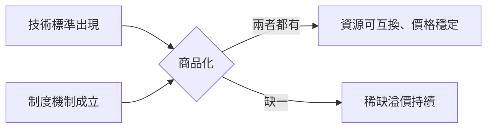

Stanford CS153 是一門有點反常的課程：65% 成績靠出席，每週講師要上課當天才知道是誰，500 個名額秒殺，數萬人在 YouTube 追課。課名叫 **Frontier Systems**，命題直接：AI 基礎設施正在從頭到腳重寫，而且不只是模型層。

這篇文章的重點不是介紹這門課，而是整理課程裡真正有用的框架和洞察——從第一週 Anjney Midha 的四大瓶頸，到各場演講帶出的技術命題。

---

## 核心框架：四大瓶頸

課程的第一堂是主講人 Anjney Midha 自己講，題目是「AI Scaling、Bottlenecks，以及 Compute 為什麼還不是商品」。他提出整個課程的思考框架：

**Context、Compute、Capital、Culture。**

這四個瓶頸不是獨立的，而是相互制約的。但多數人把所有注意力放在 Compute，忽略了 Context 才是最快形成護城河的地方。

---

## Compute：為什麼沒有越來越便宜

直覺上，基礎設施隨著時間應該越來越便宜——DRAM、頻寬、儲存都走這條路。但 AI 運算不是。

Midha 在課堂上公布了一組數據：

| 時間點 | H100 租用單價（每小時） |
|--------|----------------------|
| 2022 年 | $1.73 |
| 2024–2026 年 | 持續上漲 |

一塊兩年前的晶片，租金不降反升。這違反了所有基礎設施商品化的歷史規律。

**為什麼？** Midha 梳理了歷史上幾次基礎設施轉型的商品化路徑：鋼鐵（1867–1895）、DRAM、光纖、鈾。規律是一樣的：資源稀缺期過去後，商品化需要兩個條件同時成立：

1. **技術標準**（TCP/IP、AC/DC 標準化）
2. **制度機制**（防止壟斷性囤積的機構）

AI 運算兩個都還沒有。現在的晶片市場更像早期光纖繁榮，而不是成熟的雲端服務市場。H100 和 B300 不可互換、沒有跨供應商的標準化單位、沒有穩定的預測機制。

**CUDA 的護城河在哪裡？** 不是技術本身，而是生態系的規模。數億顆 GPU 跨越多個雲端平台，往前相容多個世代（A10、A100、H100、H200、L系列、P系列）。框架開發者優先選擇 CUDA，因為部署目標最大。這不是一個技術問題，是網路效應問題。

---

## Scaling Law 的邊界：RL 只在哪裡有效

Scaling law 還在成立嗎？Midha 的回答：在某些域，是；在某些域，根本沒有作用機制。

**成立的地方**：coding、數學、材料科學——任何有**可驗證反饋**的領域。RL 現在消耗的運算量幾乎等同訓練管線的其他步驟總和，代表它正在成為 post-training 的核心引擎。

**失效的地方**：創意寫作、美學判斷——任何**缺乏客觀驗證機制**的領域。RL 需要一個清晰的獎勵信號，但「這首詩好不好」沒有辦法被程式判斷。

這條邊界很重要，因為它決定了哪些工作會被快速自動化（有明確驗證標準的），哪些暫時不會。

另一個數據點：Anthropic 的四年數據顯示，每次新增運算投入後大約 60–90 天，就會有一次能力跳升。這個相關性相當穩定——「每次公司啟用新的運算，大約 60 到 90 天後，能力就會出現跳升。」

---

## Context：真正的護城河在這裡

四個瓶頸裡，Midha 認為 **Context** 是最快形成差距、也最容易被忽視的。

「Context」指的是 agent 運作的環境：它能看到什麼、做什麼、從哪裡獲得反饋。一個能在你的 codebase 裡跑的 agent，跟只能讀說明書的 agent，能力差距不在模型，在 context。

課堂上用來說明的例子是 WindSurf IDE 的事件：OpenAI 收購這個工具後，Anthropic 立刻切斷了對它的 API 存取。這個動作說明的是：context 反饋迴路現在是各家公司的競奪對象，不只是在 AI 產業，而是跨越整個經濟。

誰能取得獨特的、可驗證的 context，誰就有護城河——在 AI 能力相近的情況下，這比模型本身更難複製。

---

## 應用層：語音與視覺如何從草根長出來

### ElevenLabs：從 Discord Bot 到語音 AI 平台

Mati Staniszewski（ElevenLabs CEO）的演講走的是典型的「問題驅動創業」路徑。

ElevenLabs 起點是一個 Discord 的文字轉語音 bot。早期他們試圖解決的問題是 **dubbing**：把英文影片配音成其他語言，讓非英語觀眾也能看到好的內容。

技術上的挑戰是情感。人說話不是照著文字念，而是帶著語調、停頓、情緒。早期的 TTS 模型都在解決「聽得懂」，但 ElevenLabs 的關鍵轉向是把目標換成「聽起來像真人在說話」。

這個判斷讓他們和其他 TTS 供應商走出了不同的技術路徑。配音問題後來成為驗證這個路徑的第一個市場：要讓觀眾相信這是演員在說話，而不是機器，情感自然度是唯一的評判標準。

### Black Forest Labs：從 Stable Diffusion 到 FLUX

Andreas Blattmann 是 latent diffusion 的共同發明者——Stable Diffusion 背後的核心技術。他在 CS153 的演講討論的是視覺智能為什麼是 AI 下一個重要邊界。

核心論點：目前的模型主要是從人類產生的文字中學習，但世界本身有大量資訊是無法用文字表達的——空間關係、物理互動、視覺上下文。要訓練出真正理解世界的模型，需要從這些**自然表徵**中學習，不只是文字。

FLUX 模型的開放權重策略不只是商業決策，也是研究策略：讓更多人在更多場景下使用，能快速回收真實世界的反饋，加速能力迭代。

視覺智能的下一步是 Blattmann 強調的**超越靜態生成**：從「生成圖片」走向「理解並模擬世界」，整合動作預測和物理互動，這條路指向機器人與具身 AI。

### Luma AI：世界模型與可微分現實

Amit Jain（Luma AI CEO）在 Session 5 的演講題目是「Unified Intelligence」。

Luma 的技術路線是從 3D capture 出發——不是訓練語言模型，而是訓練能理解空間和物理的「世界模型」（world model）。Jain 說的是：「我們在建模並生成世界（modeling and generating worlds）。」

可微分世界學習（differentiable world learning）的核心是：讓模型能夠從與世界的互動中反向傳播學習，不是只靠靜態資料集。這個路徑在理論上能更直接地學習物理規律，而不是從文字中間接推斷。

Luma 的 Dream Machine 是這個技術路線在影像生成上的第一個產品，現在規模擴張到 Project Halo——一個 2 gigawatt 的 AI 超算叢集，目標是訓練下一代世界模型。

---

## 對齊層：為什麼「永遠不要做 X」這種規則沒用

Amanda Askell 是 Anthropic 的 alignment 哲學負責人，也是 Claude 個性設計的主要架構師。她在 Office Hours 的演講討論了一個很具體的問題：為什麼用規則訓練模型是不夠的。

**嚴格規則的問題**：「永遠不要做 X」這種規則在邊界案例上幾乎必然失效。世界太複雜，任何你寫得出來的規則都有例外情境。

**Anthropic 的選擇**：亞里斯多德的德性倫理學（virtue ethics）——不是告訴模型「在情況 Y 下做 Z」，而是給模型描述情境、後果、和在不同情況下什麼構成好的行為。目標是讓模型能對新情境做出判斷，而不是查查規則表。

這個選擇有一個具體的 agent 時代理由：當模型越來越自主、執行的任務越來越複雜，一個「純工具型」模型（只執行指令、沒有自身的價值觀）會在邊界情境下做出無人指示的有害行為。彈性加上原則性邊界，才能應對自主性持續擴大的世界。

---

## 課程設計的取捨

CS153 的計分方式（65% 出席 + 35% 專案）刻意把學習重心放在**現場**：講者是誰要上課才知道，學生必須提問，課堂對話是主要的內容產出。

最終專案叫「One-Person Frontier Lab」——一個人用現代 AI 工具在 10 週內創造真實價值，同時探索這種方式的規模極限。這個設計本身就是一個命題：在 AI 工具大幅拉高個人能力上限的時代，「一個人能做到多遠」這個問題值得實驗性地回答。

課程被稱為「AI Coachella」，批評者說學生「付了 5000 美元聽現場播客」。Midha 接受這個標籤，訂了 500 件相關 T 恤。這個比喻有一定的準確性，但它測試的假設就是：直接把最前線的人放進教室，讓學生問自己最想問的問題，這種信息密度是其他格式做不到的。

公開內容（YouTube + Podcast）讓非 Stanford 的人也能跟課，這是課程設計裡值得注意的一個決策。

---

## 整體來說

CS153 的架構命題是：AI 技術棧的每個層次都在同時重寫，而瓶頸不在同一個地方。Compute 是最可見的，但 Context 可能才是最先形成差距的。RL 正在重塑 post-training，但只在有驗證機制的域有效。語音和視覺 AI 的路徑分別驗證了不同的產品假設。世界模型是下一個大方向，但基礎設施需求還在追趕。

這門課的價值不在提供答案，而在展示問題的形狀——在 Compute 還沒商品化之前，這些問題的答案決定了誰能跑在最前面。

---

## 參考資料

- [Stanford CS153 官方網站（Spring 2026）](https://cs153.stanford.edu/)
- [CS153 Spring 2026 YouTube 播放清單](https://www.youtube.com/playlist?list=PL2aDf5-VARtBwz1kz5FsuSZXOig2U6aJI)
- [CS153 YouTube 頻道](https://www.youtube.com/@CS153Team)
- [CS153 Podcast（Apple Podcasts）](https://podcasts.apple.com/us/podcast/cs-153/id1892206689)
- [Week 1：Anjney Midha - AI Scaling, Bottlenecks, and Why Compute Isn't a Commodity Yet](https://www.youtube.com/watch?v=mZqh7emiz9Q)
- [Session 3：Mati Staniszewski, ElevenLabs - The Future of Voice Systems](https://www.youtube.com/watch?v=TnL10oBZc6U)
- [Session 4：Andreas Blattmann, Black Forest Labs - Frontier Visual Intelligence](https://www.youtube.com/watch?v=TNxXs20yhMQ)
- [Session 5：Amit Jain, Luma AI - Unified Intelligence](https://www.youtube.com/watch?v=WNNrUuMQkl8)
- [Office Hours Ep.2：Amanda Askell, Anthropic - Alignment Philosophy](https://podcasts.apple.com/us/podcast/cs-153/id1892206689)
- [Black Forest Labs / FLUX 模型介紹](https://blackforestlabs.ai/)
- [ElevenLabs 官方網站](https://elevenlabs.io/)
- [Luma AI 官方網站](https://lumalabs.ai/)
- [Anthropic Claude's Constitution](https://www.anthropic.com/constitution)
- [Stanford Daily：500 and counting](https://stanforddaily.com/2026/04/15/500-and-counting-the-cs-class-students-are-lining-up-to-take/)
- [OpenAI Software Engineer, Frontier Systems 職位](https://openai.com/careers/software-engineer-frontier-systems-san-francisco/)
