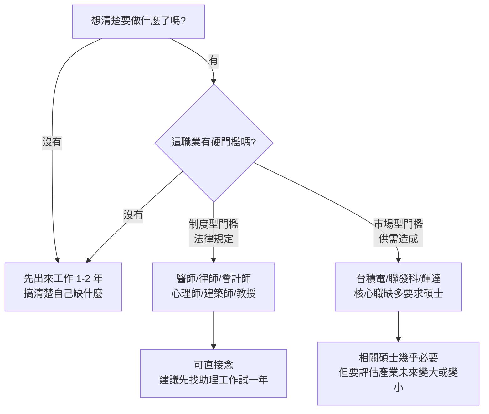

一位外語系同學在職涯講座的 Q&A 舉手問：「老師，我家境不好，是不是畢業之後該先出來工作，不要急著念研究所？」

大人學 Podcast「大人的 Small Talk」主持人 Joe（張國洋）給了一個全場沒料到的答案：「你家境不好，應該先出來工作；事實上，你家境好，也應該先出來工作。」

底下安靜了一下——大家以為他要說的是「家境不好先工作、家境好就繼續念」，結果完全相反。這一集，他把這個答案完整展開。Joe 也提到，這其實是他 16 年前（2010 年）在大人學部落格寫的〈人多的地方不要去〉的延伸：當年他就建議畢業生先去工作一到兩年，並預言「接下來 10 到 15 年，除了少數特殊職位外，賺錢與學歷高低的正相關會越來越低」。16 年後回看，這個預言大致應驗，中段碩士的薪資溢價基本已經消失，而 AI 只會讓趨勢加速。

> 本集是針對「大學生與新鮮人」的上集；Joe 預告下集會專門談「中年想轉行、第一個念頭就是去念領域碩士」的人——那是他看過失敗率很高的一條路。

## TL;DR

讀研究所不是越早讀越好，而是「知道自己要什麼」才去讀，回報才最大。而要知道自己要什麼，幾乎只有一個辦法：出來工作試試看。所以不管家境好壞，先工作一兩年，你才會知道自己缺什麼、該補什麼。

## 為什麼先工作：你才會知道自己要讀什麼

大三、大四的學生，對未來工作的具體樣貌通常沒有真實感，因為還沒進去做過。學校教的、教授講的、偶像劇演的，往往是那個產業「最高階、最有趣、最被美化」的一面——而這一面不是假的，而是你可能要進到那個領域 10 年後才會碰到的東西。

Joe 以外語系想做翻譯為例：腦中的想像可能是品牌操盤、優雅地跟客戶提案；但真進去做行銷，前面 5 到 10 年多半是基層，七成時間在處理 Excel 報表、追廣告投放數據、跟業務吵預算、把文案從第一版改到第八版。他自己念土木工程，畢業後實際做的事，跟想像也是天差地遠，花最多時間相處的同樣是 Excel 報表。

問題在於：剛畢業新鮮人的基礎工作肯定無趣，而很多人撐不到熬出頭的那 10 年。你能不能撐下去，只有真的進去做了才知道——而這件事會直接決定你「該不該讀、該讀什麼」。

那位外語系同學如果一畢業就去念翻譯碩士，可能兩年後才發現：自己其實沒那麼喜歡翻譯、或翻譯市場在 AI 衝擊下萎縮、又或者真正喜歡的是「跨文化的內容企劃」而非翻譯本身（喜歡日本文化，不等於想把日語當成日常工作）。等到唸完才發現押錯，學費與機會成本就全白費了。反過來，若先工作兩年，他可能在工作中自問自答，發現自己缺的是行銷、商學，甚至是法律與財經背景——那該去念的，根本是另一個領域。

## 理科與文科，差別在哪

要不要直接念，理科與文科確實有差，但「先想清楚這個學歷對你的必要性」這件事沒有變。

**理科（資工、電機、生科、化學）**：科系與業界職位有比較直接的對應。同樣在台積電、聯發科這類公司，電機碩士與電機學士的起薪差距是看得到的。所以如果你已經很確定要走這條路，直接把研究所念完、風險是可控的——但盡量去名校。

**文科（傳播、社會、歷史、哲學）**：Joe 真心建議先出來工作，原因有二：

1. **沒有直接對應的職位。** 有電機工程師、化工工程師，卻沒有「社會學工程師」。HR 看到文科碩士不會眼睛一亮，你必須自己把所學「翻譯」成業界聽得懂的價值——而業界聽得懂的，通常是成就與資歷。這種翻譯能力，是離開學校後最重要的能力，而它需要工作經驗才養得出來。
2. **深耕的議題未必能變現。** 文科碩士的訓練是把你帶進某個特定議題的深處（某年代的歷史、某文學流派、某哲學家的思想體系）。學術上這是好事，但若你不繼續待在學術界，這份深度在民間就業市場未必加分。寫「明清江南商業網路」的歷史碩士論文去貿易公司面試，主管很可能不知道該把你放在哪、你能解決什麼實務問題。學養增加了，未必能直接換成錢。

所以文科若沒想清楚要專精什麼、怎麼轉換，這兩年的專精就無法直接變成市場價值。解法仍是同一招：先出來工作，發現自己缺商業就去念商學，缺法律就去念法律——很可能最後你想念的，根本是設計、UX 或 UI，而不是另一個文科碩士。

## AI 時代的兩個新變數

到了 2026 年，多了 AI 這個變數，讓「要不要念」的計算大不相同。

**變數一：AI 顛覆了學習的順序。** 過去學一項技能的順序是「先上課、讀書、考試，再實習、上場」，因為不先學完根本沒辦法上場。但現在有些領域，直接動手學最快：邊做邊問 AI 把不足補起來。以前想開發一個小工具，得老老實實上完六個月的程式課；現在打開 Cursor 或 Claude Code，告訴 AI 你想做什麼，一兩天就能做出堪用的小版本，而且每段程式都對應到你真正想解決的問題，學習動機更強。其實早在十年前有 Google，學習順序就已經在改變了。重點是：很多領域的僱主只在意你能不能解決問題，你是在學校學的、跟老師學的、還是跟 AI 學的，都沒差。

這對「要不要念」的影響很大：過去唯一的路是先念才能學會、才能應用；現在若能先學會就找到工作，未必要再花兩年押注「將來可能用得上」。更好的策略是先進職場，碰到問題就自學——若一路沒碰到學歷的阻礙，那你根本不必念；若真的碰到了（例如大公司要求主管要有碩士才能升遷），那時你知道「為何而戰」，念下來的碩士才真的有用。

**變數二：AI 削弱學歷訊號，放大實戰成果。** 過去 HR 時間有限，用學歷做第一層篩選，而能念到高學歷的人有限，所以學歷訊號有價值。現在 HR 可以用 AI 一秒讀完上百份履歷，串接你的 GitHub、LinkedIn、作品集，把你的實際成果量化評分。當時間不再是篩選瓶頸，學歷的篩選價值就下降了。加上過去 20 年學歷持續貶值——台大碩士在 2026 年仍有意義，但三流學校的碩士起薪與學士差異已不明顯，甚至未必找得到工作。真正被看重的，是你做過什麼、做出過什麼、有沒有可被驗證的成果：GitHub 上的 commit、營運過的社群、執行過的活動、解決過的客戶問題、開發過的產品，甚至你發表過的 Podcast、寫過的文章——這些 AI 在面試前就能抓出來驗證。

## 那研究所還值得念嗎？

Joe 強調他不是反學歷。研究所有它值錢的地方：訓練研究方法、提升系統化思考、讓你問對問題、學會判斷，這些都有價值。

他反對的是那個無腦的簡單模型——「念研究所就能賺比較多，所以該念；念什麼不知道，大學念什麼就接著念，或找一個好申請、容易畢業的去念」。在他父母那個年代，研究所文憑是社會公認「這個人應該不錯」的訊號；但隨著大學普設，文憑這十幾年一路貶值，AI 時代更甚。所以若你要的就是那張紙，它已經從「有念就加分」變成：要嘛念名校（台灣排名前面那幾間，或出國念 Harvard、牛津、MIT，或你產業裡公認的一流學校），要嘛先想清楚你要它在哪裡幫你補強。後段、甚至中間地帶學校的轉換價值，正在快速消失。

## 例外：制度型與市場型硬門檻

「先工作」這個建議有例外：如果你已經想清楚要做的職業，而且那個職業本身有硬性門檻。門檻分兩種：

- **制度型門檻**：寫在法律裡的入場券，例如醫師、律師、會計師、心理師、建築師、教授、研究員——沒有那個文憑就不能執業。即使如此，Joe 仍鼓勵能先找個相關助理工作（例如法律事務所）做一年，確認自己真的喜歡再去念，避免唸完才發現不愛。
- **市場型門檻**：供需造成的事實門檻。法律沒規定，但產業熱門、起薪高、人人想進，僱主就用學歷做第一輪篩選。最典型的是台積電——法律沒規定製程、設備工程師一定要碩士，但核心職缺絕大多數寫「碩士以上」，因為投履歷的人太多，HR 用學歷直接砍掉一半。在當前 AI 熱潮下，聯發科、輝達等頂尖科技公司很可能也是同樣邏輯。沒那張紙，你連面試機會都拿不到。

但 Joe 多提醒一層：就算有門檻，也要想這個產業未來是變大還是變小。硬制度門檻保障的是「別人不能輕易介入」，不代表這個產業會興旺。例如國中小老師是被保障的職業、進入門檻不低（要實習、考試、學分要求），但「拿到教師資格」不等於「有工作」——流浪教師就是證明。門檻高，不一定賺得多。

## 回到那個問題：家境好不好都該先工作

所以回到外語系同學的提問。Joe 的答案是：家境不好應該趕快出來工作，因為你需要那份收入；家境好也應該出來工作，因為不出來，你就不會知道自己讀的東西是不是真正想要的。

2026 年讀研究所，不是越年輕讀越好，而是越知道自己要什麼、越知道自己缺什麼才去讀，才真正有效。家境好的真正紅利，不是可以更早繼續念書，而是當你某天決定要讀時，可以沒有經濟壓力地輕鬆去讀；決定不讀，也不必勉強自己。這份彈性才是紅利——若把它用在「不該讀的時候硬去讀」，反而是浪費掉了。

## 參考資料

- [大人的 Small Talk - 大學畢業該不該馬上讀研究所（上集）](https://www.youtube.com/watch?v=eYpO1zsQZlg)
- 延伸閱讀：Joe 於 2010 年發表的〈人多的地方不要去〉（大人學官網）
