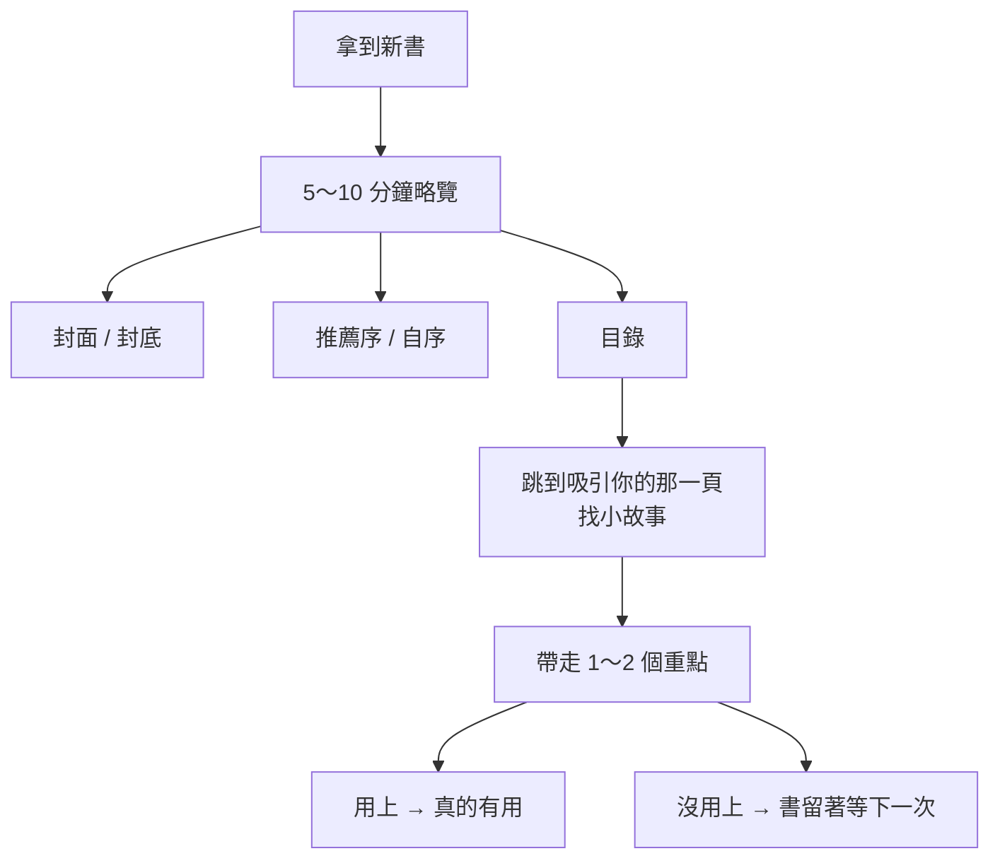
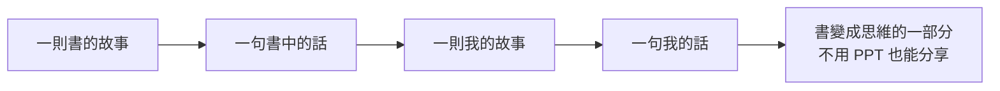

書櫃上有一半的書，買回來根本沒翻過——這幾乎是每個愛買書的人的共同罪惡感。在這集《大人的 Small Talk》裡，主持人 Bryan 找來老朋友、財經作家郝旭烈（郝哥）聊這件事。郝哥今年累積出到第 11 本書，最新一本跟三采合作的《郝會讀書》，談的不是讀書考試，而是怎麼擷取書裡的知識來影響自己的生活。

兩個人都坦承自己有同樣的毛病：本來是「愛看書的人」，後來變成「愛買書、愛藏書的人」。Bryan 搬新家做了一整面頂到天花板的書牆，結果發現最近一兩年買的書超過一半沒讀；郝哥則笑說大掃除時翻出 1996 年買的書，上面還信誓旦旦寫著「下半年一定看完」，轉眼已經到 2026 年。

郝哥對這件事的回答，可以濃縮成四個字：**放自己一馬**。

## 為什麼不用把整本書讀完

我們對「買書」的預設是：既然買了，就一定要從頭看到尾。郝哥說，這個預設其實沒必要。

他用自己年輕時在餐廳駐唱的經驗打比方：以前的卡帶 A 面 10 首、B 面 10 首，真正會讓你想唱的可能只有一兩首，所以後來他不買整捲正版，而是聽過之後挑喜歡的錄成合集。看書也是一樣——一本書裡只要有一兩個概念能被你吸收，這本書對你來說就成立了。

別人推薦書的時候也是這樣運作的。當 Bryan 或 Joe 說「這本書裡某個東西不錯」，那句話其實就是一個「預告」。你買回去針對那個重點多翻一下，如果除了他講的，又多看到幾個重點，那就賺到了。

郝哥特別提醒一件容易被忽略的事：書的知識內容產出比以前快太多。他 2018、2019 年買的一堆 AI 書，擺著沒看，到了 2023 年之後 AI 已經完全不一樣，那些書也不用看了。逼自己讀完一本正在過時的書，是在消耗注意力。

## 拿到新書，先花 5～10 分鐘略覽

郝哥養成一個習慣：書一拿到、一拆封，就立刻花 5～10 分鐘快速翻一遍，不是精讀，而是抓出兩種對自己最有價值的東西——**你沒涉獵過的**，以及**對你當下有幫助、能立刻解題的**。

他的略覽順序很簡單，跟《原子習慣》一樣沒壓力，看四個地方：

1. **封面與封底**——現在出版社和編輯很用心，最精華的亮點通常都濃縮在封面封底了。
2. **推薦序與自序**——這是作者本人和他的好朋友看完後咀嚼出來的精華，等於替你預先消化過。
3. **目錄**——看過前兩項後，你心裡已經有概念，再從目錄裡挑出你有興趣的那幾個重點。
4. **跳到吸引你的那一頁**——直接翻過去，重點不是記大道理（道理不容易記久），而是找裡面的**小故事**。故事帶著道理，你才帶得走。

郝哥說，工具類的書這樣翻，最多 10～15 分鐘就能把「帶得走的重點」帶走（大部頭小說例外）。只要帶得走、用得上，這本書就對你產生了影響；哪天真的用上、需要細節，你自然會再回來翻。

## 真正的好書，會一看再看

郝哥提醒一個有趣的反差：我們小時候看漫畫、故事書會一看再看，長大後卻常常看完一本書就以為「自己會了」。其實不會——連韓劇看到後面，前面都忘了。

真正的好書是案頭書，會持續放在那邊提醒你。同一本書你以為看過一遍了，第二次看卻會發現感受不一樣、又有新的發現。所以別把看書當成考試，而是當成交朋友：朋友都要日久見人心、路遙知馬力，何況一本好書。在沒壓力的前提下，每次記一點、兩點，日積月累就變成投資裡常講的**複利效應**。

Bryan 補充了一個自己的小妙招：他在玄關鞋櫃旁放了幾本沒翻過的書，每次等太太出門的三五分鐘，就隨手抓一本翻兩句。原本焦躁的等待變成了和書「結緣」的時間——書可能還是沒讀完，但至少跟它有了連結。

## 隨機的遇見：為什麼要逛實體書店

兩人都很有感的一點是：逛實體書店帶來的好處很難量化。在網路上不管是短影音還是搜尋，內容都被演算法推送；但走進書店、或在鞋櫃旁放一本沒看過的書，多了一個數位時代缺乏的東西——**隨機**。

郝哥說這是一種「隨緣」的遇見。他上個月在書店看到一本教做吐司麵包的書，本來毫無興趣，翻開卻看得津津有味；另一本《一個人逃亡的溫泉》，真正吸引他的反而是書裡每個溫泉附的餐點介紹。Bryan 則把逛書店比喻成《星際效應》裡的四維空間——電子書是一個「點」，你要看哪本就叫出哪本；逛書店則像展開了一整個維度，各種你沒想過的書在你面前飄來飄去，把你拉進新世界。

郝哥引用梁啟超寫給孩子的話收尾這段：求學問不必那麼功利，「**唯有趣**」。功利是結果，有趣才是過程；當你享受過程，跟別人不一樣是自然附帶而來的。

## 四一讀書法：把書跟自己連起來

郝哥在《郝會讀書》裡提出的核心方法，叫**四一讀書法**——把四個「一」連在一起：

- 一則**書裡的故事**
- 一句**書裡的話**
- 一則**我自己的故事**
- 一句**我自己的話**

關鍵在於：故事容易記、道理不容易記，所以先抓住書裡的一個故事，把它濃縮成一句話，再去想「**這跟我有什麼關係**」，連結到自己的一段經歷與一句體會。

郝哥舉自己的例子：看《灌籃高手》櫻木花道那股傻勁，他連結到自己當年又胖又跑得慢、不想被嘲笑而每天苦練、最後一路練到 50 歲完成 226 鐵人三項的經歷。從這裡他帶走一句自己的話——「**不要用你過去有限的能力，去想清楚你未來無窮的潛力**」「想都是問題，做才是答案」。

這個「連結」就是把別人的故事變成自己的記憶。郝哥說，記住其實是一個**思考**的過程：看過去如果只是滑過，就船過水無痕；只有刻意去想它跟自己的關係，才是刻意把它留下。所以他常說「我是因為記得很少，所以記得很牢」——只要某個故事有趣，他就把書放下，開始想這故事跟自己有什麼關係。

## 四大苦點，與化苦為甜的關鍵：輸出

郝哥把買書的痛苦歸納成「四大苦」：買了沒看是一苦、放上書架忘了是一苦、送人但對方未必喜歡又是一苦、越積越多佔空間還是一苦。這四苦的共同根源，都是**沒有連結**。

化解的關鍵，除了前面說的「不用全部看完」，還有一個更重要的動作——**輸出**。看書是輸入，真正的關鍵是輸出，而輸出最簡單的形式就是**分享**。你不必像郝哥一樣去錄 Podcast、寫書，只要跟家人吃飯時說一句「我今天在書裡看到一個故事蠻有意思的」，就把這本書的好帶出去了。

分享之所以有效，是因為中間多了一個被忽略的環節——**消化**。輸入只進不出記不住；當你為了講給別人聽而回想、重新咀嚼，等於再創造一次，書跟你的連結就更深。教學相長，苦點就此變成甜點，知識還能開枝散葉地流動出去。

郝哥也把這套邏輯用在帶小孩讀書上：別叫孩子去看書，自己卻在滑手機——那邏輯很奇怪。他太太和女兒會看書，是因為他常常繪聲繪影地講書裡的故事，「這本書有夠好看」，孩子被勾起好奇心就自己去翻了。Bryan 呼應這一點：很多家長希望小孩努力上進卻沒用，其實答案是**自己努力上進**——父母才四五十歲，還年輕、還能成長，你就是孩子的天花板，當你一直往上長，孩子也跟著一起長。

## 結語：書不只是知識，更是一個人

整集對談最動人的，是兩人都把書當成「一個人」。Bryan 說，他把《灌籃高手》當成自己的心理醫師，職涯或人生卡住時就重看一遍，找回那股單純、熱血、勇往直前的能量；郝哥則把《排球少年》也寫進書裡，因為日向翔陽和影山飛雄走的也是同樣的英雄旅程與成長思維——這些作品不會告訴你什麼叫「成長思維」，卻會把它印進你腦袋。

買了書沒看完，真的不必內疚。如郝哥所說，你等於用三百多塊請了一個人坐在家裡 stand by；哪天你需要他，他就在那裡。讀書的密度，從來不是頁數的密度，而是連結的密度。

## 參考資料

- [EP666 好多書買了卻沒看完，好內疚呀！郝哥說：重點不在是否讀完，而是從書中找到跟自己的連結｜大人的 Small Talk](https://www.youtube.com/watch?v=EGPEnipo3vM)
- 郝旭烈《郝會讀書》（三采文化）
