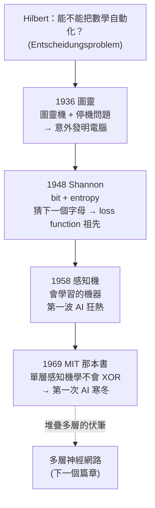

2026 年，一群穿著連帽外套的十八歲少年在 Python 檔案裡敲下 `import torch`，然後就能從創投手上換到十億美元的支票。但要走到這一步，背後是一條長達一個世紀的連鎖反應——一篇接著一篇的論文，大多由比我們聰明得多、而且早已不在世的人寫下。

Fireship 那支影片把這條鏈子上的 10 篇關鍵論文排成一線。這篇文章不打算把 10 篇都講完，而是跟著它的開場，仔細走過真正「點火」的前幾個節點。因為這幾篇最能說明一件事：每個想法，幾乎都是上一個想法的意外副產品。

## 1936：圖靈，為了證明「不行」而發明了電腦

很多人以為圖靈當年問的是「機器能不能思考」。其實不是。他真正在回答的，是一個無聊得多的問題:**每一個數學問題，都能用某個演算法解出來嗎？**

這個問題的源頭是數學家 David Hilbert。他丟出了這個領域最大的一記豪語式提問:有沒有一個「萬用演算法」，能判定任何一個數學陳述是真是假?換句話說——**我們能不能把數學本身自動化?** 他把這稱為 Entscheidungsproblem，德文裡的「判定問題」。

1936 年，圖靈給了一個殘酷的答案:**不行。**

但為了證明「不行」，他得先定義清楚「演算法」到底是什麼。於是他在〈On Computable Numbers〉這篇論文裡，想像出一台假想機器:一條無限長的紙帶、一個讀寫頭，加上一張小小的規則表。這台**圖靈機**，就是你這輩子用過的每一台運算裝置的抽象藍圖。

定義好之後，他拿這台機器去問「停機問題」(halting problem):**你能不能寫一支程式，去檢查任意另一支程式，告訴你它最後會跑完、還是會永遠迴圈下去?** 圖靈證明這樣的程式不可能存在——它會直接導向邏輯矛盾。這意味著:數學裡存在著沒有任何演算法能解的問題。

他本來只是想回答一個邏輯難題，卻在過程中**順手發明了電腦**。

## 1948：Shannon，把「資訊」變成可以量的東西

12 年後，另一位傳奇人物 Claude Shannon 登場，問了他自己那個惱人的問題:**資訊，作為一種可以被測量的東西，到底是什麼?**

在〈A Mathematical Theory of Communication〉裡，Shannon 做了一件很激進的事:他把文字的「意義」整個抽掉。在他眼中，「我愛你」和「貓著火了」如果同樣令人意外，就攜帶了同樣多的資訊。而他用來衡量這種「意外程度」的單位，就叫做 **bit**。他證明了所有資訊，最終都能被歸結成一串 0 與 1。

最瘋狂的地方在於:為了估算傳遞一則訊息需要多少資訊，他借用了熱力學裡那個沒人真正搞懂的概念——**entropy(熵)**。而為了估算英文的熵，Shannon 讓真人去**猜句子裡的下一個字母**:容易猜的字母,熵低;難猜的字母,熵高。

等一下——**讓人去猜下一個 token,不正是今天 AI 在做的事嗎?** 只是規模大得多。Shannon 當年完全沒有要打造人工智慧的意思,但他給了我們一整套處理不確定性、預測與壓縮的數學,等於**意外寫下了 loss function 的精神祖先**。這也是為什麼 Anthropic 會把他們的 AI 模型命名為 Claude。

## 1958：感知機,第一台真的會「學習」的機器

又過了大約十年,在康乃爾大學,一位**心理學家**(注意,不是電腦科學家)造出了第一台真正會學習的機器。

他從大腦神經元的運作方式得到靈感,設計出一個叫 **perceptron(感知機)** 的東西:它接收輸入、給每個輸入一個權重,當它答錯時就調整這些權重,直到能自己把不同的圖案分類出來。這就是現代神經網路的基本構件。

當時的狂熱程度,可以說是立刻而且失控。海軍出錢資助,《紐約時報》報導說:電腦很快就要有意識了。

## 1969:兩位 MIT 學者,一紙判決書

但大約 11 年後,這股熱潮被徹底澆熄,而動手的是 MIT 的兩位「黑粉」。他們發表了另一篇論文(嚴格說是一本書),調性完全相反。

他們用很基礎的數學證明了:**單層感知機連 XOR(互斥或)都學不會**——XOR 不過是「這個或那個、但不能兩者都是」這種微不足道的邏輯。這本書幾乎成了當時 AI 的死亡證明:資金蒸發,深度神經網路進入了**第一次 AI 寒冬**。

不過,真正的轉折藏在這本書的細節裡。他們其實也注意到了一件事:**把多層感知機堆疊起來**,情況可能完全不同——而這,正是把神經網路從寒冬裡救回來的那條路的起點。

## 這條鏈子長什麼樣

## 它們其實在講同一件事

把這四個節點放在一起看,有幾個反覆出現的模式:

**一、偉大的東西常常是「意外的副產品」。** 圖靈想證明數學的極限,順手發明了電腦;Shannon 想量化通訊,卻寫下了 AI loss function 的雛形。他們追的都不是後來真正改變世界的那個目標。

**二、否定本身也是一種推進。** MIT 那本書幾乎殺死了感知機,卻在字裡行間留下了「堆疊多層」的線索。一篇嚴謹的反駁,有時候比一篇樂觀的吹捧更能逼出下一步。

**三、想法之間的「時間差」很大。** Shannon 1948 年就把「猜下一個 token」的數學寫好了,但要等到幾十年後,這套思路才在真正的語言模型上大規模兌現。很多論文不是錯,只是還在等對的時機。

你不需要把這幾篇原文讀完。但記住這條鏈子的形狀,下次當你看到某個新框架號稱「改變了一切」,你會更知道怎麼問:這是真的全新,還是把舊東西重新組合得更好?而當某個方向看起來走不通時——別忘了,連 XOR 都學不會的感知機,後來變成了今天所有人賴以為生的神經網路。

## 參考資料

- [I read every major CS paper of the last 100 years... (Fireship, YouTube)](https://www.youtube.com/watch?v=ML3q7Ok4hJg)
- [On Computable Numbers, with an Application to the Entscheidungsproblem — Turing (1936)](https://www.cs.virginia.edu/~robins/Turing_Paper_1936.pdf)
- [A Mathematical Theory of Communication — Shannon (1948)](https://people.math.harvard.edu/~ctm/home/text/others/shannon/entropy/entropy.pdf)
