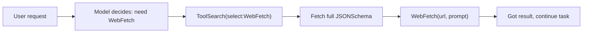
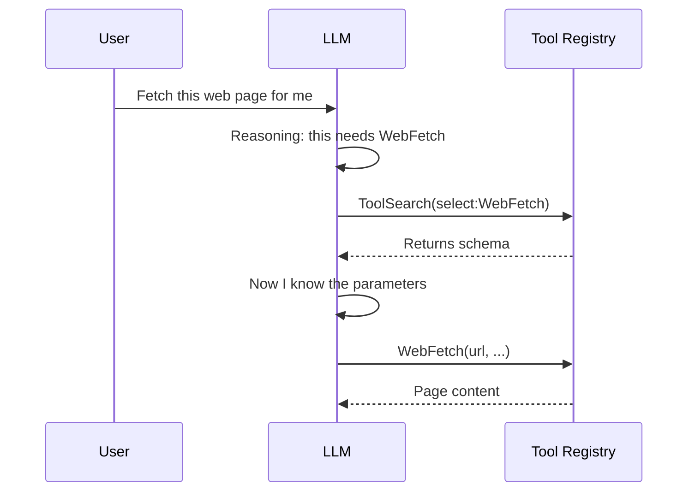

If you've used Claude Code, you may have noticed something: it advertises dozens of skills and hundreds of tools, yet none of them are stuffed into the model's context up front. They appear "on demand." This post unpacks how that mechanism works, and answers a question I confused myself with at first — **is this a form of RAG over the user's query?**

The short answer: in spirit, absolutely. But the retriever isn't a vector database — it's the LLM itself. Let's unpack it.

## The root problem: context is a scarce resource

Agent systems keep accumulating tools and instructions, but the context window is both limited and expensive. Suppose a skill's full instructions average 800 tokens and a tool's JSONSchema averages 300 tokens:

```
Preload everything:  60 skills × 800 + 50 tools × 300 ≈ 63,000 tokens
                                            ↑ burned before the conversation even starts
Lazy loading:        index ≈ 2,000 tokens + what's actually used ≈ 2,500 tokens ≈ 4,500 tokens
```

That's more than a 10x difference. Worse, preloading everything makes the prompt cache hard to maintain — the moment which skill you used changes, the leading content shifts and the cache invalidates.

So the right move isn't "give everything," it's a **two-tier approach: hand over a lightweight index first, and only expand the heavyweight full definition when it's actually needed**. That's lazy loading.

## Two kinds of on-demand loading

Claude Code has two categories that use the same strategy, with slightly different mechanics.

| | Deferred Tools | Skills |
|---|---|---|
| What it is | Callable functions (WebFetch, Notion API…) | A bundle of workflow instructions (/post, /code-review…) |
| What's in the index | **Just the name** | Name + a one-line description |
| How to expand | Use `ToolSearch` to fetch the JSONSchema | Use the `Skill` tool to execute it |
| What you get after | Parameter definitions, now callable | Full prompt injected into the conversation |

### The Deferred Tools flow

At the start of a session, the tool index the model receives looks like this (excerpt). Note each tool is **just a name**:

```
The following deferred tools are now available via ToolSearch.
Their schemas are NOT loaded — calling them directly will fail:
  WebFetch
  WebSearch
  mcp__claude_ai_Notion__notion-search
  ... (~50 of them)
```

At this point `WebFetch` is just a string. The model doesn't know what parameters it takes or what it returns; calling it blindly gets rejected with an error. The flow is:



The key is step three: those 50 tool schemas might total tens of thousands of tokens, but the model only pays the cost for the one it actually needs. The other 49 forever occupy nothing but "a name."

### The Skills flow

Each line in the skills index has only a description:

```
- post: Convert a conversation, notes... into a structured post
- code-review: Review the current diff for correctness bugs...
```

Behind `post` there might be hundreds of lines of instructions (how to categorize, how to fill frontmatter, article structure templates, commit format…), but **none of it is in context** until the user says "turn this into an article," the model matches the description, and executes `Skill(skill="post")`. Only at that moment do the full instructions get injected. Before that, the model knows nothing about the details.

## Back to the core question: is this RAG?

Many people equate RAG with "embeddings + vector database," but that's just one implementation of retrieval. RAG, broken down, is two things:

```
Retrieval + Augmentation (inject the result into context) → Generation
```

The real definition is **"don't stuff everything in — retrieve the relevant bits first, then inject."** By that definition, on-demand tool loading genuinely is RAG — it's "don't put all schemas in context; retrieve what's needed first, then inject."

But who is the retriever? Here are two modes, and this is the key difference.

### Mode A: Vector retrieval (classic RAG)

```
query → embedding → compute cosine similarity → take top-k
decision-maker = math
```

Retrieval is **automatic and upfront**; the model passively receives already-retrieved content, and retrieval happens before the model "speaks."

### Mode B: Agentic retrieval (the LLM is the retriever)

```
query → LLM reads the index, reasons → actively calls search to fetch
decision-maker = the model's reasoning
```

Retrieval is **an action the model actively initiates mid-conversation**, not a background pre-processing step the system runs. The model looks at the index, uses reasoning to decide which to fetch, then goes and fetches it.



### The two modes compared

| | Vector RAG (Mode A) | Tool loading (Mode B) |
|---|---|---|
| Retrieves what | Document chunks | Tool schemas |
| **Who decides** | Cosine similarity (math) | **The LLM's reasoning** |
| When it retrieves | "Before" the model generates | "During" the conversation, model-initiated |
| Retrieval method | Embedding vector match | Name match + model judgment |
| Model's role | Passive recipient | Active initiator |

So the most precise framing is: **on-demand tool loading is the concept of RAG, but with agentic retrieval replacing vector retrieval**. It belongs to a broader family, "Retrieval-Augmented X": retrieving documents is RAG, retrieving tools could be called Tool RAG, retrieving examples is dynamic few-shot. They all share the same parent philosophy — **context is scarce; retrieve before you inject**.

## A detail that makes it click

`ToolSearch` actually **supports both modes**, and you can tell from the shape of the query:

```
ToolSearch("select:WebFetch")      ← I know which one → exact fetch (like SQL WHERE name=)
ToolSearch("notion send message")  ← I'm not sure of the name → keyword/semantic search (like RAG)
```

That second, fuzzy query is very likely backed by a keyword index or embeddings comparing against tool descriptions — and that part **really is Mode A vector retrieval**, just with the retrieval target swapped from articles to tools.

In other words, Modes A and B aren't mutually exclusive; they stack: **the model uses reasoning to decide "whether to retrieve and with what keywords" (the agentic layer), and underneath, vector similarity maps the fuzzy keywords to concrete tools (the vector layer)**.

## Overall

If you're building a RAG system, this observation is a useful reminder: **RAG's value isn't the vector database — it's the "index-then-load" structure.** The same structure applies to documents (knowledge RAG), to tools (tool RAG), and to examples (dynamic few-shot).

What agent systems genuinely add is the layer of **letting the model participate in the retrieval decision** itself. When your agent has so many tools they won't fit in context, rather than categorizing them by hand, build a minimal mechanism: a tool registry storing only name + description, with a search function that returns the full schema. It's isomorphic to the document RAG you already know — just with a different retrieval target.

## References

For a deeper look at the technologies and architecture mentioned here, see the following.

- [Anthropic — Claude Docs (Claude Code / Agent SDK)](https://docs.claude.com)
- [Model Context Protocol (MCP) official docs](https://modelcontextprotocol.io)
- [Lewis et al., 2020 — Retrieval-Augmented Generation for Knowledge-Intensive NLP Tasks (the original RAG paper)](https://arxiv.org/abs/2005.11401)
- [Anthropic — Building effective agents](https://www.anthropic.com/research/building-effective-agents)
