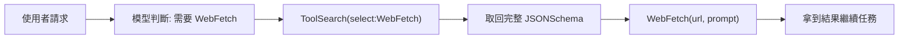
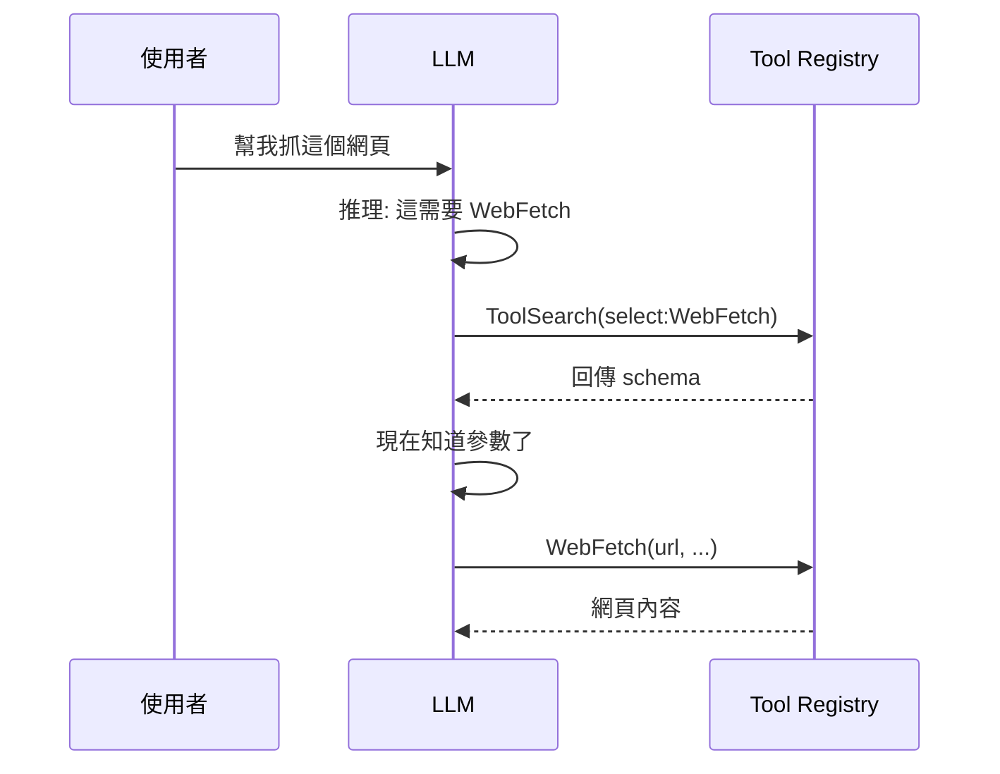

如果你用過 Claude Code，可能注意到一件事:它號稱有幾十個 skill、上百個工具,但這些東西並不是一開始就全部塞進模型的 context。它們是「按需」出現的。這篇想拆解這個機制怎麼運作,並回答一個我自己一開始也搞混的問題——**這算不算對使用者的 query 做 RAG?**

結論先講:精神上完全是 RAG,但檢索器(retriever)不是向量資料庫,而是 LLM 自己。下面慢慢展開。

## 問題的根源:context 是稀缺資源

Agent 系統的工具與指令越來越多,但 context window 既有限又昂貴。假設一個 skill 的完整指令平均 800 token、一個工具的 JSONSchema 平均 300 token:

```
全部預載:  60 skills × 800 + 50 tools × 300 ≈ 63,000 token
                                          ↑ 還沒開始對話就燒掉
惰性載入:  目錄 ≈ 2,000 token + 實際用到的幾個 ≈ 2,500 token ≈ 4,500 token
```

差距超過 10 倍。更糟的是,全部預載會讓 prompt cache 難以維持——只要今天用了哪個 skill 有變化,前段內容跟著變,快取就失效。

所以正確的做法不是「全給」,而是**分兩層:先給輕量的目錄,真正要用時才展開重量的完整定義**。這就是惰性載入(lazy loading)。

## 兩種按需載入的對象

Claude Code 裡有兩類東西用同一套策略,但機制略有不同。

| | Deferred Tools | Skills |
|---|---|---|
| 是什麼 | 可呼叫的函式(WebFetch、Notion API…) | 一整包流程指令(/post、/code-review…) |
| 目錄裡有什麼 | **只有名字** | 名字 + 一行描述 |
| 怎麼展開 | 用 `ToolSearch` 取回 JSONSchema | 用 `Skill` 工具執行它 |
| 展開後得到 | 參數定義,變成可呼叫 | 完整 prompt 注入對話 |

### Deferred Tools 的流程

session 開頭,模型收到的工具目錄長這樣(節錄),注意每個工具**只有名字**:

```
The following deferred tools are now available via ToolSearch.
Their schemas are NOT loaded — calling them directly will fail:
  WebFetch
  WebSearch
  mcp__claude_ai_Notion__notion-search
  ... (約 50 個)
```

`WebFetch` 此刻只是一個字串。模型不知道它要什麼參數、回傳什麼,硬呼叫會被擋下並報錯。流程是這樣:



關鍵在第三步:那 50 個工具的 schema 可能合計上萬 token,但模型只在真正要用的那 1 個上付出成本,其他 49 個永遠只佔「一個名字」的空間。

### Skills 的流程

Skill 目錄每個只有一行描述:

```
- post: Convert a conversation, notes... into a structured post
- code-review: Review the current diff for correctness bugs...
```

`post` 背後可能有幾百行指令(怎麼分類、frontmatter 怎麼填、文章結構模板、commit 格式…),但這些**完全不在 context 裡**,直到使用者說「幫我整理成文章」、模型比對描述命中、執行 `Skill(skill="post")` 的那一刻,完整指令才被注入。在那之前,模型對細節一無所知。

## 回到核心問題:這是 RAG 嗎?

很多人把 RAG 等同於「embedding + 向量資料庫」,但那只是檢索的一種實作。RAG 的本質拆開來是兩件事:

```
Retrieval(檢索) + Augmentation(把結果塞進 context) → Generation
```

真正的定義是**「不要全塞,先檢索相關的再塞」**。按這個定義,按需載入 tool 確實是 RAG——它就是「不把所有 schema 塞進 context,先檢索需要的再塞」。

但檢索器是誰?這裡有兩種模式,也是最關鍵的差異。

### 模式 A:向量檢索(典型 RAG)

```
query → embedding → 算 cosine 相似度 → 取 top-k
決策者 = 數學
```

檢索是**自動前置**的,模型被動收到已經檢索好的內容,檢索發生在模型「開口前」。

### 模式 B:Agentic 檢索(LLM 自己當檢索器)

```
query → LLM 讀目錄、推理判斷 → 主動呼叫 search 取回
決策者 = 模型的推理
```

檢索是模型在對話**中途主動發起的一個動作**,而不是系統背後自動跑的前處理。模型看著目錄、用推理判斷該抓哪個,然後自己去抓。



### 兩種模式對照

| | 向量 RAG(模式 A) | Tool 載入(模式 B) |
|---|---|---|
| 檢索什麼 | 文件 chunk | tool schema |
| **誰決定** | cosine 相似度(數學) | **LLM 的推理** |
| 何時檢索 | 模型生成「之前」 | 對話「之中」,模型主動 |
| 檢索手段 | embedding 向量比對 | 名稱比對 + 模型判斷 |
| 模型角色 | 被動接收 | 主動發起 |

所以最精準的說法是:**按需載入 tool 是 RAG 的概念,但用 agentic retrieval 取代了 vector retrieval**。它屬於一個更廣的家族「Retrieval-Augmented X」:檢索文件叫 RAG、檢索工具可以叫 Tool RAG、檢索範例叫 dynamic few-shot,它們共享同一個母體哲學——**context 是稀缺資源,先檢索再注入**。

## 一個會讓你「啊原來如此」的細節

`ToolSearch` 其實**同時支援兩種模式**,看 query 的形式就知道:

```
ToolSearch("select:WebFetch")      ← 已確定要哪個 → 精確取回(像 SQL WHERE name=)
ToolSearch("notion send message")  ← 不確定叫什麼 → 關鍵字/語意搜尋(像 RAG)
```

第二種模糊查詢,背後很可能就是用關鍵字索引或 embedding 去比對工具的描述——這一段就**真的是模式 A 的向量檢索**了,只是檢索對象從文章換成工具。

換句話說,模式 A 與 B 不是互斥,而是可以疊起來:**模型用推理決定「要不要檢索、用什麼關鍵字檢索」(agentic 那層),底層再用向量相似度把模糊關鍵字對應到具體工具(vector 那層)**。

## 整體來說

如果你正在做 RAG 系統,這個觀察其實是個提醒:**RAG 的價值不在向量資料庫,而在「index-then-load」這個結構**。同一套結構可以套在文件上(知識 RAG)、套在工具上(tool RAG)、套在範例上(dynamic few-shot)。

而 agent 系統真正多出來的,是讓**模型自己參與檢索決策**這一層主動性。當你的 agent 工具多到塞不下 context 時,與其手動分類,不如建一個「tool registry 只存 name + description,提供一個 search 函式回傳完整 schema」的最小機制——這跟你已經會的文件 RAG 是同構的,只是換了檢索對象。

## 參考資料

如果想更深入了解本文提到的技術與架構,建議進一步閱讀以下文件。

- [Anthropic — Claude Docs(Claude Code / Agent SDK)](https://docs.claude.com)
- [Model Context Protocol(MCP)官方文件](https://modelcontextprotocol.io)
- [Lewis et al., 2020 — Retrieval-Augmented Generation for Knowledge-Intensive NLP Tasks(RAG 原始論文)](https://arxiv.org/abs/2005.11401)
- [Anthropic — Building effective agents](https://www.anthropic.com/research/building-effective-agents)
