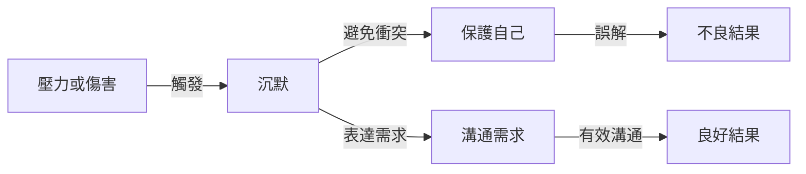

【放心來信】為什麼他總是不溝通？沉默不是不在乎，而是一種防衛

## TL;DR
沉默是一種防衛機制，了解其背後的原因可以改善溝通。

## 是什麼
沉默是一種人際交往中的溝通方式，通常被視為是一種消極或不合作的表現。但事實上，沉默可以是一種防衛機制，人們用來保護自己免受傷害或壓力的影響。

## 為什麼重要
沉默可以是一種有效的溝通方式，尤其是在人際關係中。透過沉默，人們可以避免衝突、保護自己的情感、或是表達自己的需求。然而，沉默也可能導致誤解和不良的結果，因此了解其背後的原因是改善溝通的關鍵。

## 怎麼運作
沉默的防衛機制可以透過以下流程來運作：

## 跟 直接表達 的差別
直接表達是一種主動的溝通方式，人們直接表達自己的需求和感受。沉默和直接表達的差別在於，沉默是一種被動的溝通方式，人們透過不表達自己的需求和感受來保護自己。

## 小結
沉默是一種防衛機制，了解其背後的原因可以改善溝通。透過沉默，人們可以避免衝突、保護自己的情感、或是表達自己的需求。然而，沉默也可能導致誤解和不良的結果，因此需要透過其他溝通方式來改善人際關係。

## 參考資料
- [【放心來信】為什麼他總是不溝通？沉默不是不在乎，而是一種防衛](https://www.youtube.com/watch?v=j0joxsq05_A)