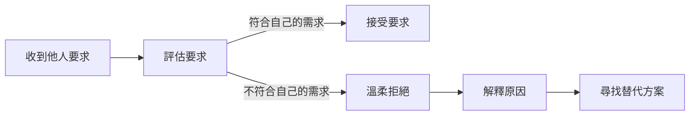

【十分鐘心理學】不想順從卻又怕傷感情？學會溫柔堅持自己的界線

## TL;DR
溫柔堅持自己的界線是處理人際關係的有效策略。

## 是什麼
溫柔堅持自己的界線是一種溝通技巧，指的是在與他人交往的過程中，通過溫和的方式表達自己的界限和需求，避免因順從他人而犧牲自己的權益。

## 為什麼重要
在現實生活中，很多人會遇到這樣的困境：為了維持良好的人際關係，不想傷害他人的感情，卻又不想順從他人的要求。溫柔堅持自己的界線可以幫助你在這種情況下找到平衡點，既能保護自己的權益，又能避免傷害他人的感情。

## 怎麼運作
溫柔堅持自己的界線的原理可以用以下流程圖表示：

首先，當你收到他人的要求時，需要評估這個要求是否符合自己的需求。如果符合，可以接受要求；如果不符合，需要溫柔地拒絕，並解釋自己的原因。最後，尋找替代方案，以滿足雙方的需求。

## 跟順從的差別
溫柔堅持自己的界線與順從的最大差別在於，它們的核心目標不同。順從的目標是避免衝突和傷害他人的感情，而溫柔堅持自己的界線的目標是保護自己的權益和需求。前者可能會犧牲自己的權益，後者則能夠找到平衡點，既能保護自己的權益，又能避免傷害他人的感情。

## 小結
溫柔堅持自己的界線是一種有效的溝通技巧，適合那些不想順從卻又怕傷感情的人使用。通過溫柔堅持自己的界線，你可以保護自己的權益，避免犧牲自己的需求，又能避免傷害他人的感情。

## 參考資料
NA
- [【十分鐘心理學】不想順從卻又怕傷感情？學會溫柔堅持自己的界線](https://www.youtube.com/watch?v=niXi8iv9Sgc)