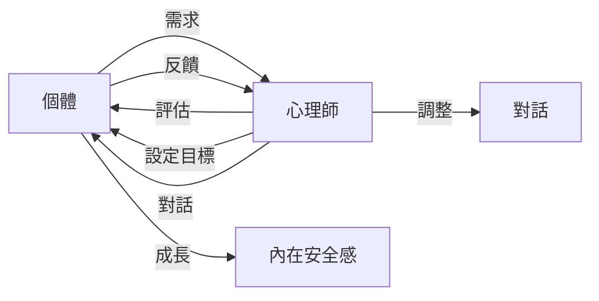

# 專業對話的力量：重建內在安全感的關鍵

## TL;DR
專業對話是促進個體內在安全感的重要工具。

## 是什麼
專業對話是指由受過專業訓練的心理師與個體進行的有結構、有目標的對話過程。透過這種對話，個體可以獲得情感支持、認知改變和行為調整的幫助，從而重建內在安全感。

## 為什麼重要
內在安全感是個體的心理基石，直接影響其自信、自尊和幸福感。然而，個體可能因為各種原因（如創傷、失敗或重大變故）而喪失內在安全感，從而出現心理問題。專業對話提供了一種有效的方式，幫助個體重建內在安全感，恢復心理健康。

## 怎麼運作
專業對話的運作流程如下：

首先，個體會與心理師溝通需求，心理師會進行評估和目標設定。然後，心理師會與個體進行結構化的對話，提供情感支持、認知改變和行為調整的幫助。個體會給予反饋，心理師會根據反饋調整對話內容，促進個體成長和內在安全感的重建。

## 跟 自助書籍的差別
自助書籍提供了一種自我幫助的方式，然而，它們缺乏專業指導和即時互動，難以提供個體化的幫助。專業對話則由受過專業訓練的心理師提供，能夠根據個體的具體需求提供針對性的幫助。

## 小結
專業對話適合需要情感支持、認知改變和行為調整的個體，尤其是那些遭遇創傷、失敗或重大變故的人。透過專業對話，個體可以重建內在安全感，恢復心理健康。

## 參考資料
- 《內在安全感：心理學的新視角》
- [【十分鐘心理學】專業對話無可取代，了解心理師如何協助個體重建「內在安全感」](https://www.youtube.com/watch?v=fRjSmxaxMKw)