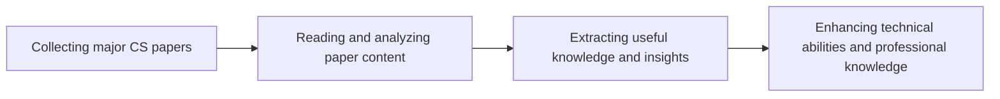

# Introduction: What Problem Does This Case Solve

The video title "I read every major CS paper of the last 100 years..." showcases an engineer's in-depth exploration and learning enthusiasm for the field of Computer Science (CS). The engineer spent a significant amount of time reading major CS papers from the past 100 years, gaining knowledge and insights, and attempting to solve a problem: how to gain a comprehensive understanding of the development and progress of the CS field.

## TL;DR
By reading major CS papers from the past 100 years, the engineer gained a comprehensive understanding and deep insights into the CS field, thereby enhancing their technical abilities and professional knowledge.

## Background and Challenges

Computer Science is a rapidly evolving field, with new technologies and theories being proposed and developed continuously. Gaining a comprehensive understanding of the development and progress of the CS field is a challenging task that requires a significant amount of time and effort. The engineer faced the challenge of effectively reading and absorbing major CS papers from the past 100 years, extracting useful knowledge and insights.

## Solution Design

The engineer's solution was to gain a comprehensive understanding of the CS field by reading major CS papers. This solution involves the following steps:

1. Collecting major CS papers
2. Reading and analyzing paper content
3. Extracting useful knowledge and insights

## Implementation Details

During the implementation process, the engineer may encounter the following challenges:

* How to effectively collect major CS papers?
* How to quickly read and analyze a large amount of paper content?
* How to extract useful knowledge and insights?

To address these challenges, the engineer may adopt the following strategies:

* Using search engines and academic databases to collect papers
* Using speed reading and note-taking techniques to improve reading efficiency
* Using mind maps and knowledge graphs to organize and extract knowledge

## Outcome

By reading major CS papers from the past 100 years, the engineer gained a comprehensive understanding and deep insights into the CS field, thereby enhancing their technical abilities and professional knowledge.

## Lessons Learned

The engineer's experience tells us that reading major CS papers is an effective learning method that can help us enhance our technical abilities and professional knowledge. It also tells us that effectively collecting, reading, and analyzing paper content is crucial.

## References

* Video title "I read every major CS paper of the last 100 years..."