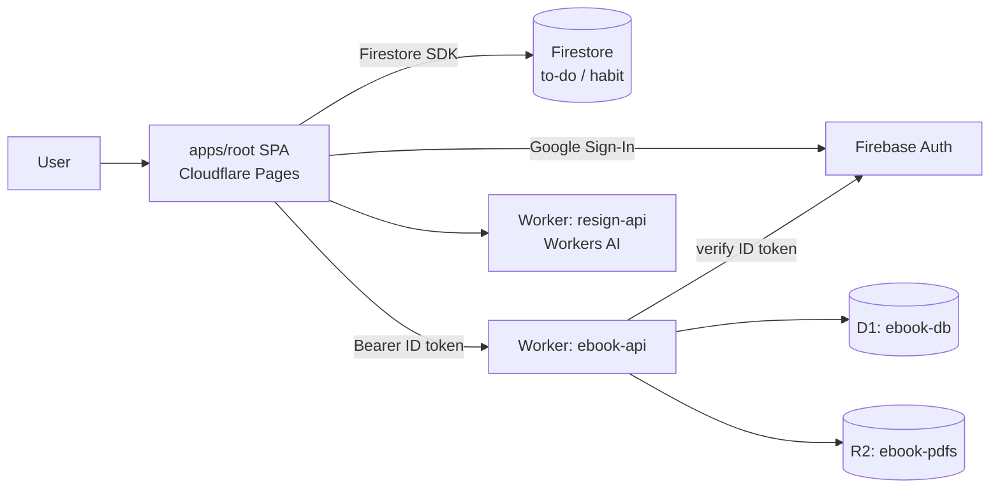

a920604a Labs is a pnpm monorepo that integrates four independent daily tools into a single repo: a to-do list, a habit tracker, an ebook reader, and a resignation stamp collector. The technical backbone is React 19 + TypeScript + Chakra UI + Firebase + Cloudflare, with the goal of making shared logic (authentication, UI components) genuinely reusable rather than reimplemented in each side project.

The design focus of the whole project isn't "lots of features" but **how the monorepo is carved up**: how to let four SPAs share the same auth and ui while still developing independently; and how to flexibly mix and match Firestore or Cloudflare backend services according to each module's actual needs.

## How the Monorepo Is Carved Up: A Single Build Entry Point + Library-Only Modules

The repo is split into three layers: `apps/`, `packages/`, and `workers/`.

```
a920604a-labs/
├── apps/
│   ├── root/            # SPA entry (route assembly + HubPage)
│   ├── ebook-reader/    # @a920604a/ebook-reader
│   ├── habit-tracker/   # @a920604a/habit-tracker
│   ├── resign-stamp/    # @a920604a/resign-stamp
│   └── to-do-list/      # @a920604a/to-do-list
├── packages/
│   ├── auth/            # @a920604a/auth (Firebase Auth)
│   └── ui/              # @a920604a/ui (GlobalShell, LoginPage, theme)
└── workers/
    └── ebook-api/       # Cloudflare Worker + D1 (ebook API)
```

The key design decision is: **`apps/root` is the sole build entry point for the entire SPA**. Its code is extremely minimal, doing just three things—

| File | Responsibility |
|---|---|
| `src/main.tsx` | Calls Firebase `initFirebase()`, mounts ChakraProvider + AuthProvider |
| `src/App.tsx` | BrowserRouter, `MODULES` navigation config, `<GlobalShell>`, four module Routes |
| `src/pages/HubPage.tsx` | Home launch page (time-of-day greeting + four module cards) |

The four feature modules are **library-only** workspace packages: each `apps/{module}` exports only a single `./src/index.ts` (`export { default } from './App'`), and **has no `vite.config.ts` of its own**. They are bundled all at once by `apps/root`'s Vite via pnpm workspace symlinks. In other words, the modules are "assembled" into root rather than being built independently and stitched together afterward. This lets the four tools share the same build config and the same set of Providers, while still developing their own sub-routes, components, and hooks independently within their own directories.

## Two Shared Packages: auth and ui

Authentication is consolidated in `@a920604a/auth`, which exposes only a handful of APIs:

```ts
initFirebase(config)      // Initialize the Firebase App (idempotent)
getFirebaseAuth()         // Get the Auth instance
getFirebaseFirestore()    // Get the Firestore instance
AuthProvider              // React Context Provider
useAuth()                 // → { user, loading, signInWithGoogle, logout }
```

Any module that needs login state just uses `useAuth()`—no need to touch the Firebase SDK directly.

UI is consolidated in `@a920604a/ui`, centered on `GlobalShell`—a sidebar shell modeled after the macOS HIG. Its navigation is entirely controlled by the `modules` prop passed in by the caller, with **no hardcoded routes**:

```ts
interface SidebarModule {
  path: string
  label: string
  icon?: ReactNode
  subItems?: { label: string; path: string }[]
  exact?: boolean
}
```

Presentation details of GlobalShell: on desktop, a fixed 240px Sidebar on the left, with the Topbar using `backdrop-filter` for a frosted-glass effect; on mobile, it collapses into a Hamburger that opens a left-sliding Drawer; the active state is a filled rounded rect à la macOS Finder. The package also exports `LoginPage`, `AppShell`, `NavBar`, and a Chakra-extended `theme` (brand palette + Noto Sans TC).

## The Four Feature Modules

- **📝 To-Do List**: Real-time Firestore sync, with due-date alerts, tag categories (work / study / personal / other), three views (list / stats / calendar), and rich-text notes via Tiptap.
- **✅ Habit Tracker**: Daily check-ins, streak counts, achievement badges (data stored in Firestore). The stats page uses Recharts + Chart.js to draw weekly/monthly check-in rate line charts, heatmaps, and bar charts, plus browser notification reminders and PDF export via pdf-lib.
- **📚 Ebook Reader**: After a PDF is uploaded, it's cached locally in IndexedDB and simultaneously synced to a Cloudflare Worker's D1. The reader uses `@react-pdf-viewer`, remembers reading progress, and provides a categorized library and a pie-chart stats view.
- **🏮 Resignation Stamp**: A 100-cell stamp grid (click to stamp and enter a reason), a progress bar, achievement badges, and a daily maxim; reasons can be searched / sorted / exported as .txt, and pdf-lib + fontkit generate a PDF resignation-stamp certificate in one click.

## Dual-Cloud Architecture: Pick a Backend per Module

What's most worth documenting about this project is that it **doesn't force all modules onto the same backend**, but mixes and matches by need:



The Cloudflare services each module actually uses:

| Module | Pages | Workers | D1 | R2 |
|---|:---:|:---:|:---:|:---:|
| Ebook Reader | ✓ | ✓ | ✓ | ✓ |
| Resignation Stamp | ✓ | ✓ | - | - |
| To-Do List | ✓ | - | - | - |
| Habit Tracker | ✓ | - | - | - |

The to-do and habit modules store their data in Firestore, with Cloudflare only doing static hosting; the ebook module leverages the full Workers + D1 + R2 stack; and the resignation stamp uses Workers + Workers AI.

## Cross-Cloud Verification: The Worker Trusts the Firebase ID Token

The ebook's `ebook-api` Worker is the key integration point of the dual-cloud setup. Every one of its endpoints requires `Authorization: Bearer <Firebase ID token>`; the Worker verifies the token before authorizing any operation on D1:

| Method | Path | Description |
|---|---|---|
| `GET` | `/books?user_id=` | Get the book list |
| `POST` | `/books` | Add a book |
| `DELETE` | `/books/:id?user_id=` | Delete a book + its progress |
| `GET` | `/progress/:bookId?user_id=` | Get reading progress |
| `PUT` | `/progress/:bookId` | Update reading progress |

This way, the Firebase login identity the frontend obtains can be carried all the way to Cloudflare's backend for authorization—identity issued by Firebase, data stored in D1, with the two clouds each doing their own job.

## Tech Stack

| Layer | Technology | Version |
|---|---|---|
| UI framework | React + TypeScript | 19.x / 5.8 |
| Component library | Chakra UI | 2.x |
| Routing | React Router DOM | 7.x |
| Build | Vite + SWC | 6.x |
| Monorepo | pnpm workspaces + NX | 10.x / 20.x |
| Auth | Firebase Auth (Google Sign-In) | 11.x |
| Database | Firebase Firestore | 11.x |
| Local storage | IndexedDB (native API) | — |
| Backend API | Cloudflare Workers | — |
| API DB | Cloudflare D1 (SQLite) | — |
| Deployment | Cloudflare Pages + Workers | — |
| CI/CD | GitHub Actions | — |

Deployment runs through `.github/workflows/deploy.yml`: after pushing to `main`, two jobs run automatically—`deploy-root` builds `apps/root` and deploys it to Cloudflare Pages (`a920604a-labs`), while `deploy-ebook-api` deploys `workers/ebook-api` to Cloudflare Workers. Both the Firebase and Cloudflare keys are injected from GitHub Secrets.

## Conclusion

The real value of a920604a Labs isn't in the individual features of the four tools, but in how it demonstrates a pragmatic way to carve up a monorepo: **a single Vite build entry point + library-only modules** makes sharing natural, while **picking a backend per module** frees you from over-engineering in the name of "uniformity"—simple things go into Firestore, and only what needs relational data and files brings in Workers + D1 + R2. For a personal full-stack playground, this sense of proportion—"share what should be shared, isolate what should be isolated"—is rarer than piling on technology.

## References

- [GitHub: a920604a/a920604a-labs](https://github.com/a920604a/a920604a-labs)
- [Production: a920604a-labs.pages.dev](https://a920604a-labs.pages.dev)
