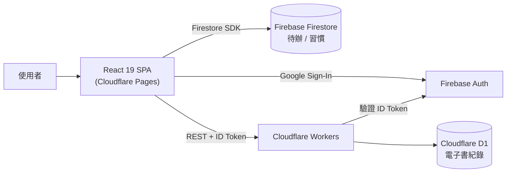
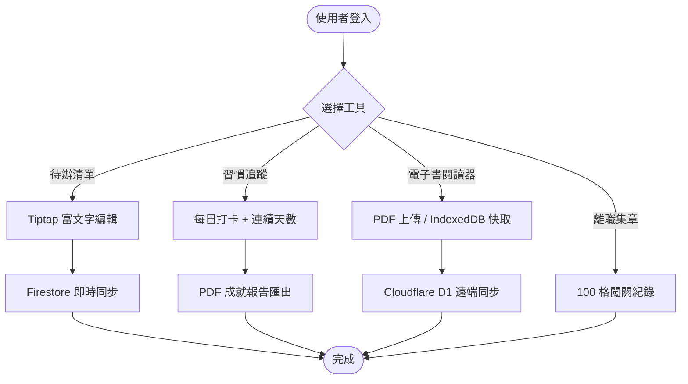

a920604a Labs 是一個 pnpm monorepo，整合四個獨立的日常工具 SPA，共用 Firebase Auth 與 Chakra UI 元件庫，部署於 Cloudflare Pages，作為個人全端技術實驗場。

## 背景

分散的 side project 難以統一管理共用邏輯（身份驗證、UI 元件），也難以在同一個部署流程中維護。這個專案的目標是透過 monorepo 架構把四個工具整合進同一個 repo，實際練習 React 19 與 Cloudflare 全端開發，並讓共用套件真正被複用而非重複實作。

## 挑戰

pnpm workspaces + NX 架構下需同時整合兩套雲端服務：Firebase 負責身份驗證與 Firestore 即時同步，Cloudflare 負責靜態部署與 Workers API，Firebase ID token 必須能跨服務正確傳遞與驗證，否則電子書的 D1 CRUD API 無法授權。

## 解法

採用 shared packages 架構，各功能 app 獨立打包部署，共享 auth 與 ui：

- 以 **React 19 + Vite 6** 建置四個功能 SPA（待辦清單、習慣追蹤、電子書閱讀器、離職集章），共享 Chakra UI 元件庫
- 以 **Firebase Auth + Firestore** 實作 Google Sign-In 及跨裝置即時資料同步（待辦清單、習慣追蹤）
- 以 **Cloudflare Workers + D1** 建置電子書 CRUD API，整合 Firebase ID token 驗證確保請求授權
- 以 **pnpm workspaces + NX** 管理 monorepo 架構，共用 `@a920604a/auth` 與 `@a920604a/ui` 套件

## 架構圖

## 流程圖

## 成果

四個功能模組均已部署至 Cloudflare Pages，目前作為個人全端技術展示平台持續維護，Firebase + Cloudflare 雙雲整合驗證流程穩定運行。
