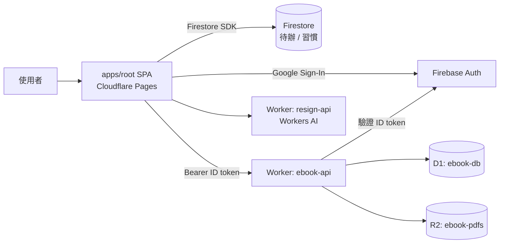

a920604a Labs 是一個 pnpm monorepo，把四個各自獨立的日常工具整合進同一個 repo：待辦清單、習慣追蹤、電子書閱讀器、離職集章。技術主軸是 React 19 + TypeScript + Chakra UI + Firebase + Cloudflare，目標是讓共用邏輯（身份驗證、UI 元件）真正被複用，而不是在每個 side project 裡重複實作一遍。

整個專案的設計重點不在「功能很多」，而在 **monorepo 怎麼切**：如何讓四個 SPA 共享同一套 auth 與 ui，又能各自獨立開發；以及如何依每個模組的實際需求，靈活搭配 Firestore 或 Cloudflare 的後端服務。

## monorepo 怎麼切：單一建置入口 + library-only 模組

repo 分成三層：`apps/`、`packages/`、`workers/`。

```
a920604a-labs/
├── apps/
│   ├── root/            # SPA 入口（路由組裝 + HubPage）
│   ├── ebook-reader/    # @a920604a/ebook-reader
│   ├── habit-tracker/   # @a920604a/habit-tracker
│   ├── resign-stamp/    # @a920604a/resign-stamp
│   └── to-do-list/      # @a920604a/to-do-list
├── packages/
│   ├── auth/            # @a920604a/auth（Firebase Auth）
│   └── ui/              # @a920604a/ui（GlobalShell, LoginPage, theme）
└── workers/
    └── ebook-api/       # Cloudflare Worker + D1（電子書 API）
```

關鍵設計是：**`apps/root` 是整個 SPA 唯一的建置入口**，程式碼極精簡，只做三件事——

| 檔案 | 職責 |
|---|---|
| `src/main.tsx` | 呼叫 Firebase `initFirebase()`，掛載 ChakraProvider + AuthProvider |
| `src/App.tsx` | BrowserRouter、`MODULES` 導覽設定、`<GlobalShell>`、四個模組 Route |
| `src/pages/HubPage.tsx` | 首頁啟動頁（時段問候 + 四個模組卡片） |

四個功能模組則是 **library-only** 的 workspace 套件：每個 `apps/{module}` 只 export 一個 `./src/index.ts`（`export { default } from './App'`），**本身沒有 `vite.config.ts`**。它們透過 pnpm workspace 的 symlink，由 `apps/root` 的 Vite 一次打包。換句話說，模組像是被「組裝」進 root，而不是各自獨立建置再拼起來。這讓四個工具能共用同一份建置設定、同一套 Provider，卻又能在各自的目錄裡獨立開發 sub-routes、components 與 hooks。

## 兩個共用套件：auth 與 ui

身份驗證收斂在 `@a920604a/auth`，對外只暴露少數幾個 API：

```ts
initFirebase(config)      // 初始化 Firebase App（幂等）
getFirebaseAuth()         // 取得 Auth instance
getFirebaseFirestore()    // 取得 Firestore instance
AuthProvider              // React Context Provider
useAuth()                 // → { user, loading, signInWithGoogle, logout }
```

任何模組要登入狀態，只要 `useAuth()` 就好，不必各自碰 Firebase SDK。

UI 則收斂在 `@a920604a/ui`，核心是 `GlobalShell`——一個仿 macOS HIG 的 sidebar shell。它的導覽完全由呼叫端傳入的 `modules` prop 控制，**沒有硬編碼路由**：

```ts
interface SidebarModule {
  path: string
  label: string
  icon?: ReactNode
  subItems?: { label: string; path: string }[]
  exact?: boolean
}
```

GlobalShell 的呈現細節：桌面端固定左側 240px Sidebar，Topbar 用 `backdrop-filter` 做磨砂玻璃效果；行動端則收成 Hamburger，點開後左滑 Drawer；active state 是仿 macOS Finder 的 filled rounded rect。套件也一併匯出 `LoginPage`、`AppShell`、`NavBar` 與 Chakra 擴充的 `theme`（brand 色系 + Noto Sans TC）。

## 四個功能模組

- **📝 待辦清單**：Firestore 即時同步，支援截止日期警示、標籤分類（工作／學習／個人／其他）、列表／統計／日曆三視圖，備註用 Tiptap 富文字編輯。
- **✅ 習慣追蹤**：每日打卡、連續天數、成就徽章（資料存 Firestore）。統計頁用 Recharts + Chart.js 畫週／月打卡率折線圖、熱力圖與長條圖，並支援瀏覽器通知提醒、pdf-lib 匯出 PDF。
- **📚 電子書閱讀器**：PDF 上傳後在 IndexedDB 做本機快取，同時同步到 Cloudflare Worker 的 D1。閱讀器用 `@react-pdf-viewer`，記憶閱讀進度、提供分類書庫與圓餅統計圖。
- **🏮 離職集章**：100 格印章格（點擊蓋章並輸入理由）、進度條、成就徽章、每日箴言；理由可搜尋／排序／匯出 .txt，並用 pdf-lib + fontkit 一鍵生成 PDF 離職集章證明。

## 雙雲架構：按模組挑後端

這個專案最值得記錄的，是它**沒有強求所有模組用同一套後端**，而是按需求混搭：


```mermaid
graph LR
  User["使用者"] --> FE["apps/root SPA<br/>Cloudflare Pages"]
  FE -->|"Google Sign-In"| FAuth["Firebase Auth"]
  FE -->|"Firestore SDK"| FS[("Firestore<br/>待辦 / 習慣")]
  FE -->|"Bearer ID token"| EBK["Worker: ebook-api"]
  FE --> RSG["Worker: resign-api<br/>Workers AI"]
  EBK -->|"驗證 ID token"| FAuth
  EBK --> D1[("D1: ebook-db")]
  EBK --> R2[("R2: ebook-pdfs")]
```

各模組實際用到的 Cloudflare 服務：

| 模組 | Pages | Workers | D1 | R2 |
|---|:---:|:---:|:---:|:---:|
| 電子書閱讀器 | ✓ | ✓ | ✓ | ✓ |
| 離職集章 | ✓ | ✓ | - | - |
| 待辦清單 | ✓ | - | - | - |
| 習慣追蹤 | ✓ | - | - | - |

待辦與習慣兩個模組資料存在 Firestore，Cloudflare 只負責靜態托管；電子書用上完整的 Workers + D1 + R2；離職集章則用 Workers + Workers AI。

## 跨雲驗證：Worker 認 Firebase ID token

電子書的 `ebook-api` Worker 是雙雲整合的關鍵點。它的所有端點都要求 `Authorization: Bearer <Firebase ID token>`，由 Worker 端驗證 token 後才授權對 D1 的操作：

| Method | Path | 說明 |
|---|---|---|
| `GET` | `/books?user_id=` | 取得書單 |
| `POST` | `/books` | 新增書籍 |
| `DELETE` | `/books/:id?user_id=` | 刪除書籍 + 進度 |
| `GET` | `/progress/:bookId?user_id=` | 取得閱讀進度 |
| `PUT` | `/progress/:bookId` | 更新閱讀進度 |

這樣前端拿到的 Firebase 登入身份，就能一路傳遞到 Cloudflare 的後端做授權——身份由 Firebase 發、資料由 D1 存，兩朵雲各司其職。

## 技術棧

| 層級 | 技術 | 版本 |
|---|---|---|
| UI 框架 | React + TypeScript | 19.x / 5.8 |
| 元件庫 | Chakra UI | 2.x |
| 路由 | React Router DOM | 7.x |
| 建置 | Vite + SWC | 6.x |
| Monorepo | pnpm workspaces + NX | 10.x / 20.x |
| 認證 | Firebase Auth（Google Sign-In） | 11.x |
| 資料庫 | Firebase Firestore | 11.x |
| 本機儲存 | IndexedDB（原生 API） | — |
| 後端 API | Cloudflare Workers | — |
| API DB | Cloudflare D1（SQLite） | — |
| 部署 | Cloudflare Pages + Workers | — |
| CI/CD | GitHub Actions | — |

部署走 `.github/workflows/deploy.yml`：push 到 `main` 後自動跑兩個 job——`deploy-root` 建置 `apps/root` 並部署到 Cloudflare Pages（`a920604a-labs`），`deploy-ebook-api` 則部署 `workers/ebook-api` 到 Cloudflare Workers。Firebase 與 Cloudflare 的金鑰都放在 GitHub Secrets 注入。

## 小結

a920604a Labs 真正的價值不在四個工具各自的功能，而在它示範了一種務實的 monorepo 切法：**單一 Vite 建置入口 + library-only 模組**讓共用變得自然，而**按模組挑後端**讓你不必為了「統一」而過度設計——簡單的存 Firestore，需要關聯資料與檔案的才動用 Workers + D1 + R2。對個人全端實驗場來說，這種「共用該共用的、隔離該隔離的」分寸，比堆技術更難得。

## 參考資料

- [GitHub：a920604a/a920604a-labs](https://github.com/a920604a/a920604a-labs)
- [Production：a920604a-labs.pages.dev](https://a920604a-labs.pages.dev)
