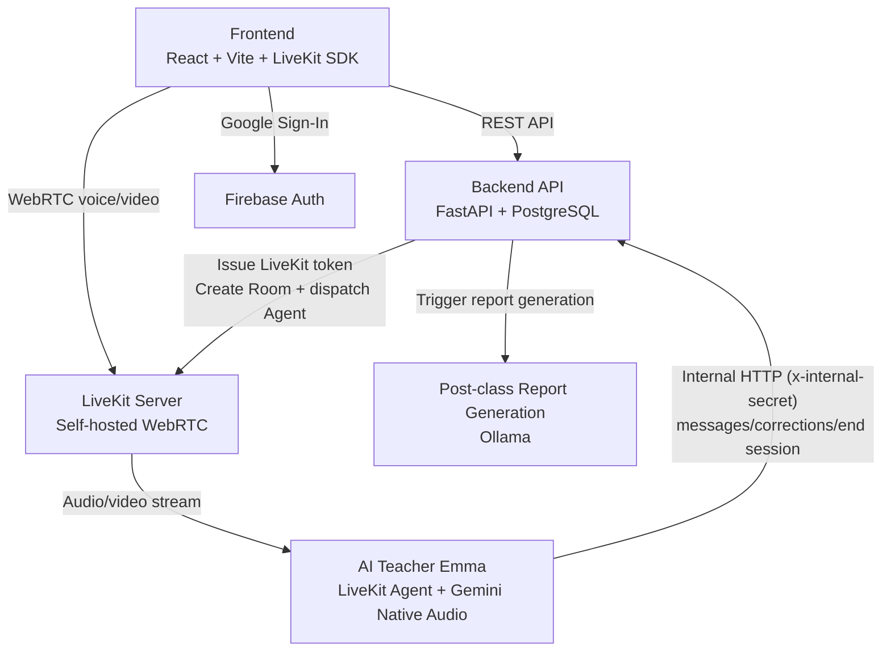
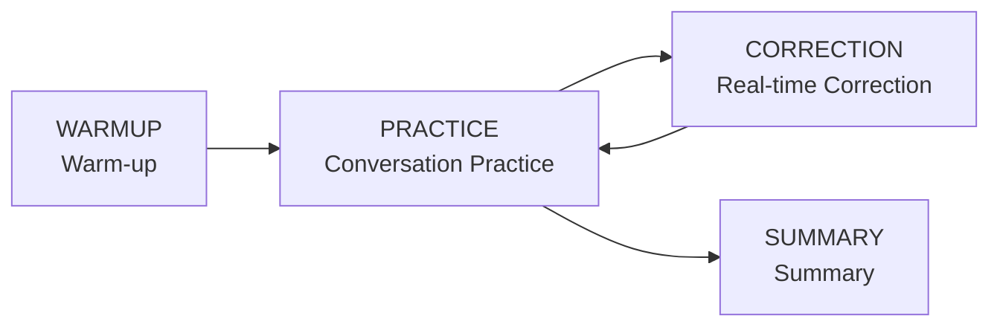
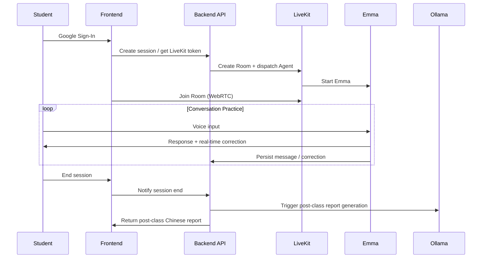

Live English Tutor is an AI English tutoring system built around **real-time voice**. Students practice conversations with the AI teacher Emma through their microphone (and optionally camera or screen sharing); the system corrects mistakes in real time during the session and generates a Chinese-language learning report afterward.

Unlike most text-first language-learning tools, this project puts the emphasis on "natural conversation": letting students speak and practice just like they would with a human tutor. The biggest engineering challenge in pulling this off is the latency and architectural integration of real-time voice — and that's the central axis of the whole system design.

## Three Decoupled Layers

The system deliberately splits the "media layer," the "API layer," and the "AI Agent layer" apart, each with its own independent responsibility:

- **Frontend (browser)**: React + Vite, using Firebase Auth for Google Sign-In, going through the REST API via axios, and building the WebRTC voice/video connection with the LiveKit JS SDK.
- **FastAPI backend**: Handles Firebase token verification, course and message management, issuing LiveKit tokens, and persisting data into PostgreSQL.
- **LiveKit Agent Worker (Emma)**: The actual AI teacher, running in a standalone worker backed by Google Gemini 2.5 Flash Native Audio.

External services include LiveKit (Self-hosted Docker), Firebase (auth), the Google Gemini API (conversation + voice), and Ollama (post-class report generation, running on an external server).

## Why Gemini Native Audio

Traditional voice-conversation systems usually chain together a long pipeline: VAD (voice activity detection) → STT (speech-to-text) → LLM (generate response) → TTS (text-to-speech). Each stage adds latency, and stacked up they break the fluency of a conversation.

This project instead uses **Google Gemini 2.5 Flash Native Audio** — a native audio model that integrates VAD, STT, LLM, and TTS together. The Agent is configured with `video_enabled=True`, so beyond voice it can also receive the student's camera feed or screen share. This design dramatically reduces the latency and complexity of stitching multiple services together.

## Emma's Four-Stage State Machine

The AI teacher Emma isn't a single fixed conversation mode — she's driven by a state machine that switches through four stages in order, each corresponding to a different System Prompt:

Conversation messages and correction records are persisted via the Agent's callback mechanism, which calls the backend's internal API — these internal endpoints require an `x-internal-secret` header, are for Agent use only, and are isolated from the user-facing API.

## The Full Flow of One Class

Post-class report generation is handled by Ollama (OpenAI-compatible API), which is independent of the main conversation flow, and it's disabled by default — you need to set `ENABLE_REPORT_GENERATION` to `true` and confirm the Ollama server is reachable for it to be enabled. The frontend can query the status via `GET /sessions/{id}/report` (`disabled` / `pending` / `ready`).

## The Fine Points of Self-hosted LiveKit and LAN Connectivity

LiveKit runs in **Self-hosted** mode (Docker), requiring no LiveKit Cloud account; the whole stack is brought up locally via `docker-compose.livekit.yml`.

A classic WebRTC problem I hit in practice: when accessing from another device on the LAN, the connection would fail (`could not establish pc connection`). The cause is that the IP broadcast in the ICE candidates is wrong. The fix is to set `LIVEKIT_NODE_IP` to the host's LAN IP (e.g. `192.168.15.116`) so LiveKit broadcasts the correct address, then restart the LiveKit server. These "works locally but drops when switching devices" problems almost always originate in the ICE/network layer rather than application logic.

## Auth and Security Boundaries

The whole system has two clear trust boundaries:

- **External**: The user APIs (`/auth/*`, `/sessions/*`) all require a Firebase ID Token. The frontend does Google Sign-In first to obtain the token, and the backend verifies it with the Firebase Admin SDK.
- **Internal**: The Agent → Backend callbacks (`/internal/agent/*`) are protected by an `x-internal-secret` shared secret, isolated from the external API.

After deploying to Cloudflare Pages, there are two more must-dos: add the `*.pages.dev` domain to the Authorized domains in the Firebase Console (otherwise Google Sign-In returns `auth/unauthorized-domain`), and add the frontend domain to `ALLOWED_ORIGINS` in the backend's `main.py` to avoid CORS errors.

## Tech Stack at a Glance

| Layer | Technology |
|------|------|
| Frontend | React 18, TypeScript, Vite, React Router v6, Zustand, Axios, LiveKit JS SDK |
| Backend | FastAPI, SQLAlchemy 2.0, PostgreSQL 16, Firebase Admin SDK, LiveKit API SDK |
| AI Agent | LiveKit Agents SDK 1.x, Google Gemini 2.5 Flash Native Audio (Realtime) |
| Report Generation | Ollama (OpenAI-compatible API, external server) |
| Auth | Firebase Authentication (Google Sign-In) |
| Real-time Voice/Video | LiveKit Self-hosted (WebRTC) |
| Deployment | Docker Compose (backend + Agent), Cloudflare Pages (frontend) |

## Wrap-up

The design focus of Live English Tutor is splitting a "real-time voice AI tutor" into three independently operable layers: media (LiveKit WebRTC), API (FastAPI + PostgreSQL), and AI Agent (Gemini Native Audio + state machine). Among these, using a native audio model in place of a traditional STT/TTS pipeline is the key decision for reducing conversation latency; while Self-hosted LiveKit, Firebase auth, and the internal secret together form the operational and security foundation for running this system in both local and production environments.

## References

- [Live English Tutor — GitHub](https://github.com/a920604a/live-english-tutor)
- [LiveKit Agents Docs](https://docs.livekit.io/agents/)
- [Google AI Studio (Gemini API)](https://aistudio.google.com)
- [Firebase Authentication](https://firebase.google.com/docs/auth)
