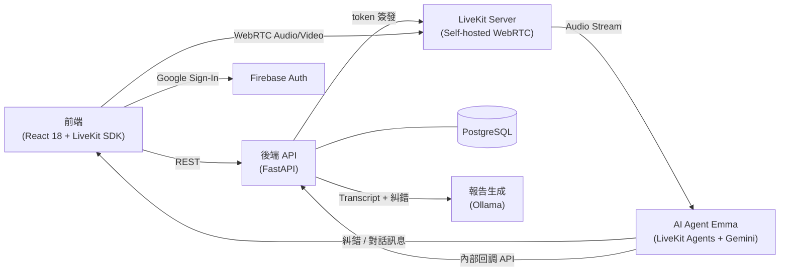
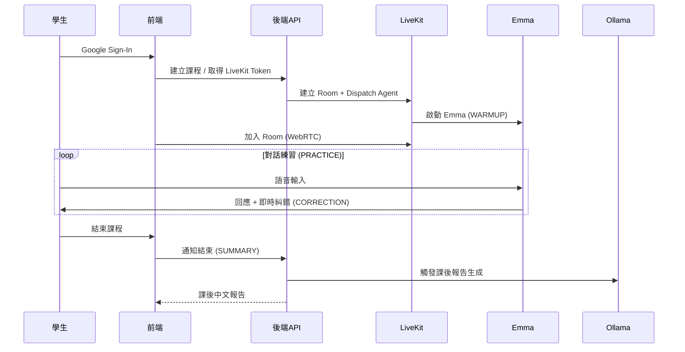

Live English Tutor 是一個以即時語音互動為核心的 AI 英文家教平台，學生透過麥克風與 AI 教師 Emma 進行對話練習，系統即時糾錯並於課後生成中文學習報告。

## 背景

學生缺乏低成本、隨時可用的口語練習管道，市面上語言學習工具大多以文字為主，難以在自然對話中提供即時語音回饋與糾錯。這個專案目標是打造一個能模擬真實家教互動的 AI 系統，讓學生在自然對話中練習英文並降低開口焦慮。

## 挑戰

需在低延遲環境中同時處理 WebRTC 媒體傳輸、Gemini Native Audio 推理與 STT/TTS 流程，任一環節延遲都會破壞對話流暢感。此外，Firebase ID token 需跨 FastAPI 與 LiveKit Agent 兩個服務正確驗證，確保 session 安全；Agent 狀態機（WARMUP → PRACTICE → CORRECTION → SUMMARY）需在同一 WebRTC 連線中無縫切換。

## 解法

採用解耦式架構，將媒體層、API 層與 AI Agent 層分離：

- 以 **React 18 + LiveKit JS SDK** 建置前端，支援麥克風、鏡頭與螢幕分享
- 以 **FastAPI + PostgreSQL** 建置後端 API 層，負責 Firebase token 驗證、LiveKit token 簽發與 session 管理
- 以 **LiveKit Agents SDK + Google Gemini 2.5 Flash Native Audio** 實作即時語音對話、四階段狀態機與語法糾錯
- 以 **Docker Compose** 自架 LiveKit Server，支援本地多裝置 WebRTC 連線
- 以 **Ollama** 驅動課後中文報告生成服務，獨立於主對話流程

## 架構圖

## 流程圖

## 成果

完成端到端即時語音互動教學系統，支援即時糾錯與課後中文報告，可在本地多裝置環境穩定運行。Agent 四階段狀態機完整實作，WebRTC 連線延遲在區網環境下維持流暢對話體驗。
