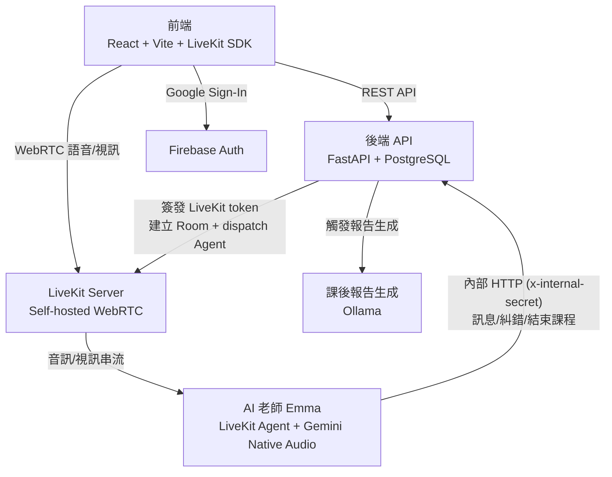
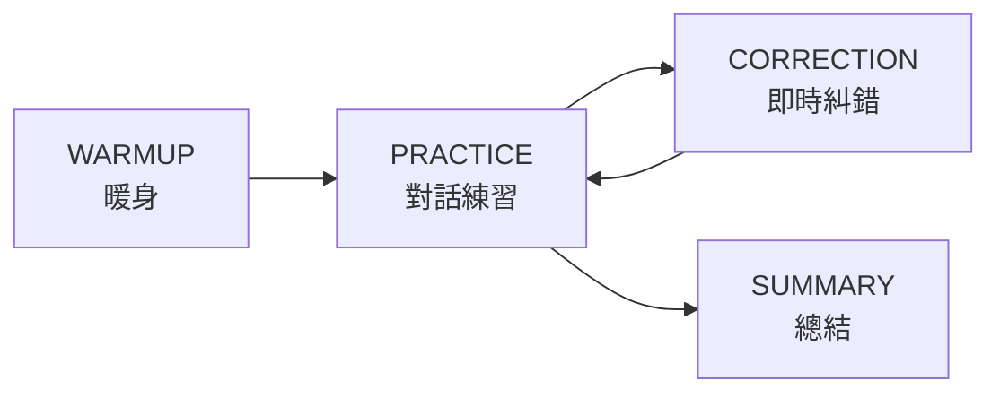
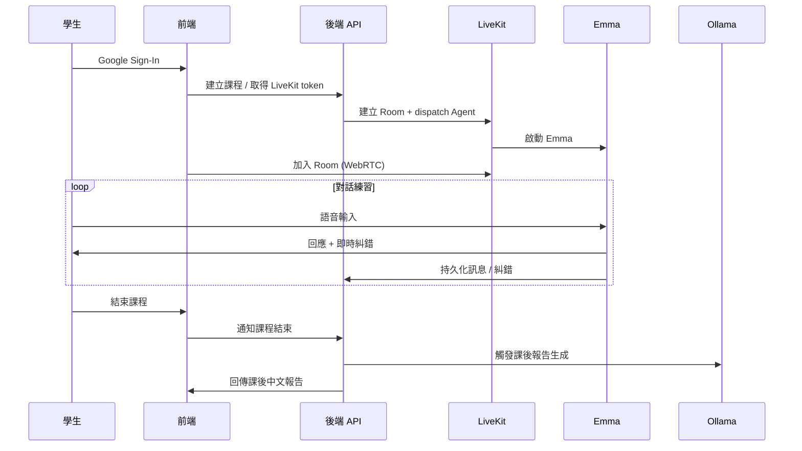

Live English Tutor 是一套以**即時語音**為核心的 AI 英文家教系統。學生透過麥克風（並可選配攝影機、螢幕分享）與 AI 老師 Emma 進行對話練習，系統在過程中即時糾錯，並在課後生成中文學習報告。

跟多數以文字為主的語言學習工具不同，這個專案把重心放在「自然對話」上：讓學生能像跟真人家教一樣開口練習。要做到這件事，最大的工程挑戰在於即時語音的延遲與架構整合——這也是整個系統設計的主軸。

## 三層解耦架構

系統刻意把「媒體層」「API 層」與「AI Agent 層」拆開，各自獨立負責：

- **前端（瀏覽器）**：React + Vite，透過 Firebase Auth 做 Google Sign-In，以 axios 走 REST API，並用 LiveKit JS SDK 建立 WebRTC 語音／視訊連線。
- **FastAPI 後端**：負責 Firebase token 驗證、課程與訊息管理、簽發 LiveKit token，資料存進 PostgreSQL。
- **LiveKit Agent Worker（Emma）**：實際的 AI 老師，跑在獨立的 worker，背後接 Google Gemini 2.5 Flash Native Audio。

外部服務則包含 LiveKit（Self-hosted Docker）、Firebase（認證）、Google Gemini API（對話＋語音）與 Ollama（課後報告生成，跑在外部伺服器）。

```mermaid
graph TD
  FE["前端<br/>React + Vite + LiveKit SDK"]
  API["後端 API<br/>FastAPI + PostgreSQL"]
  Agent["AI 老師 Emma<br/>LiveKit Agent + Gemini Native Audio"]
  LK["LiveKit Server<br/>Self-hosted WebRTC"]
  Firebase["Firebase Auth"]
  Ollama["課後報告生成<br/>Ollama"]

  FE -->|"Google Sign-In"| Firebase
  FE -->|"REST API"| API
  FE -->|"WebRTC 語音/視訊"| LK
  API -->|"簽發 LiveKit token<br/>建立 Room + dispatch Agent"| LK
  LK -->|"音訊/視訊串流"| Agent
  Agent -->|"內部 HTTP (x-internal-secret)<br/>訊息/糾錯/結束課程"| API
  API -->|"觸發報告生成"| Ollama
```

## 為什麼選 Gemini Native Audio

傳統的語音對話系統通常要串接一長串 pipeline：VAD（語音活動偵測）→ STT（語音轉文字）→ LLM（生成回應）→ TTS（文字轉語音）。每一段都有延遲，疊加起來會破壞對話的流暢感。

這個專案改用 **Google Gemini 2.5 Flash Native Audio**——一個原生音訊模型，把 VAD、STT、LLM、TTS 整合在一起。Agent 端設定 `video_enabled=True`，因此除了語音之外，也能接收學生的攝影機畫面或螢幕分享。這樣的設計大幅減少了把多個服務串起來的延遲與複雜度。

## Emma 的四階段狀態機

AI 老師 Emma 並非單一固定的對話模式，而是用一個狀態機驅動，依序在四個階段間切換，每個階段對應不同的 System Prompt：

```mermaid
graph LR
  WARMUP["WARMUP<br/>暖身"] --> PRACTICE["PRACTICE<br/>對話練習"]
  PRACTICE --> CORRECTION["CORRECTION<br/>即時糾錯"]
  CORRECTION --> PRACTICE
  PRACTICE --> SUMMARY["SUMMARY<br/>總結"]
```

對話訊息與糾錯紀錄會透過 Agent 的回呼機制，呼叫後端的 internal API 持久化下來——這些內部端點需要帶 `x-internal-secret` header，僅供 Agent 使用，與對外的使用者 API 隔離。

## 一堂課的完整流程

```mermaid
sequenceDiagram
  participant S as 學生
  participant FE as 前端
  participant API as 後端 API
  participant LK as LiveKit
  participant E as Emma
  participant O as Ollama

  S->>FE: Google Sign-In
  FE->>API: 建立課程 / 取得 LiveKit token
  API->>LK: 建立 Room + dispatch Agent
  LK->>E: 啟動 Emma
  FE->>LK: 加入 Room (WebRTC)
  loop 對話練習
    S->>E: 語音輸入
    E->>S: 回應 + 即時糾錯
    E->>API: 持久化訊息 / 糾錯
  end
  S->>FE: 結束課程
  FE->>API: 通知課程結束
  API->>O: 觸發課後報告生成
  API->>FE: 回傳課後中文報告
```

課後報告生成由獨立於主對話流程的 Ollama（OpenAI 相容 API）負責，且預設是關閉的——需要把 `ENABLE_REPORT_GENERATION` 設為 `true` 並確認 Ollama 伺服器可連線才會啟用。前端可透過 `GET /sessions/{id}/report` 查詢狀態（`disabled` / `pending` / `ready`）。

## Self-hosted LiveKit 與區網連線的眉角

LiveKit 採 **Self-hosted** 模式（Docker），不需要 LiveKit Cloud 帳號，整套靠 `docker-compose.livekit.yml` 在本地拉起。

實務上踩到的一個典型 WebRTC 問題是：從區網中的其他裝置存取時，連線會失敗（`could not establish pc connection`）。原因在於 ICE candidate 廣播的 IP 不對。解法是把 `LIVEKIT_NODE_IP` 設成主機的 LAN IP（例如 `192.168.15.116`），讓 LiveKit 廣播正確的位址，之後重啟 LiveKit server 即可。這類「本地能跑、換裝置就斷線」的問題，往往都出在 ICE/網路層而不是應用邏輯。

## 認證與安全邊界

整個系統有兩道清楚的信任邊界：

- **對外**：使用者 API（`/auth/*`、`/sessions/*`）都需要 Firebase ID Token。前端先做 Google Sign-In 拿到 token，後端用 Firebase Admin SDK 驗證。
- **對內**：Agent → Backend 的回呼（`/internal/agent/*`）用 `x-internal-secret` 共享密鑰保護，與對外 API 隔離。

部署到 Cloudflare Pages 後，還有兩件事必做：在 Firebase Console 的 Authorized domains 加入 `*.pages.dev` 網域（否則 Google Sign-In 會回 `auth/unauthorized-domain`），以及在後端 `main.py` 的 `ALLOWED_ORIGINS` 加入前端網域以避免 CORS 錯誤。

## 技術堆疊一覽

| 層次 | 技術 |
|------|------|
| 前端 | React 18, TypeScript, Vite, React Router v6, Zustand, Axios, LiveKit JS SDK |
| 後端 | FastAPI, SQLAlchemy 2.0, PostgreSQL 16, Firebase Admin SDK, LiveKit API SDK |
| AI Agent | LiveKit Agents SDK 1.x, Google Gemini 2.5 Flash Native Audio（Realtime） |
| 報告生成 | Ollama（OpenAI 相容 API，外部伺服器） |
| 認證 | Firebase Authentication（Google Sign-In） |
| 即時語音／視訊 | LiveKit Self-hosted（WebRTC） |
| 部署 | Docker Compose（後端 + Agent）、Cloudflare Pages（前端） |

## 小結

Live English Tutor 的設計重點，是把「即時語音 AI 家教」拆成可獨立運作的三層：媒體（LiveKit WebRTC）、API（FastAPI + PostgreSQL）、AI Agent（Gemini Native Audio + 狀態機）。其中採用原生音訊模型取代傳統 STT/TTS pipeline，是降低對話延遲的關鍵決策；而 Self-hosted LiveKit、Firebase 認證與內部密鑰，則共同構成這套系統在本地與生產環境的運行與安全基礎。

## 參考資料

- [Live English Tutor — GitHub](https://github.com/a920604a/live-english-tutor)
- [LiveKit Agents 文件](https://docs.livekit.io/agents/)
- [Google AI Studio（Gemini API）](https://aistudio.google.com)
- [Firebase Authentication](https://firebase.google.com/docs/auth)
