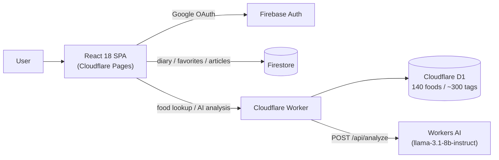
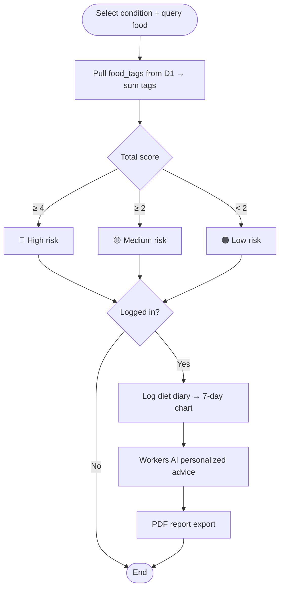

Nutrition Guard is a dietary risk management system targeting a "multi-population, multi-condition" scenario, aimed at four patient groups: **gout, high cholesterol, diabetes, and hypertension**. Its core isn't a fancy ML model but an explainable, auditable **tag scoring engine**: each food carries a number of risk tags for each condition, each tag has a score, and the sum lands in one of three levels — red / yellow / green. The entire backend runs on the free tiers of Cloudflare and Firebase, keeping the monthly cost at **$0**.

## Why Build "Multi-Condition" Scoring

The real pain point for chronic disease patients isn't "not being able to find a taboo list for a single condition" — it's that the same meal often has to account for several conditions at once. Someone with both gout and high cholesterol can hardly tell at a glance, from a static nutrition table, whether a given food is okay to eat. Nutrition Guard breaks this down into a "food × condition × tag" data structure, so once users select their own set of conditions, they immediately get corresponding real-time risk scores across 140 foods.

## Features and Permission Tiers

The product deliberately makes "lookup-type" features usable without login to lower the barrier to entry; only features that need to save personal data require signing in:

| Feature | Login Required | Description |
|------|:--:|------|
| Food Lookup | No | Search 140 foods and view real-time risk scores per condition |
| Dietary Recommendations | No | Lists foods to avoid / safe to eat by condition |
| Knowledge Center | Reading is login-free | Markdown articles; after login you can add / edit your own articles |
| FAQ | No | 12 common questions, filterable by condition |
| Diet Diary | Yes | Log daily meals, visualized as a 7-day bar chart |
| AI Diet Analysis | Yes | Workers AI generates personalized advice from the last 7 days of records |
| PDF Report Export | Yes | A4 report with charts + AI advice, one-click download |
| My Favorites | Yes | Save frequently used foods, synced to display current condition risk |

## Tech Stack

The frontend is **Vite 5 + React 18 + TypeScript**, styled with **TailwindCSS v3**, routed via **React Router v6**, with state managed by **Zustand** and persisted to localStorage. The risk engine is pure TypeScript (`evaluate(tags, condition) → FoodRisk` in `src/engine/riskEngine.ts`) with no AI dependency whatsoever.

The backend is a single **Cloudflare Worker** serving the food API, with data stored in **Cloudflare D1** (SQLite, 140 foods). Only the personalized recommendations that require reasoning are handed off to **Cloudflare Workers AI (llama-3.1-8b-instruct)**. PDFs are generated on the frontend via **@react-pdf/renderer**, lazy-loaded and embedding the Noto Sans SC font to correctly output Chinese. User authentication goes through **Firebase Auth (Google OAuth)**, and user data (diet diary, favorites, custom articles) is stored in **Firebase Firestore**. The entire site is hosted on **Cloudflare Pages**.

The Worker's public API is minimal:

- `GET /api/foods`: food lookup
- `GET /api/foods/:id`: single food
- `GET /api/stats`: statistics
- `POST /api/analyze`: calls Workers AI for diet analysis

> Note: The Workers AI binding can only run in the Cloudflare edge environment, so local development of `POST /api/analyze` must use `wrangler dev --remote` to work.

## Architecture



## The Core: Explainable Tag Scoring

The design priority of the scoring system is **explainability** — no black-box model, but every risk factor explicitly laid out as tags and scores. The database expresses "which condition tags a food carries" with two tables:

```sql
CREATE TABLE foods (
  id       TEXT PRIMARY KEY,
  name_zh  TEXT NOT NULL,
  name_en  TEXT NOT NULL,
  category TEXT NOT NULL  -- meat | seafood | vegetable | fruit | drink | grain | dairy | other
);

CREATE TABLE food_tags (
  food_id   TEXT NOT NULL REFERENCES foods(id),
  condition TEXT NOT NULL,  -- gout | high cholesterol | diabetes | hypertension
  tag       TEXT NOT NULL
);
```

Each tag is scored by severity — for example, gout's `high_purine`, `organ_meat`, and `alcohol` are 3 points each, `seafood_high_risk` is 2, and `moderate_purine` is 1; high cholesterol's `trans_fat` and `high_saturated_fat` are 3 each; diabetes's `high_sugar`, `refined_carbs`, and `sweetened_drink` are 3 each; hypertension's `high_sodium` is 3, and `processed_food` / `canned_food` / `pickled_food` are 2 each. For the selected condition, the matched tag scores are summed and graded:



The benefit of this design is that when a user sees "high risk," they can directly tell which specific tags were matched, rather than being brushed off by a single confidence score. Adding foods or adjusting scores also just means editing `seed.sql` and the tag scores — no need to retrain any model.

## Data Permissions

Firestore's security rules separate "public read, login to write" from "users can only touch their own data": knowledge center articles are readable by anyone, writable only after login, and editable / deletable only by the author; diet diary and favorites under `users/{uid}` are strictly limited to `request.auth.uid == uid` for read and write.

## Deployment and Cost

The deployment flow is the classic full Cloudflare bundle: use `wrangler d1 create` to create D1, apply `schema.sql` and `seed.sql` to load the 140 foods, `worker:deploy` to ship the API, while the frontend is handed to Cloudflare Pages linked to GitHub for automatic builds (build command `npm run build`, output `dist`). On the Firebase side, just enable Google login and Firestore and apply the security rules. Since D1, Workers, Workers AI, Pages, and Firebase all fall within the free tiers, the overall **monthly cost is $0** — which is also the most important constraint in this project's technical choices.

## Summary

Nutrition Guard demonstrates a pragmatic tradeoff: **whatever can be solved with rules shouldn't be thrown at a model**. Core logic like risk scoring — which needs to be trusted and explained — is handled with a pure tag-summing function; only the part that genuinely requires natural language generation, like "writing a paragraph of personalized advice from the last 7 days of records," calls on Workers AI. Combined with the free tiers of Cloudflare + Firebase, the whole product delivers a complete lookup, logging, analysis, and report-export experience at zero operating cost.

## References

- [GitHub: a920604a/nutrition-risk-engine](https://github.com/a920604a/nutrition-risk-engine)
- [Live Demo: nutrition-guard.pages.dev](https://nutrition-guard.pages.dev)
