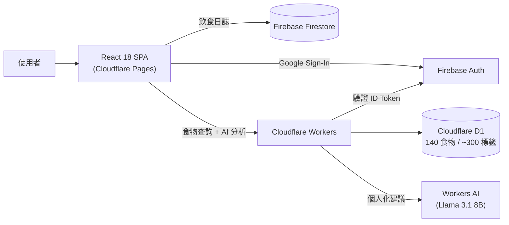
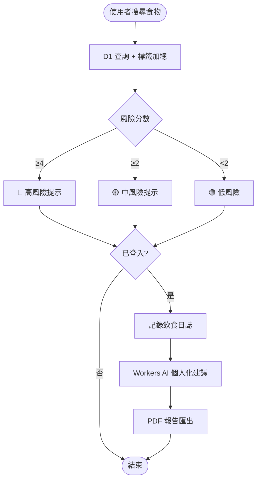

Nutrition Guard 是一個零月費的飲食風險管理平台，140 種食物依病症標籤即時計算風險分數，登入後可記錄飲食日誌，並透過 Workers AI 生成個人化中文建議與 PDF 報告。

## 背景

慢性病患者（痛風、高血脂、糖尿病、高血壓）在日常飲食中缺乏簡單可查、多病症兼顧的風險參考工具。現有營養資料庫多為靜態表格，難以即時評估特定食物對多種疾病的複合風險。

## 挑戰

需在 Cloudflare Pages + Workers 全無伺服器架構下，同時支援即時多病症風險評分、Firebase ID token 跨服務驗證、Workers AI 個人化推理、7 天飲食記錄圖表與 PDF 匯出，且月費必須維持在零元。

## 解法

採用純 Cloudflare + Firebase 全無伺服器架構，以標籤加總取代複雜 ML 模型做風險評分：

- 以 **React 18 + Vite 5 + TailwindCSS** 建置前端，Zustand 管理本地狀態並持久化至 localStorage
- 以 **Cloudflare Workers + D1** 建置後端 API，存放 140 種食物與 ~300 個疾病標籤
- 以 **Cloudflare Workers AI（Llama 3.1 8B）** 根據近 7 天飲食記錄生成個人化建議
- 以 **Firebase Auth + Firestore** 實作 Google Sign-In 與飲食日誌跨裝置同步
- 以標籤加總風險評分（≥4 高風險 / ≥2 中風險 / <2 低風險）取代黑盒模型，確保可解釋性

## 架構圖

## 流程圖

## 成果

完成八項核心功能並部署至 Cloudflare Pages，月費維持零元，140 種食物可在未登入情況下即時查詢多病症風險分數。
