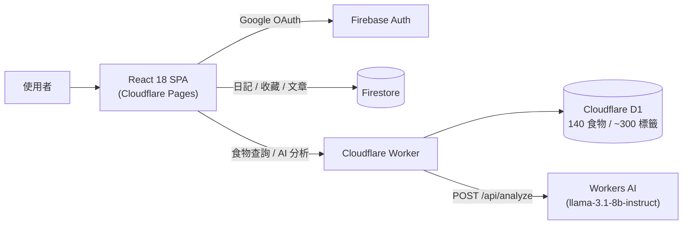
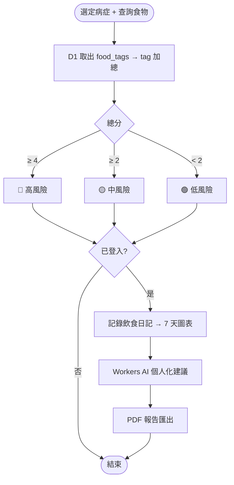

Nutrition Guard 是一個鎖定「多族群、多病症」場景的飲食風險管理系統，目標族群是**痛風、高血脂、糖尿病、高血壓**四類患者。它的核心不是花俏的 ML 模型，而是一套可解釋、可審計的 **tag 評分引擎**：每種食物對每種病症掛上若干風險標籤，標籤各有分數，加總後落入紅／黃／綠三個等級。整套後端跑在 Cloudflare 與 Firebase 的免費額度上，月費維持在 **$0**。

## 為什麼要做「多病症」評分

慢性病患者真正的痛點不是「找不到某一種病的禁忌表」，而是同一份餐點往往要同時兼顧多種狀況——一個同時有痛風和高血脂的人，看靜態營養表很難一眼判斷一份食物到底該不該吃。Nutrition Guard 把這件事拆成「食物 × 病症 × 標籤」的資料結構，讓使用者選定自己的病症條件後，直接對 140 種食物即時得到對應的風險分數。

## 功能與權限分層

產品刻意把「查詢類」功能做成免登入即可用，降低使用門檻；只有需要保存個人資料的功能才要求登入：

| 功能 | 是否需登入 | 說明 |
|------|:--:|------|
| 食物查詢 | 否 | 搜尋 140 種食物，即時查看各病症風險評分 |
| 飲食建議 | 否 | 依病症列出應避免 / 可安心食用的食物 |
| 知識專區 | 閱讀免登入 | Markdown 文章，登入後可新增 / 編輯自己的文章 |
| FAQ | 否 | 12 題常見問答，可依病症分類篩選 |
| 飲食日記 | 是 | 記錄每日飲食，7 天長條圖視覺化 |
| AI 飲食分析 | 是 | Workers AI 依近 7 天記錄生成個人化建議 |
| PDF 報告匯出 | 是 | 含圖表 + AI 建議的 A4 報告，一鍵下載 |
| 我的收藏 | 是 | 儲存常用食物，同步顯示當前病症風險 |

## 技術選型

前端是 **Vite 5 + React 18 + TypeScript**，樣式用 **TailwindCSS v3**，路由用 **React Router v6**，狀態管理用 **Zustand** 並持久化到 localStorage。風險引擎是純 TypeScript（`src/engine/riskEngine.ts` 的 `evaluate(tags, condition) → FoodRisk`），完全不依賴 AI。

後端由一支 **Cloudflare Worker** 提供食物 API，資料存在 **Cloudflare D1**（SQLite，140 種食物）。需要推理的個人化建議才交給 **Cloudflare Workers AI（llama-3.1-8b-instruct）**。PDF 由 **@react-pdf/renderer** 在前端 lazy load 生成，內嵌 Noto Sans SC 字體以正確輸出中文。使用者驗證走 **Firebase Auth（Google OAuth）**，使用者資料（飲食日記、收藏、自訂文章）存在 **Firebase Firestore**。整站 host 在 **Cloudflare Pages**。

Worker 對外的 API 很精簡：

- `GET /api/foods`：食物查詢
- `GET /api/foods/:id`：單筆食物
- `GET /api/stats`：統計資訊
- `POST /api/analyze`：呼叫 Workers AI 做飲食分析

> 注意：Workers AI binding 只能在 Cloudflare 邊緣環境執行，因此本機開發 `POST /api/analyze` 必須用 `wrangler dev --remote` 才跑得起來。

## 架構


```mermaid
graph LR
  User["使用者"] --> FE["React 18 SPA<br/>(Cloudflare Pages)"]
  FE -->|"Google OAuth"| Auth["Firebase Auth"]
  FE -->|"日記 / 收藏 / 文章"| FS[("Firestore")]
  FE -->|"食物查詢 / AI 分析"| Worker["Cloudflare Worker"]
  Worker --> D1[("Cloudflare D1<br/>140 食物 / ~300 標籤")]
  Worker -->|"POST /api/analyze"| AI["Workers AI<br/>(llama-3.1-8b-instruct)"]
```

## 核心：可解釋的 tag 評分

評分系統的設計重點是**可解釋性**——不用黑盒模型，而是把每個風險因子明確列成標籤與分數。資料庫用兩張表表達「食物擁有哪些病症標籤」：

```sql
CREATE TABLE foods (
  id       TEXT PRIMARY KEY,
  name_zh  TEXT NOT NULL,
  name_en  TEXT NOT NULL,
  category TEXT NOT NULL  -- meat | seafood | vegetable | fruit | drink | grain | dairy | other
);

CREATE TABLE food_tags (
  food_id   TEXT NOT NULL REFERENCES foods(id),
  condition TEXT NOT NULL,  -- 痛風 | 高血脂 | 糖尿病 | 高血壓
  tag       TEXT NOT NULL
);
```

每個標籤依嚴重程度給分，例如痛風的 `high_purine`、`organ_meat`、`alcohol` 各 3 分，`seafood_high_risk` 2 分，`moderate_purine` 1 分；高血脂的 `trans_fat`、`high_saturated_fat` 各 3 分；糖尿病的 `high_sugar`、`refined_carbs`、`sweetened_drink` 各 3 分；高血壓的 `high_sodium` 3 分、`processed_food` / `canned_food` / `pickled_food` 各 2 分。針對選定病症把命中的標籤分數加總後分級：


```mermaid
flowchart TD
  A(["選定病症 + 查詢食物"]) --> B["D1 取出 food_tags → tag 加總"]
  B --> C{總分}
  C -- "≥ 4" --> D["🔴 高風險"]
  C -- "≥ 2" --> E["🟡 中風險"]
  C -- "< 2" --> F["🟢 低風險"]
  D & E & F --> G{已登入?}
  G -- 是 --> H["記錄飲食日記 → 7 天圖表"]
  H --> I["Workers AI 個人化建議"]
  I --> J["PDF 報告匯出"]
  G -- 否 --> Z(["結束"])
  J --> Z
```

這種設計的好處是：使用者看到「高風險」時，能直接知道是因為哪幾個標籤被命中，而不是被一個信心分數打發。新增食物或調整評分，也只是改 `seed.sql` 與標籤分數，不需要重新訓練任何模型。

## 資料權限

Firestore 的安全規則把「公開閱讀、登入才寫」與「使用者只能動自己資料」分開：知識專區文章任何人可讀，登入才能新增，且只有作者本人能改 / 刪；`users/{uid}` 底下的飲食日記、收藏則嚴格限定 `request.auth.uid == uid` 才能讀寫。

## 部署與成本

部署流程是典型的 Cloudflare 全家桶：用 `wrangler d1 create` 建 D1、套用 `schema.sql` 與 `seed.sql` 灌入 140 種食物、`worker:deploy` 上線 API，前端則交給 Cloudflare Pages 連動 GitHub 自動建置（build command `npm run build`，output `dist`）。Firebase 端啟用 Google 登入與 Firestore 並套上安全規則即可。由於 D1、Workers、Workers AI、Pages 與 Firebase 都落在免費額度內，整體**月費為 $0**——這也是這個專案在技術選型上最重要的約束。

## 小結

Nutrition Guard 示範了一個務實的取捨：**能用規則解決的，就不要丟給模型**。風險評分這種需要被信任、被解釋的核心邏輯，用 tag 加總的純函式處理；只有「依近 7 天記錄寫出一段個人化建議」這種真正需要自然語言生成的環節，才動用 Workers AI。再加上 Cloudflare + Firebase 的免費額度，整個產品得以在零營運成本下提供完整的查詢、記錄、分析與報告匯出體驗。

## 參考資料

- [GitHub：a920604a/nutrition-risk-engine](https://github.com/a920604a/nutrition-risk-engine)
- [Live Demo：nutrition-guard.pages.dev](https://nutrition-guard.pages.dev)
