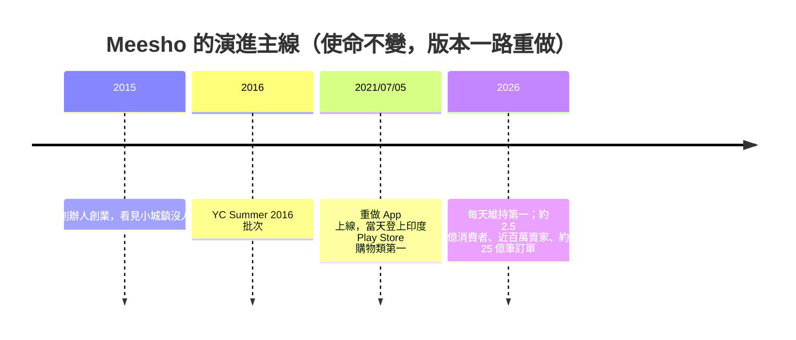

「砍掉你現有的業務、重新開始一個新的，這件事很難。我們做到了。」

這是 Meesho 創辦人在 Y Combinator 場合分享時的開場。對一家正在成長的公司來說，主動把既有版本推倒重來通常違反直覺——但 Meesho 把這件事做成了它故事裡最關鍵的一段。本文以這場分享的第一手內容為依據，整理 Meesho 的起源、今天的規模，以及背後那套「敢於殺掉自己」的產品思維。

## 那個關鍵時刻：2021 年 7 月重做 App

創辦人記得很清楚：**2021 年 7 月 5 日，他們推出了新的 App**。

當天，這個 App 就衝上了印度 Android Play Store 購物分類的第一名。而從那天起一直到 2026 年——講者強調是「每一天、每一個 single day」——Meesho 都維持在印度 Android Play Store 購物類的第一名。

重點不在於數字本身，而在於這個動作的性質：他們是在「殺掉現有業務、重做一個」的前提下完成這次轉換的。對任何一個正在成長、捨不得放手的團隊，這都是值得記住的一課——**保護現有的成功，有時正是擋住你走向下一個成功的那道牆。**

## Meesho 今天是什麼

今天的 Meesho 是一個橫跨眾多品類的電商平台。它的價值主張很單純，而且非常聚焦：

> 在各個品類裡，為消費者提供最好的「物超所值（value for money）」。

從第一天起，他們就是為「mass India」（印度的大眾市場）打造的，使命是「把網路電商普及給印度的十億消費者和每一個生意人」。

這套定位反映在規模上：

| 指標 | 數字（過去 12 個月） |
|------|------|
| 下單消費者（不重複人數） | 約 2.5 億人 |
| 賣家數量 | 接近 100 萬 |
| 人均下單次數 | 一年約 10 次 |
| 全年訂單量 | 約 25 億筆 |
| 年成長率 | 30%+（年對年） |

講者表示，這些數字「在所有平台裡都是遙遙領先的最高值」。而 2.5 億這個消費者數字，**目前仍以每年 30% 以上的速度成長。**

## 為什麼成長空間還這麼大

理解 Meesho 的規模，要放回印度的市場底色：

- 印度有約 15 億人口；
- 但每年「在網路上買過任何東西」的人，只有大約 3.5 億到 4 億；
- 也就是說，**還有非常多人根本沒進到線上消費的生態系裡。**

換個角度看：在這些有在線上購物的人當中，可能有「超過一半」是在 Meesho 上買的。這既說明了 Meesho 的滲透力，也說明了為什麼它還能持續高速成長——真正的天花板不是搶現有用戶，而是把還沒上線的那十億人帶上來。

## 起源：班加羅爾在網購，老家卻沒人在買

公司從 **2015 年**開始（後來成為 YC Summer 2016 批次）。兩位共同創辦人都來自印度的小城鎮：

- 講者本人出生在 **Meerut**，家族大多來自印度北方邦（western UP），是農民家庭；
- 共同創辦人 Sanjiv 在 **Jharkhand 的 Hazaribagh** 出生長大。

2015 年，兩人都剛從大學畢業約兩年，對當時的「行動網路浪潮」非常興奮，覺得這正是動手做點東西的時機。讓他們真正有感的，是一個反覆出現的觀察：

> 在班加羅爾，你會看到身邊每個人都在網路上買東西；
> 但一回到 Meerut、回到 Jharkhand 的家人身邊，你會發現——**沒有人在線上買，也沒有人在線上賣。**

而那時候，印度的主流敘事其實是「電商這件事已經結束了」：Flipkart 剛賣給了 Walmart，Amazon 也在，許多公司都在場上，大家覺得格局已定、不會再有新玩家、沒什麼好解的了。

但兩位創辦人的判斷恰恰相反：既然連自己的家人都還沒開始網購，那就一定還有東西沒被解決。於是出發點變得很簡單——**把全印度的人都帶上線。**

## 同一個使命，第五個版本

最值得玩味的是這句話：11 年走下來，業務在很多方面都進化了，創辦人說現在的 Meesho「大概是第五個版本（version five）」——但**公司的核心使命，其實從頭到尾都沒變過。**

這正是這個案例對產品人的核心啟示：**「使命穩定、版本可棄」**。你願意守的應該是那個長期目標（把十億人帶上線、給最好的 value for money），而不是任何一個具體的產品形態或商業模式。當舊版本擋路時，敢於砍掉它、重做下一個——即使那發生在你看起來正順風的時候。

## 學到的事

- **敢在巔峰砍掉自己**：重做 App 不是因為舊的不行，而是因為要去更大的地方；保護現有成功，有時正是阻力。
- **使命要穩、版本要敢換**：Meesho 走到「第五版」，但「普及電商給十億印度人」這個使命從第一天就沒動過。
- **真正的市場在還沒上線的人身上**：15 億人口、只有 3.5–4 億年度線上買家，成長故事的核心是把剩下的人帶進來，而不是互相搶存量。

## 參考資料

- [Meesho Killed Their Business at Its Peak - And Became India's #1 Shopping App](https://www.youtube.com/watch?v=49L8lVe_PVo)
