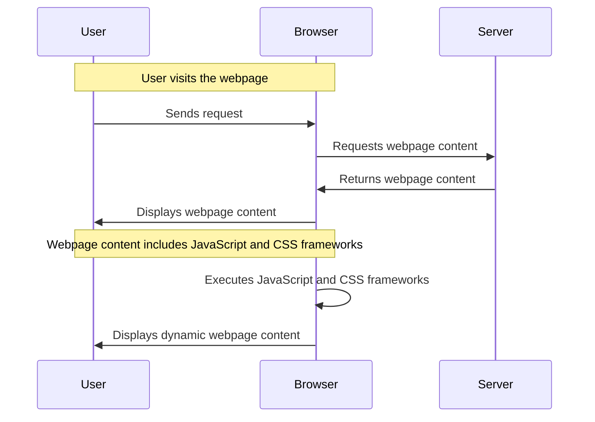

**Introduction**
This article explains the concept and technical implementation behind the title "May the 4th Be With You!". After reading this article, readers will understand the meaning and technical aspects of this special web effect.

## TL;DR
Core concept in one sentence: Utilizing code and frameworks to achieve a unique web effect.

## What is it
Definition: "May the 4th Be With You!" is a special web effect that uses code and frameworks to create dynamic web content.

## Why is it important
Problem solved or changes brought: This effect can increase the interactivity and attractiveness of a website, capturing users' attention and interest.

## How it works
Principle explanation: This effect is achieved through JavaScript and CSS frameworks. The following is a simplified flowchart:

## Comparison with other concepts
Differences and applicable scenarios: Compared to other web effects, "May the 4th Be With You!" is more dynamic and interactive, making it suitable for websites that need to capture users' attention.

## Conclusion
Who it's for and when to use it: This effect is suitable for websites that need to increase interactivity and attractiveness, such as commercial websites and blogs.

## References
Related links: NA