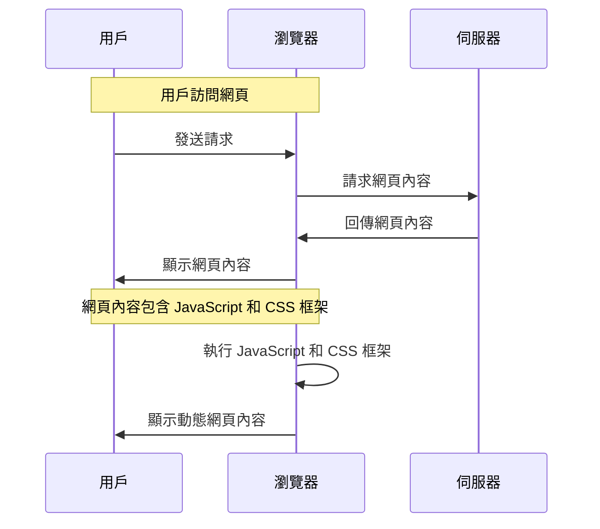

**開頭**
這篇文章要解釋的是什麼？讀者看完會理解什麼？本文將深入探討「May the 4th Be With You!」這個標題背後的意涵和技術實現。

## TL;DR
核心概念一句話：利用程式碼和框架，實現一個特殊的網頁效果。

## 是什麼
概念定義：May the 4th Be With You! 是一個特殊的網頁效果，利用程式碼和框架，實現一個動態的網頁內容。

## 為什麼重要
解決了什麼問題，或帶來什麼改變：這個效果可以增加網頁的互動性和吸引力，吸引用戶的注意力和興趣。

## 怎麼運作
原理說明：這個效果是通過 JavaScript 和 CSS 框架實現的。下面是簡略的流程圖：

## 跟其他概念的差別
比較，說清楚適用情境：與其他網頁效果相比，May the 4th Be With You! 的效果更為動態和互動，適合用於需要吸引用戶注意力的網頁。

## 小結
適合誰用、什麼情況下選它：這個效果適合用於需要增加網頁互動性和吸引力的網站，例如商業網站、博客等。

## 參考資料
相關連結：NA
- [May the 4th Be With You!](https://www.youtube.com/watch?v=2_4ZA5QffCg)