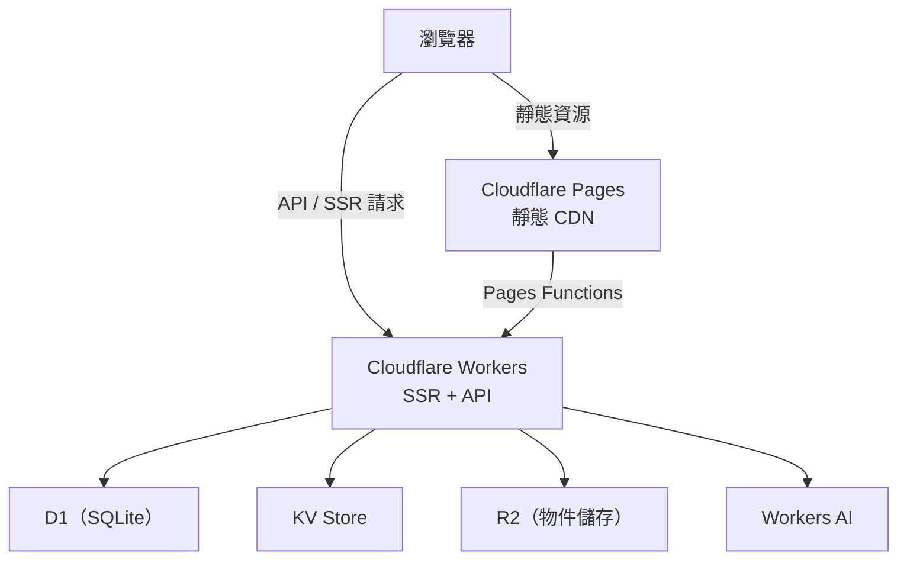

I wanted to build a technical blog or a small demo platform, but without wrestling with a complicated backend environment every time I deploy. This post records how I made everything lightweight using Astro + Cloudflare Workers, including the pitfalls I hit and the details that actually matter.

## Why This Stack

There are plenty of static-site options out there: Vercel, Netlify, Railway, each with its own strengths. But if your requirements are "lightweight frontend + a bit of dynamic API + global edge deployment + near-zero ops cost," Cloudflare's level of integration is the highest.

| | Cloudflare Pages + Workers | Vercel | Netlify |
|-|--------------------------|--------|---------|
| Edge execution | Workers (V8 isolates) | Edge Functions (Node) | Edge Functions (Deno) |
| Database | D1 (SQLite), KV | External required | External required |
| Vector database | Vectorize (built-in) | External required | External required |
| Free tier | 100k Workers requests/day | Limited | Limited |
| Cold start | Virtually none (isolate) | Yes | Yes |

The price of choosing Cloudflare: its runtime is Workers (V8 isolates), not a full Node.js. A handful of npm packages are incompatible, and `fs`, `path`, and `child_process` simply don't exist. That's something to confirm before you commit.

## Overall Architecture



Once Astro uses the Cloudflare adapter, both SSR pages and API routes run on Workers, while static assets (JS, CSS, images) are cached and distributed by the Pages CDN. The two roles have a clear division of labor and don't interfere with each other.

## Starting from Scratch

### 1. Initialize the Astro Project

```bash
pnpm create astro@latest my-site
cd my-site
pnpm add @astrojs/cloudflare
```

Modify `astro.config.mjs`:

```js
import { defineConfig } from 'astro/config';
import cloudflare from '@astrojs/cloudflare';

export default defineConfig({
  output: 'server',
  adapter: cloudflare({
    mode: 'directory',
    platformProxy: {
      enabled: true,
    },
  }),
});
```

`mode: 'directory'` makes the output structure match the directory format of Cloudflare Pages Functions. `platformProxy: { enabled: true }` is the key to emulating the Cloudflare environment during local development — without it, `locals.runtime` will be `undefined` locally, which makes debugging extremely painful.

If you need multilingual routing (Traditional Chinese as default, English under `/en/*`):

```js
export default defineConfig({
  output: 'server',
  adapter: cloudflare({ mode: 'directory', platformProxy: { enabled: true } }),
  i18n: {
    defaultLocale: 'zh-TW',
    locales: ['zh-TW', 'en'],
    routing: { prefixDefaultLocale: false },
  },
});
```

### 2. Configure wrangler.jsonc

The bindings for all Cloudflare services are managed centrally in `wrangler.jsonc`. The `binding` is the name you reference in code, e.g. `env.DB`, `env.AI`.

```jsonc
{
  "name": "my-site",
  "compatibility_date": "2025-09-01",
  "pages_build_output_dir": "./dist",

  "d1_databases": [{
    "binding": "DB",
    "database_name": "my-site-db",
    "database_id": "xxxxxxxx-xxxx-xxxx-xxxx-xxxxxxxxxxxx"
  }],

  "kv_namespaces": [{
    "binding": "CACHE",
    "id": "xxxxxxxxxxxxxxxxxxxxxxxxxxxxxxxx"
  }],

  "r2_buckets": [{
    "binding": "STORAGE",
    "bucket_name": "my-site-assets"
  }],

  "ai": {
    "binding": "AI"
  }
}
```

If you want to use some Node.js built-ins (`crypto`, `buffer`, `stream`), add:

```jsonc
{
  "compatibility_flags": ["nodejs_compat"]
}
```

Note: `nodejs_compat` does not include `fs`, `path`, or `child_process`.

### 3. Use Bindings in an API Route

I recommend first declaring an `Env` interface in `src/env.d.ts` so that `locals.runtime.env` is typed:

```ts
// src/env.d.ts
type Runtime = import('@astrojs/cloudflare').Runtime<Env>;

interface Env {
  DB: D1Database;
  CACHE: KVNamespace;
  STORAGE: R2Bucket;
  AI: Ai;
  ADMIN_TOKEN: string;
}

declare namespace App {
  interface Locals extends Runtime {}
}
```

After this, the IDE autocomplete will correctly suggest D1's methods. An example API route (`src/pages/api/count.ts`):

```ts
import type { APIRoute } from 'astro';

export const GET: APIRoute = async ({ locals }) => {
  const { DB } = locals.runtime.env;

  const result = await DB
    .prepare('SELECT count(*) as cnt FROM posts')
    .first<{ cnt: number }>();

  return Response.json({ count: result?.cnt ?? 0 });
};
```

Workers AI is accessed the same way:

```ts
const { AI } = locals.runtime.env;
const embedding = await AI.run('@cf/baai/bge-m3', {
  text: ['搜尋關鍵字'],
});
```

### 4. Create the D1 Database

D1 is Cloudflare's SQLite-compatible edge database. Inside Workers it's a local call with virtually no connection latency.

```bash
# Create D1
wrangler d1 create my-site-db

# Run migrations locally
wrangler d1 execute my-site-db --local --file=./migrations/0001_init.sql

# Run migrations remotely
wrangler d1 execute my-site-db --remote --file=./migrations/0001_init.sql
```

Put migration files in the `migrations/` directory, managed with version-number prefixes:

```sql
-- migrations/0001_init.sql
CREATE TABLE IF NOT EXISTS posts (
  id TEXT PRIMARY KEY,
  title TEXT NOT NULL,
  date TEXT NOT NULL,
  category TEXT NOT NULL,
  lang TEXT NOT NULL DEFAULT 'zh-TW',
  tags TEXT,
  description TEXT
);

CREATE INDEX IF NOT EXISTS idx_posts_date ON posts(date DESC);
CREATE INDEX IF NOT EXISTS idx_posts_category ON posts(category);
```

Naming convention: `NNNN_description.sql`, where the numeric prefix guarantees execution order.

### 5. Deploy with GitHub Actions

`.github/workflows/deploy.yml`:

```yaml
name: Deploy

on:
  push:
    branches: [main]

jobs:
  deploy:
    runs-on: ubuntu-latest
    steps:
      - uses: actions/checkout@v4

      - uses: pnpm/action-setup@v4
        with:
          version: 9

      - run: pnpm install
      - run: pnpm build

      - name: Deploy to Cloudflare Pages
        uses: cloudflare/wrangler-action@v3
        with:
          apiToken: ${{ secrets.CLOUDFLARE_API_TOKEN }}
          accountId: ${{ secrets.CLOUDFLARE_ACCOUNT_ID }}
          command: pages deploy dist --project-name=my-site
```

Add `CLOUDFLARE_API_TOKEN` and `CLOUDFLARE_ACCOUNT_ID` under the GitHub repo's **Settings → Secrets and variables → Actions**. Create the token in Cloudflare Dashboard → My Profile → API Tokens → Create Token, choose "Custom token," and it needs at minimum Cloudflare Pages: Edit permission; if your workflow runs migrations, it also needs D1: Edit.

Pages generates a separate Preview URL for every branch, making it easy to verify the result before merging into main, with no manual intervention required.

## A Few Common Pitfalls

### Environment Variables vs. Bindings Are Two Separate Systems

**Symptom**: locally `pnpm dev` can read a secret, but after deployment `env.MY_SECRET` is `undefined`.

**Cause**: wrangler.jsonc bindings (DB, KV, R2) and the Cloudflare Dashboard's Environment Variables are two completely independent systems. Local dev uses `.dev.vars` to emulate env vars, but the two are accessed differently.

**Fix**: put secrets (API tokens, passwords) in the Dashboard's Environment Variables and access them via `env.MY_SECRET`; put database, KV, and R2 in wrangler.jsonc bindings and access them via `env.DB`. Use `.dev.vars` (added to .gitignore) for local development secrets.

### Node.js APIs Are Incompatible

**Symptom**: after importing some npm package, the deploy reports `Cannot find module 'fs'`.

**Cause**: the Workers runtime is V8 isolates, not Node.js, so `fs`, `path`, and `child_process` simply don't exist.

**Fix**: check whether the npm package has a Workers-compatible version; or enable the `nodejs_compat` compatibility flag (which supports `crypto`, `buffer`, etc., but not `fs`).

### Data Contamination in the D1 Preview Environment

**Symptom**: after running tests in a PR's Preview environment, production data is mysteriously modified.

**Cause**: by default, every branch's Pages Preview environment points to the same `database_id` in `wrangler.jsonc` — namely the production D1. Writes in the Preview environment directly affect production data.

**Fix**: in the Cloudflare Pages project settings → Environment Variables, override `database_id` for the Preview environment to point to a dedicated staging D1 database.

### The Statelessness of Isolates

**Symptom**: a module-level variable gets set after the first request, but reverts to its initial value on the second request.

**Cause**: each request in Workers V8 isolates is an independent execution environment, so global variables don't persist between requests. This differs from a traditional Node.js server.

**Fix**: put any state that needs to be shared across requests (sessions, caches) in KV or D1 — don't rely on module-level variables.

## What I Learned

- Cloudflare's integration is its biggest selling point: D1, KV, R2, Vectorize, and Workers AI are all on the same platform, so you don't have to manage credentials and IAM across multiple services.
- Don't forget to enable `platformProxy: { enabled: true }`. Without it, `locals.runtime` is undefined during local development.
- Astro content collections' Zod schema lets you catch frontmatter errors locally, instead of waiting for CI.
- Keep sensitive keys in the Cloudflare Dashboard / GitHub Secrets; in wrangler.jsonc, put only binding names and resource IDs, never secrets.

## References

- [Astro Official Docs](https://docs.astro.build/)
- [Astro Cloudflare Adapter](https://docs.astro.build/en/guides/integrations-guide/cloudflare/)
- [Cloudflare Workers Docs](https://developers.cloudflare.com/workers/)
- [Cloudflare D1 Docs](https://developers.cloudflare.com/d1/)
- [wrangler CLI Docs](https://developers.cloudflare.com/workers/wrangler/)
- [Cloudflare Pages Docs](https://developers.cloudflare.com/pages/)
