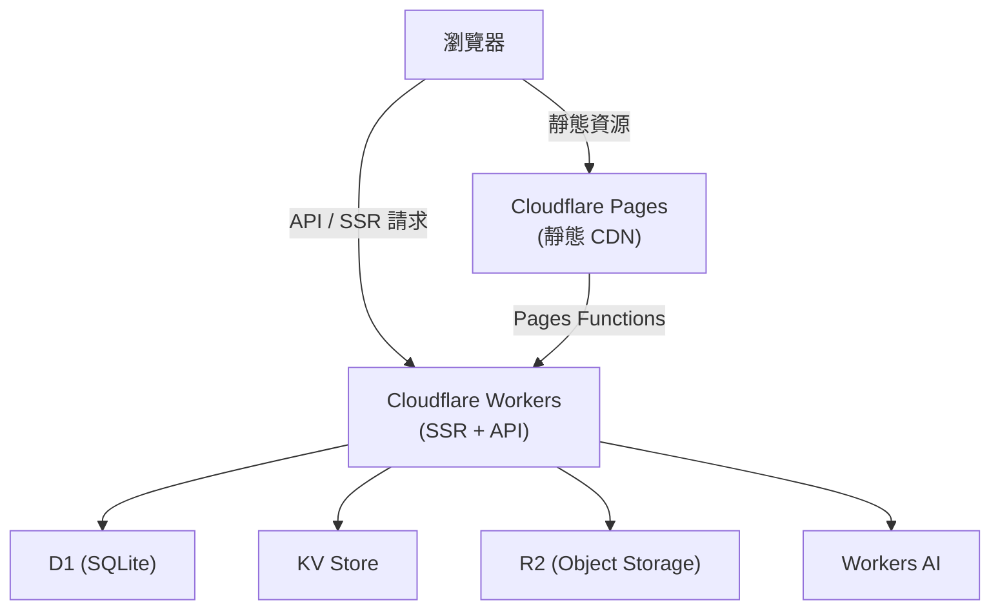

想建一個技術部落格或小型 demo 平台，但不想每次部署都跟複雜的後端環境搏鬥。這篇記錄我用 Astro + Cloudflare Workers 把一切變輕的過程。

## 為什麼是這個組合

市面上有很多靜態網站選項：Vercel、Netlify、Railway，各有所長。但如果需求是「輕量前端 + 少量動態 API + 全球邊緣部署 + 幾乎零維運成本」，Cloudflare 的整合度是最高的。

| | Cloudflare Pages + Workers | Vercel | Netlify |
|-|--------------------------|--------|---------|
| 邊緣執行 | Workers（V8 isolates） | Edge Functions（Node） | Edge Functions（Deno） |
| 資料庫 | D1（SQLite）、KV | 需外接 | 需外接 |
| 向量資料庫 | Vectorize（內建） | 需外接 | 需外接 |
| 免費方案 | 慷慨（Workers 10萬次/天） | 有限制 | 有限制 |
| Cold start | 幾乎無（isolate） | 有 | 有 |

選 Cloudflare 的代價是：它的 runtime 是 Workers（V8 isolates），不是完整的 Node.js，少數 npm 套件不相容。

## 整體架構



Astro 使用 Cloudflare adapter 後，SSR 頁面和 API routes 都由 Workers 執行；靜態資源（JS、CSS、圖片）由 Pages CDN 快取分發。兩個角色分工明確，互不干擾。

## 從零開始

### 1. 初始化 Astro 專案

```bash
pnpm create astro@latest my-site
cd my-site
pnpm add @astrojs/cloudflare
```

修改 `astro.config.mjs`：

```js
import { defineConfig } from 'astro/config';
import cloudflare from '@astrojs/cloudflare';

export default defineConfig({
  output: 'server',
  adapter: cloudflare({
    mode: 'directory',
    platformProxy: {
      enabled: true,
    },
  }),
});
```

`mode: 'directory'` 讓輸出結構對應 Cloudflare Pages Functions 的目錄格式。`platformProxy: { enabled: true }` 是本地開發時模擬 Cloudflare 環境的關鍵，沒有這個，`locals.runtime` 在本地會是 `undefined`。

### 2. 設定 wrangler.jsonc

```jsonc
{
  "name": "my-site",
  "compatibility_date": "2025-09-01",
  "pages_build_output_dir": "./dist",

  "d1_databases": [{
    "binding": "DB",
    "database_name": "my-site-db",
    "database_id": "xxxxxxxx-xxxx-xxxx-xxxx-xxxxxxxxxxxx"
  }],

  "kv_namespaces": [{
    "binding": "CACHE",
    "id": "xxxxxxxxxxxxxxxxxxxxxxxxxxxxxxxx"
  }],

  "r2_buckets": [{
    "binding": "STORAGE",
    "bucket_name": "my-site-assets"
  }],

  "ai": {
    "binding": "AI"
  }
}
```

`binding` 是程式碼裡取用的名稱，例如 `env.DB`、`env.AI`。所有 Cloudflare 服務的 binding 都在這一個檔案管理，遷移和 review 都簡單很多。

### 3. 在 API route 使用 bindings

Astro 的 API route（`src/pages/api/count.ts`）：

```ts
import type { APIRoute } from 'astro';

export const GET: APIRoute = async ({ locals }) => {
  const { DB } = locals.runtime.env;

  const result = await DB
    .prepare('SELECT count(*) as cnt FROM posts')
    .first<{ cnt: number }>();

  return Response.json({ count: result?.cnt ?? 0 });
};
```

`locals.runtime.env` 就是 Workers 的 `env` 物件，所有 wrangler.jsonc 裡的 bindings 都掛在這裡。Workers AI 也是同樣的取法：

```ts
const { AI } = locals.runtime.env;
const embedding = await AI.run('@cf/baai/bge-m3', {
  text: ['搜尋關鍵字'],
});
```

### 4. 建立 D1 資料庫

```bash
# 建立 D1
wrangler d1 create my-site-db

# 本地跑遷移
wrangler d1 execute my-site-db --local --file=./migrations/0001_init.sql

# 遠端跑遷移
wrangler d1 execute my-site-db --remote --file=./migrations/0001_init.sql
```

遷移檔放 `migrations/` 目錄，用版本號前綴管理，讓 schema 的演進可以追蹤。

### 5. GitHub Actions 部署

`.github/workflows/deploy.yml`：

```yaml
name: Deploy

on:
  push:
    branches: [main]

jobs:
  deploy:
    runs-on: ubuntu-latest
    steps:
      - uses: actions/checkout@v4

      - uses: pnpm/action-setup@v4
        with:
          version: 9

      - run: pnpm install
      - run: pnpm build

      - name: Deploy to Cloudflare Pages
        uses: cloudflare/wrangler-action@v3
        with:
          apiToken: ${{ secrets.CLOUDFLARE_API_TOKEN }}
          accountId: ${{ secrets.CLOUDFLARE_ACCOUNT_ID }}
          command: pages deploy dist --project-name=my-site
```

一次 push 到 main 就觸發部署，全程不需要手動介入。Pages 每個 branch 都會產生獨立 Preview URL，方便在合入 main 前確認效果。

## 本地開發流程

```bash
# 啟動 dev server（含 Workers / D1 / KV 模擬）
pnpm dev
```

`@astrojs/cloudflare` 的 `platformProxy` 讓本地開發時可以直接用 `locals.runtime.env.DB`，不用 mock，跟生產環境行為一致。這是這個 adapter 最重要的開發體驗優勢。

## 幾個常見坑

**環境變數 vs Bindings 的區別**：secret（API token、密碼）放 Cloudflare Dashboard 的 Environment Variables，用 `env.MY_SECRET` 取；資料庫、KV、R2、AI 放 wrangler.jsonc 的 bindings，走 `env.DB` 等。兩者不互通，搞混會在本地可以跑、部署後壞掉。

**Node.js API 不相容**：Workers runtime 沒有 `fs`、`path`、`child_process`。依賴這些的套件需要換替代品，或者啟用 `nodejs_compat` compatibility flag（支援部分 built-ins）。

**D1 Preview 環境的資料污染**：Pages 每個 branch 的 Preview 環境預設指向同一個 `database_id`，所以 PR 上跑的測試可能改到 production 的資料。需要設定 staging 用的 D1 database_id，或者讓測試資料有固定的前綴可以清除。

**Isolate 的無狀態性**：Workers 用 V8 isolates，每次請求是獨立的，全域變數不會在請求之間持續。需要跨請求共享狀態的情境要用 KV 或 D1，不要靠 module-level 變數。

## 學到的事

- Cloudflare 的整合是它最大的賣點：D1、KV、R2、Vectorize、Workers AI 全部在同一個平台，不需要管多個服務的 credentials 和 IAM。
- `platformProxy: { enabled: true }` 別忘了開。沒有這個，本地開發時 `locals.runtime` 是 undefined，debug 很痛苦。
- Schema 在 build 時驗證：Astro content collections 的 Zod schema 讓 frontmatter 錯誤在本地就能抓到，不用等到 CI。
- 把敏感金鑰放在 Cloudflare Dashboard / GitHub Secrets，wrangler.jsonc 裡只放 binding name 和 resource ID，不放 secret。

## 參考資料

- [Astro 官方文件](https://docs.astro.build/)
- [Astro Cloudflare Adapter](https://docs.astro.build/en/guides/integrations-guide/cloudflare/)
- [Cloudflare Workers 文件](https://developers.cloudflare.com/workers/)
- [Cloudflare D1 文件](https://developers.cloudflare.com/d1/)
- [wrangler CLI 文件](https://developers.cloudflare.com/workers/wrangler/)
- [Cloudflare Pages 文件](https://developers.cloudflare.com/pages/)
