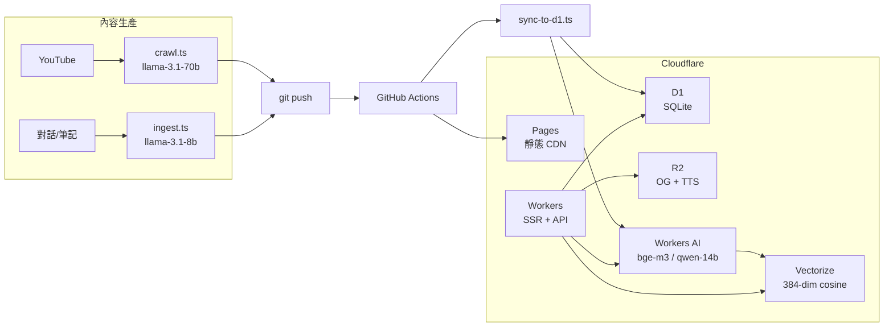

This post walks through the Engineer News tech stack: why each tool was chosen, how they fit together, and which choices were the result of tradeoffs.

## The Overall Architecture



From a YouTube video or a conversation, all the way to a reader seeing the article in their browser and being able to run a semantic search — the entire flow runs inside the Cloudflare ecosystem.

## Frontend: Astro

Astro is a frontend framework designed around a "content-first" philosophy. By default it outputs pure static HTML, injecting JavaScript only into the components that actually need interactivity (Island Architecture). It's especially well suited to article and documentation sites.

Astro isn't React, and it isn't Vue — it's a framework designed with "content" at its core.

For a blog this design makes a lot of sense: most pages are pure reading and don't need any JS bundle at all. Articles are managed as Markdown (Content Collections), with a Zod schema validating frontmatter at build time, so a wrong field fails locally instead of waiting for CI.

i18n routing is also built into Astro: `zh-TW` is the default language with no URL prefix, while the English version lives under `/en/*`.

Compared to Next.js: Next has a more mature ecosystem, but for a pure content site both the bundle size and configuration complexity are higher. Astro with the Cloudflare adapter's `output: 'server'` mode routes the dynamic parts (API routes, SSR) through Workers and the static parts through the Pages CDN — a natural division of labor.

## Deployment: Cloudflare Pages + Workers

Cloudflare Pages is a CDN hosting service for static assets that automatically deploys and produces a Preview URL on every git push. Cloudflare Workers is an edge compute platform running on V8 isolates, handling dynamic requests (API routes, SSR). Used together, static and dynamic each do their own job.

Pages handles CDN distribution of static assets (HTML, CSS, JS, images), and Workers handles dynamic requests (APIs, SSR pages). Both are managed in the same `wrangler.jsonc` and deployed with the same token:

```
git push main
  → GitHub Actions
      → pnpm build
      → wrangler pages deploy dist
```

Every push to a non-main branch automatically produces a Preview URL, making it easy to confirm the result before merging.

## Database: D1 (SQLite on the edge)

D1 is Cloudflare's SQLite-compatible edge database. Inside a Worker you query directly with `env.DB.prepare().all()` — no connection pool, no TCP overhead, no cross-service IAM setup.

The current table breakdown:

| Table | Purpose |
|-------|------|
| `posts` | Article metadata (title, date, tag, language) |
| `doc_chunks` | Article text chunks (used for RAG) |
| `page_views` | View count per article |
| `search_logs` | Search keyword records |
| `settings` | Site-wide key-value settings |

Migration files live in the `migrations/` directory, managed with a version-number prefix:

```sql
-- migrations/0001_init.sql
CREATE TABLE IF NOT EXISTS posts (
  id TEXT PRIMARY KEY,
  title TEXT NOT NULL,
  date TEXT NOT NULL,
  category TEXT NOT NULL,
  lang TEXT NOT NULL DEFAULT 'zh-TW',
  tags TEXT,
  description TEXT,
  tldr TEXT
);

CREATE TABLE IF NOT EXISTS doc_chunks (
  id TEXT PRIMARY KEY,
  post_id TEXT NOT NULL,
  chunk_index INTEGER NOT NULL,
  content TEXT NOT NULL
);
```

```bash
# Run migration locally
wrangler d1 execute my-site-db --local --file=migrations/0001_init.sql

# Run migration remotely
wrangler d1 execute my-site-db --remote --file=migrations/0001_init.sql
```

D1's limits: a 25MB cap per query and a 10GB cap on database size. More than enough for a blog. Large binaries (audio, images) go to R2 instead.

**Why not PlanetScale / Supabase?** An external database means extra connection management, IAM, cost, and cross-service latency. D1 is a local call inside Workers, so latency is practically negligible.

## Vector Search: Vectorize + Workers AI

This is the most interesting part of the whole stack.

After an article is deployed, `sync-to-d1.ts` splits each article into chunks, generates a 384-dimensional embedding with Workers AI's `bge-m3` model, and stores it in Vectorize. When a user searches:

```mermaid
sequenceDiagram
  participant "瀏覽器" as Browser
  participant "Worker" as W
  participant "WorkersAI" as AI
  participant "Vectorize" as V
  participant "Database" as D1
  Browser->>W: POST /api/search {query}
  W->>AI: embed(query) via bge-m3
  AI-->>W: query_vector[384]
  W->>V: similaritySearch(top_k=5)
  V-->>W: [{chunk_id, score}...]
  W->>D1: SELECT chunks WHERE id IN (...)
  D1-->>W: chunks[]
  W->>AI: query-14b stream(query + chunks)
  AI-->>W: 回答
  W->>Browser: 回答
  note right of AI
    回答
```

Core snippet from `sync-to-d1.ts`:

```ts
// 呼叫 bge-m3 生成 embedding
const res = await fetch(
  `https://api.cloudflare.com/client/v4/accounts/${ACCOUNT_ID}/ai/run/@cf/baai/bge-m3`,
  {
    method: 'POST',
    headers: { Authorization: `Bearer ${API_TOKEN}` },
    body: JSON.stringify({ text: chunkContent }),
  }
);
const { result } = await res.json();
const vector = result?.data?.[0]; // number[384]

// 寫入 Vectorize（NDJSON 格式批次 insert）
// wrangler vectorize insert engineer-news-index --file=vectors.ndjson
```

This entire RAG flow runs inside Workers — no external API calls, no OpenAI costs. `qwen-14b` is good enough for Traditional Chinese technical Q&A.

**Why 384 dimensions instead of 1536?** Vectorize's cost scales with dimensionality. The 384 dimensions of `bge-m3` are already sufficient for semantic search over Chinese technical articles; there's no need to inflate cost just to "look higher-dimensional."

## Object Storage: R2

R2 is Cloudflare's object storage service. It's S3-API-compatible but has no bandwidth charges (egress free).

R2 stores two kinds of things:

**OG images**: an API route generates them dynamically (satori + a Chinese font), caches the result to R2 after the first generation, and afterward returns it directly without re-running satori. This gives social media shares a correct preview image without recomputing on every request.

```ts
const { OG_IMAGES } = locals.runtime.env;

// 先查 R2 cache
const cached = OG_IMAGES ? await OG_IMAGES.get(cacheKey) : null;
if (cached) {
  return new Response(await cached.arrayBuffer(), {
    headers: { 'Content-Type': 'image/png', 'Cache-Control': 'public, max-age=31536000' },
  });
}

// miss：跑 satori 生成，再寫回 R2
const png = await renderToPng(createShareCardNode({ post }), fontData);
await OG_IMAGES.put(cacheKey, png);
return new Response(png, { headers: { 'Content-Type': 'image/png' } });
```

**TTS audio**: each article has a corresponding `.wav`, batch-generated and uploaded by `tts-all.ts`, with the `audio_url` recorded in the frontmatter for the frontend to play directly.

R2 is S3-API-compatible but has no bandwidth charges (it only bills for storage and operations), which is very friendly for large files like audio.

## AI Models: Workers AI

Workers AI is Cloudflare's inference platform, offering serverless access to a number of open-source models, invoked directly from Workers with `env.AI.run()`.

| Model | Purpose |
|------|------|
| `bge-m3` | Article embedding (384 dim, Chinese-friendly) |
| `qwen-14b` | RAG search answers (streaming) |
| `llama-3.1-8b` | Metadata extraction at ingest time (frontmatter) |
| `llama-3.1-70b` | zh-TW summary generation at crawl time |

An example of calling it from a Worker / API route:

```ts
const { AI } = locals.runtime.env;

// embedding（用於向量搜尋）
const { data } = await AI.run('@cf/baai/bge-m3', { text: [query] });
const queryVector = data[0]; // number[384]

// RAG 回答（串流）
const stream = await AI.run('@cf/qwen/qwen1.5-14b-chat-awq', {
  stream: true,
  messages: [
    { role: 'system', content: systemPrompt },
    { role: 'user', content: userQuery },
  ],
});
return new Response(stream, { headers: { 'Content-Type': 'text/event-stream' } });
```

Everything runs through Workers AI, so there's no API key rotation to manage and no external-service latency hops. For Chinese articles, `qwen-14b`'s comprehension and generation quality is far better than English-leaning models of comparable size.

**Why not OpenAI?** Workers AI is good enough for this use case, and the entire AI pipeline shares the same set of credentials as the infrastructure — no separate OpenAI billing or rate limits to manage.

## Content Automation: crawl + ingest

**crawl.ts**: runs daily at UTC 02:00 (10 AM Taiwan time) via GitHub Actions, crawling 9 YouTube channels, generating Traditional Chinese summaries with `llama-3.1-70b`, and automatically committing + pushing — no manual intervention.

**ingest.ts**: feed it a conversation or notes file, and it automatically detects and masks sensitive information (tokens, keys, internal URLs), then uses `llama-3.1-8b` to generate the title, tags, tldr, and description, outputting a complete Markdown article.

These two scripts, combined with Claude Code's `post` skill, let each day's engineering decisions turn into articles with very little friction.

## Full-Text Search: Pagefind

Beyond RAG (vector semantic search), the site also uses Pagefind for static full-text indexing. After `pnpm build` finishes, Pagefind scans the `dist/` directory to build an index, so exact keyword search needs no backend and runs entirely in the browser.

The division of labor between RAG and Pagefind: RAG answers open-ended questions, Pagefind finds exact terms.

## Development Tooling

**TypeScript**: all scripts and API routes are written in TypeScript, paired with a strict content schema to catch problems early at build time.

**pnpm**: faster than npm, and its shared node_modules mechanism saves space — well suited to a setup with multiple scripts like this.

**GitHub Actions**: three workflows:
- `deploy.yml`: auto-deploys on push to main
- `crawl.yml`: runs the scheduled YouTube crawl daily
- `fix-mermaid.yml`: manually triggered to repair broken Mermaid diagrams in articles

## References

- [Astro official docs](https://docs.astro.build/)
- [Cloudflare Pages docs](https://developers.cloudflare.com/pages/)
- [Cloudflare D1 docs](https://developers.cloudflare.com/d1/)
- [Cloudflare Vectorize docs](https://developers.cloudflare.com/vectorize/)
- [Cloudflare Workers AI docs](https://developers.cloudflare.com/workers-ai/)
- [Cloudflare R2 docs](https://developers.cloudflare.com/r2/)
- [Pagefind](https://pagefind.app/)
- [bge-m3 (Hugging Face)](https://huggingface.co/BAAI/bge-m3)
